# PRD — Hệ thống PL-Tour

**Phiên bản tài liệu:** 1.0  
**Ngày:** 10/04/2026  
**Phạm vi:** Đồ án — mã nguồn `PL-Tour-main`

---

## Mục lục

1. [Tóm tắt điều hành](#1-tóm-tắt-điều-hành)  
2. [Bên liên quan](#2-bên-liên-quan-vai-trò)  
3. [Phạm vi hệ thống](#3-phạm-vi-hệ-thống)  
4. [Yêu cầu chức năng](#4-yêu-cầu-chức-năng)  
5. [Yêu cầu phi chức năng](#5-yêu-cầu-phi-chức-năng)  
6. [Mô hình kiến trúc](#6-mô-hình-kiến-trúc-hệ-thống)  
7. [Mô hình dữ liệu (ERD)](#7-mô-hình-dữ-liệu-quan-hệ-erd)  
8. [Use case](#8-use-case-tổng-quan)  
9. [Luồng nghiệp vụ (sequence)](#9-luồng-nghiệp-vụ-app-tải-tour-và-hiển-thị-poi)  
- [Phụ lục A — Use Case / Activity / Sequence theo chức năng](#appendix-a)  
10. [DFD — mức 0, 1, 2](#10-dfd---mức-0-1-2)  
11. [User story & Sprint](#11-user-story--acceptance-criteria-theo-sprint)  
12. [Ma trận traceability](#12-ma-trận-traceability)  
13. [Tiêu chí chấp nhận tổng thể](#13-tiêu-chí-chấp-nhận-tổng-thể)  
14. [Lộ trình mở rộng](#14-lộ-trình-mở-rộng)

---

## 1. Tóm tắt điều hành

**PL-Tour** là nền tảng hỗ trợ **du lịch thông minh**: quản trị viên và đối tác (vendor) quản lý **điểm đến (POI)**, **tuyến tour**, **thuyết minh đa ngôn ngữ**; người dùng cuối dùng **ứng dụng .NET MAUI** xem bản đồ, lọc điểm, nghe **audio** hoặc **TTS** theo ngôn ngữ đã chọn.

- **Backend:** ASP.NET Core Web API + Entity Framework Core + **SQL Server**.  
- **Web:** MVC **Admin** (Cookie auth) và **Vendor** (Cookie `VendorAuth`).  
- **Mobile:** MAUI + Mapsui + vị trí + Plugin.Maui.Audio.  
- **API:** JWT cho `api/auth/login`; CORS; Swagger.

**Mục tiêu:** tập trung hóa dữ liệu địa điểm và thuyết minh; trải nghiệm “xem trên bản đồ — nghe nội dung tại chỗ”.

---

## 2. Bên liên quan & vai trò

| Vai trò | Mô tả |
|--------|--------|
| Khách du lịch | Dùng app: tour, bản đồ, POI, âm thanh/TTS. |
| Quản trị (Admin) | Web Admin: dashboard, category, location, narration, vendor. |
| Đối tác (Vendor) | Web Vendor: đăng ký, cửa hàng, sản phẩm, ảnh. |
| Dev / Ops | Triển khai API, DB, JWT, build app đa nền tảng. |

---

## 3. Phạm vi hệ thống

**Trong phạm vi (theo solution):**

- `PLTour.API` — REST, JWT, Locations, Tours, Narrations, Auth.  
- `PLTour.Admin` — quản trị nội dung, thống kê.  
- `PLTour.Vendor` — kênh đối tác.  
- `PLTour.App` — client du khách.  
- `PLTour.Shared` — entity + DTO.

**Hạn chế / ghi chú:**

- App gọi chủ yếu `api/tours`, `api/Locations`; harden JWT trên các endpoint cần bảo vệ khi triển khai thật.  
- Mở rộng hiển thị vendor/sản phẩm trên app là hướng phát triển, chưa bắt buộc trong PRD này.

---

## 4. Yêu cầu chức năng

### 4.1. API

| ID | Yêu cầu | Chi tiết |
|----|---------|----------|
| F-API-01 | Đăng nhập | `POST api/auth/login` → JWT. |
| F-API-02 | Địa điểm | `GET api/Locations` — optional filter `lat`, `lng`, `radiusInMeters`. |
| F-API-03 | Chi tiết | `GET api/Locations/{id}`. |
| F-API-04 | Tour | `GET api/tours` — `TourLocation.OrderIndex`, narrations theo ngôn ngữ. |
| F-API-05 | Swagger + Bearer | Mô tả và thử API. |

### 4.2. Admin

| ID | Yêu cầu |
|----|--------|
| F-ADM-01 | Cookie authentication, `[Authorize]`. |
| F-ADM-02 | Dashboard: đếm location, vendor, pending, user; chart category. |
| F-ADM-03 | CRUD Category, Location, Narration, quản Vendor. |

### 4.3. Vendor

| ID | Yêu cầu |
|----|--------|
| F-VEN-01 | Đăng ký / đăng nhập vendor. |
| F-VEN-02 | Dashboard, sản phẩm, ảnh cửa hàng. |

### 4.4. App MAUI

| ID | Yêu cầu |
|----|--------|
| F-APP-01 | Tải tour & locations từ API. |
| F-APP-02 | Mapsui: POI, vị trí user, lọc category. |
| F-APP-03 | Chọn narration theo `UserLanguage` (default `vi`), fallback `IsDefault`. |
| F-APP-04 | Audio URL → stream play; không URL → TTS. |
| F-APP-05 | Reload map khi `OnAppearing` (đổi ngôn ngữ). |

### 4.5. Quy tắc dữ liệu

- `Location.Radius`: 10–500 m (validation entity).  
- `Narration`: unique filter `(LocationId, IsDefault=1)`.  
- `TourLocation`: khóa `{TourId, LocationId}`, có `OrderIndex`.  
- Seed: Languages, Categories, user admin.

---

## 5. Yêu cầu phi chức năng

| Loại | Mô tả |
|------|--------|
| Bảo mật | BCrypt password; JWT secret cấu hình; HTTPS (Kestrel). |
| Hiệu năng | HttpClient timeout 15s app; có thể cache tour. |
| Khả dụng | Phụ thuộc SQL Server. |
| Đa nền tảng | MAUI: Android (+ iOS/Windows/Mac theo csproj). |
| Bảo trì | Shared models giảm trùng lặp. |

---

## 6. Mô hình kiến trúc hệ thống

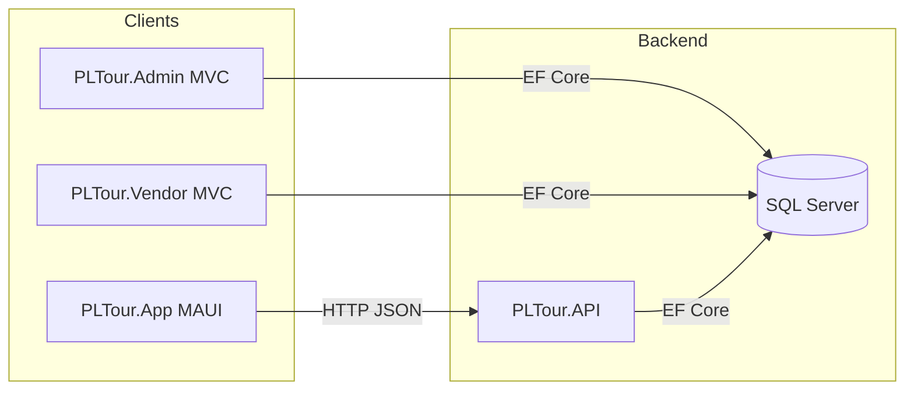

---

## 7. Mô hình dữ liệu quan hệ (ERD)

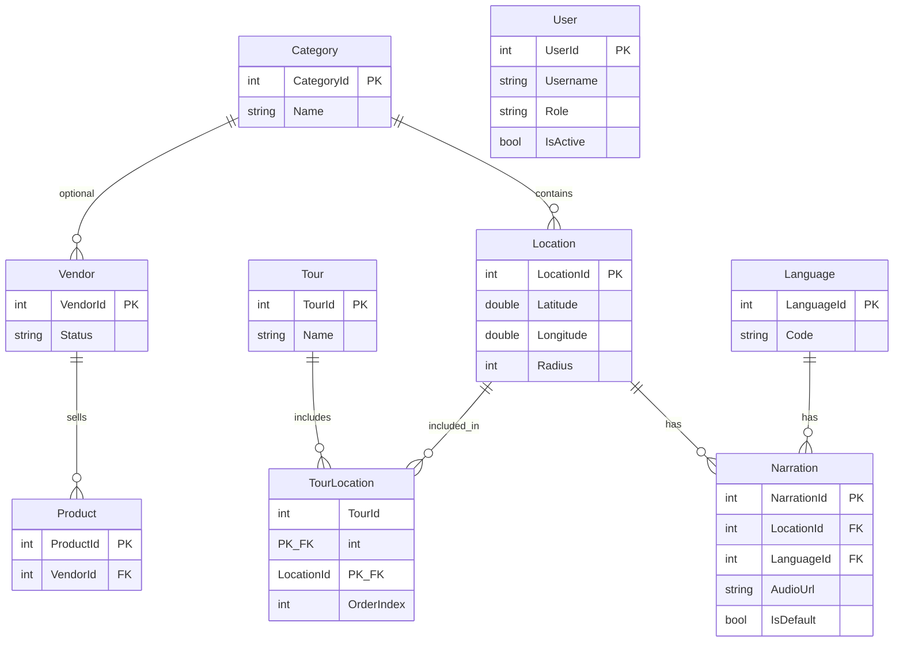

Chi tiết thuộc tính: `PLTour.Shared/Models/Entities/*.cs`.

---

## 8. Use case (tổng quan)

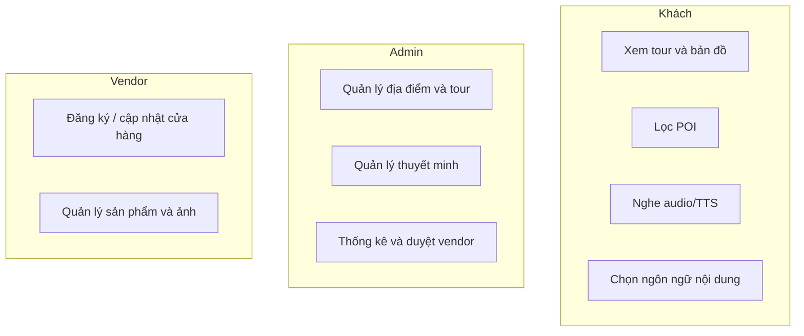

---

## 9. Luồng nghiệp vụ: App tải tour và hiển thị POI

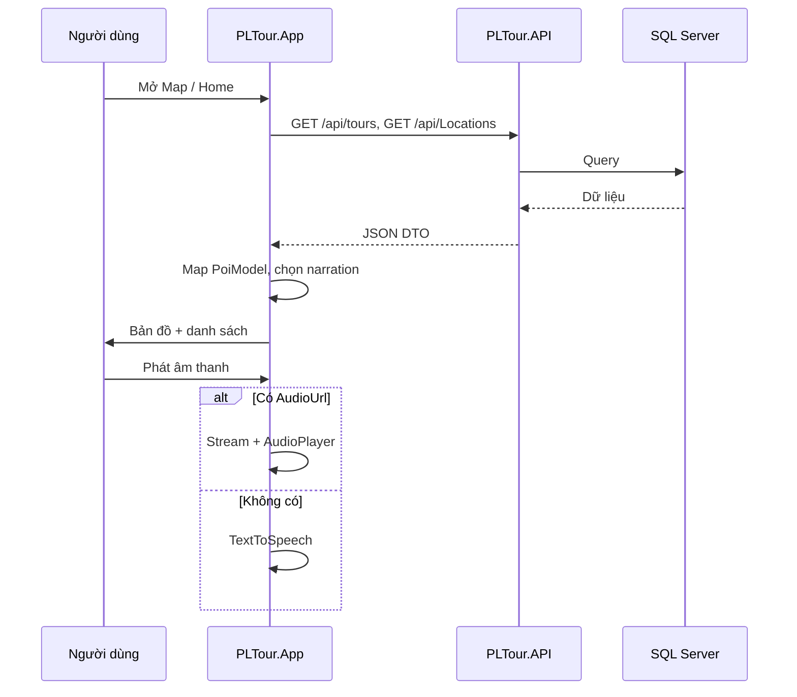

---

<a id="appendix-a"></a>

## Phụ lục A. Biểu đồ Use Case, Activity, Sequence theo từng chức năng

Phần này bổ sung **sơ đồ Use Case** (tác nhân ↔ chức năng), **Activity** (luồng xử lý nội bộ + nhánh điều kiện), **Sequence** (tương tác theo thời gian giữa các thành phần) — tương ứng các module **API**, **Admin**, **Vendor**, **App MAUI** trong đồ án PL-Tour.

---

### A.0. Use Case tổng hợp theo tác nhân

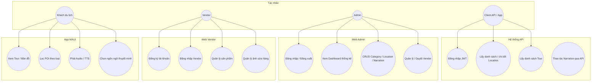

---

### A.1. API — Đăng nhập & cấp JWT

**Use Case (chi tiết nhóm xác thực)**

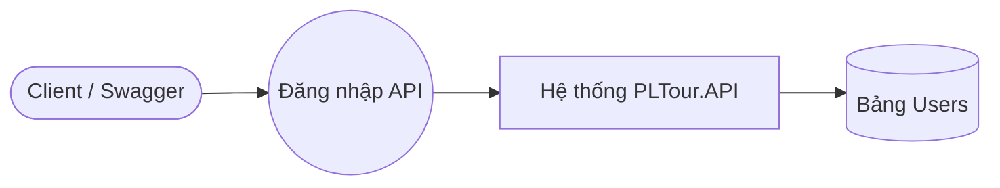

**Activity**

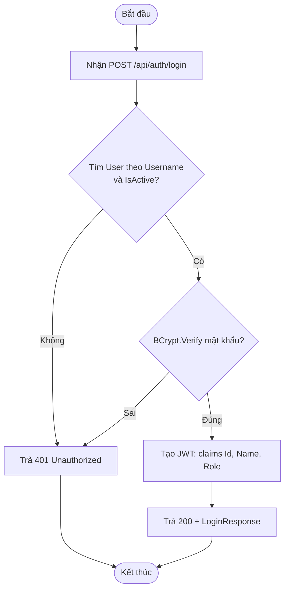

**Sequence**

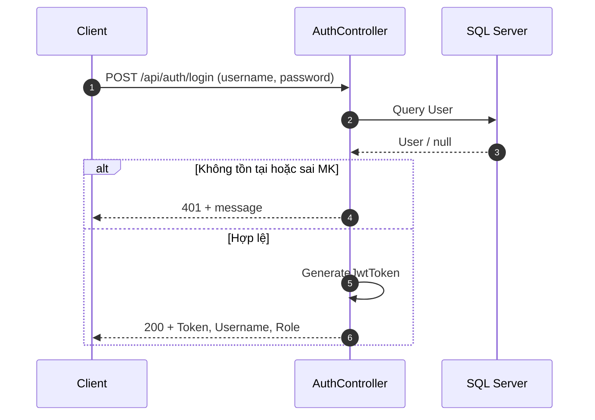

---

### A.2. API — Lấy danh sách địa điểm (có/không lọc bán kính)

**Activity**

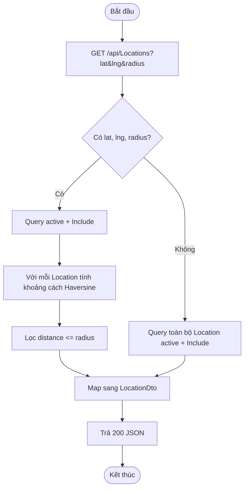

**Sequence**

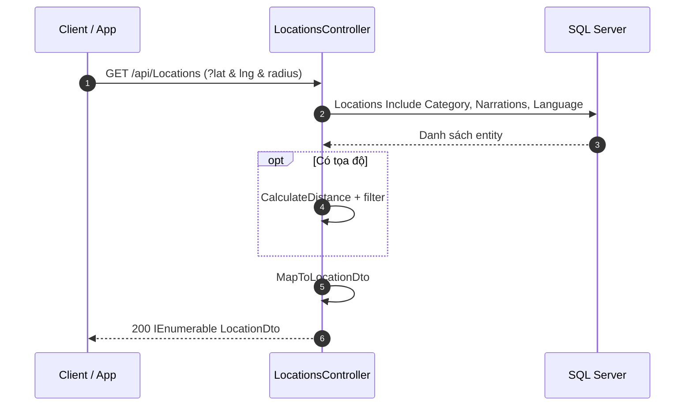

---

### A.3. API — Lấy chi tiết một địa điểm

**Activity**

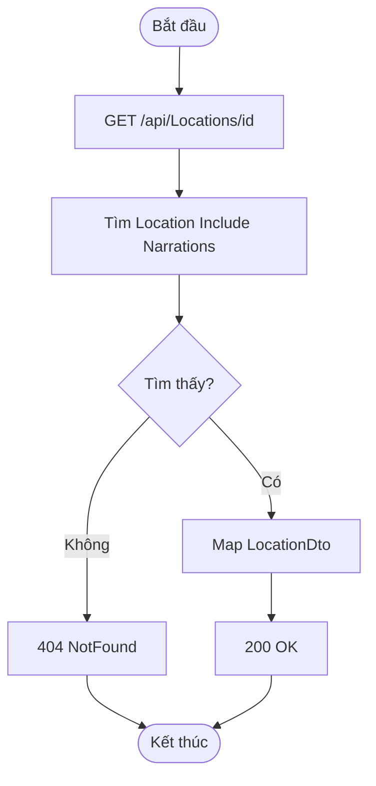

**Sequence**

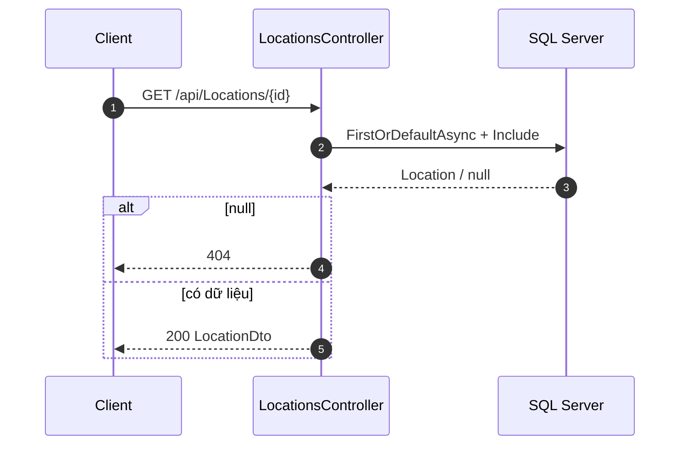

---

### A.4. API — Lấy danh sách Tour (kèm điểm & thuyết minh)

**Activity**

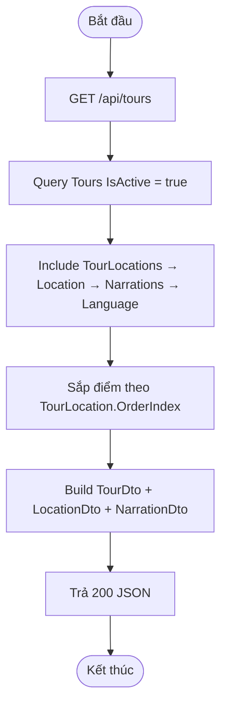

**Sequence**

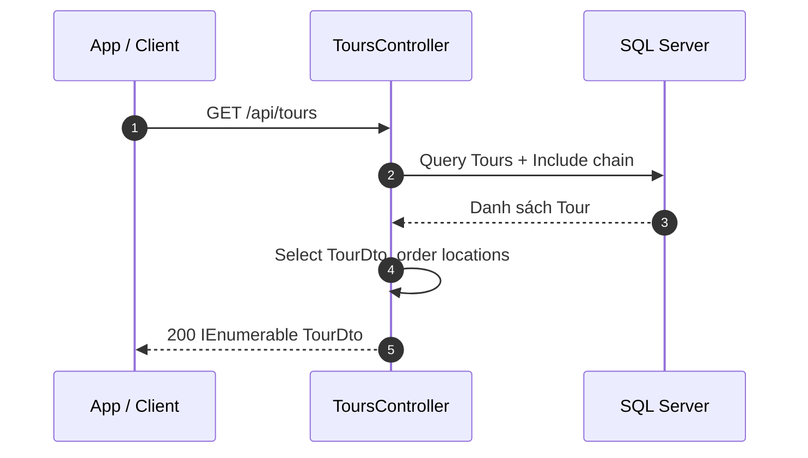

---

### A.5. Admin — Đăng nhập Web (Cookie)

**Use Case**

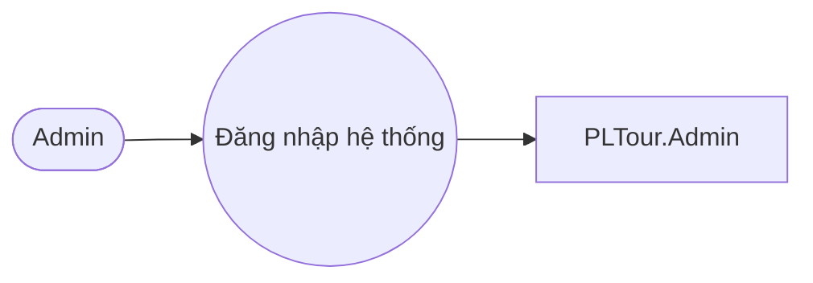

**Activity**

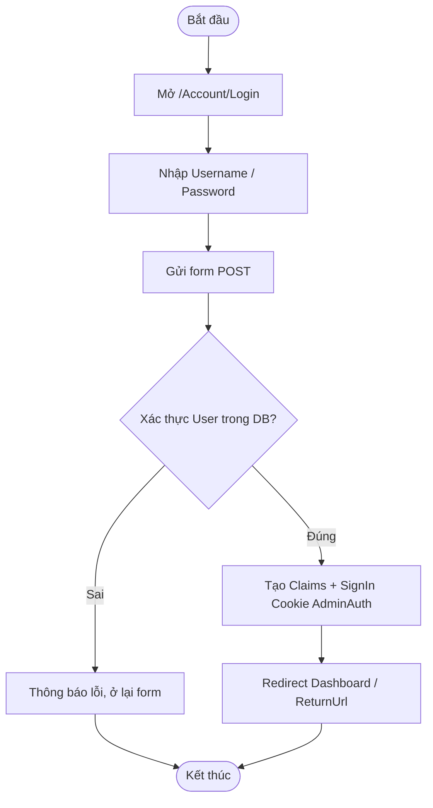

**Sequence**

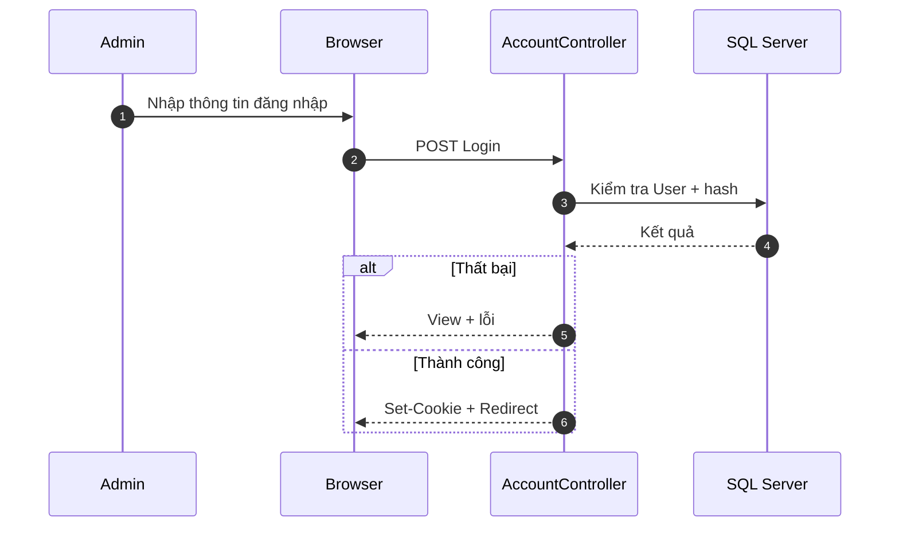

---

### A.6. Admin — Xem Dashboard thống kê

**Activity**

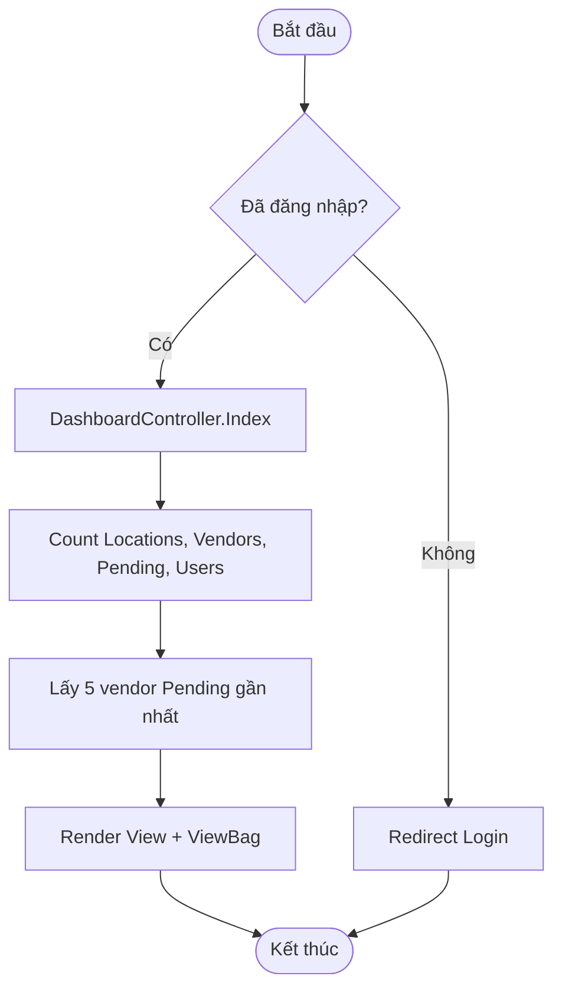

**Sequence**

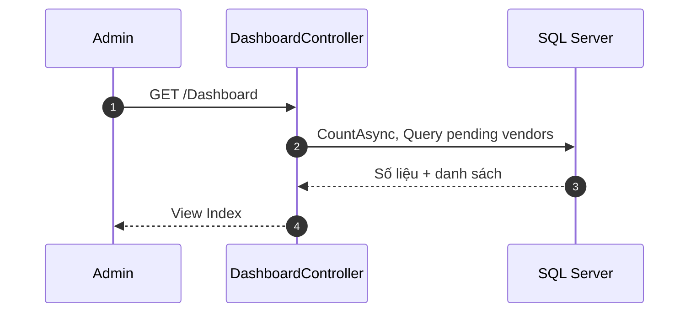

---

### A.7. Admin — Biểu đồ phân bố Location theo Category (AJAX)

**Activity**

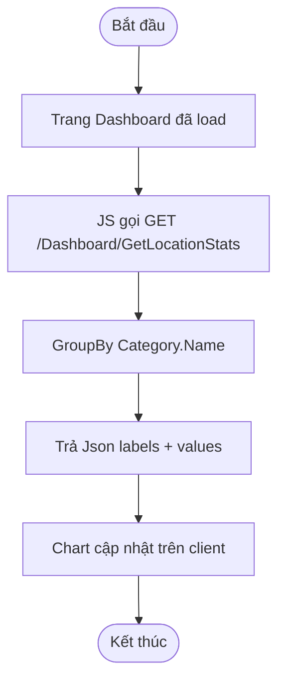

**Sequence**

```mermaid
sequenceDiagram
  autonumber
  participant Br as Browser
  participant DC as DashboardController
  participant DB as SQL Server

  Br->>DC: GET GetLocationStats
  DC->>DB: Locations Include Category, GroupBy
  DB-->>DC: Aggregates
  DC-->>Br: JSON { labels, values }
```

---

### A.8. Admin — Quản lý địa điểm (CRUD điển hình)

**Use Case**

```mermaid
flowchart LR
  AD([Admin]) --> UC1((Thêm/Sửa Location))
  AD --> UC2((Gán Category, Radius, tọa độ))
  UC1 --> SYS[LocationController + DbContext]
  UC2 --> SYS
```

**Activity (lưu địa điểm)**

```mermaid
flowchart TD
  Start([Bắt đầu]) --> A[Mở form Create/Edit]
  A --> B[Nhập Name, Lat, Lng, Radius, CategoryId...]
  B --> C{ModelState hợp lệ?}
  C -->|Không| D[Hiển thị lỗi validation]
  C -->|Có| E[EF Add hoặc Update Location]
  E --> F[SaveChanges]
  F --> G[Redirect danh sách / chi tiết]
  D --> End([Kết thúc])
  G --> End
```

**Sequence**

```mermaid
sequenceDiagram
  autonumber
  participant Ad as Admin
  participant LC as LocationController
  participant DB as SQL Server

  Ad->>LC: POST Create/Edit
  LC->>LC: Validate
  LC->>DB: Add/Update Location
  DB-->>LC: OK
  LC-->>Ad: Redirect + message
```

---

### A.9. Admin — Quản lý thuyết minh (gắn Location + Ngôn ngữ)

**Activity**

```mermaid
flowchart TD
  Start([Bắt đầu]) --> A[Chọn Location]
  A --> B[Thêm/Sửa Narration: Language, Title, Content, AudioUrl]
  B --> C{Đánh dấu IsDefault?}
  C --> D[Lưu — ràng buộc 1 default/location]
  D --> E{Vi phạm unique index?}
  E -->|Có| F[Thông báo / chỉnh lại]
  E -->|Không| G[SaveChanges thành công]
  F --> End([Kết thúc])
  G --> End
```

**Sequence**

```mermaid
sequenceDiagram
  autonumber
  participant Ad as Admin
  participant NC as NarrationController
  participant DB as SQL Server

  Ad->>NC: POST/PUT Narration
  NC->>DB: Save Narration + FK LocationId, LanguageId
  alt Lỗi DB unique default
    DB-->>NC: Exception
    NC-->>Ad: View lỗi
  else OK
    DB-->>NC: OK
    NC-->>Ad: Redirect
  end
```

---

### A.10. Admin — Quản lý / duyệt Vendor

**Activity**

```mermaid
flowchart TD
  Start([Bắt đầu]) --> A[Xem danh sách Vendor]
  A --> B{Thao tác?}
  B -->|Duyệt| C[Cập nhật Status, ApprovedDate, IsActive]
  B -->|Từ chối / Ghi chú| D[Cập nhật Notes / Status]
  B -->|Xem chi tiết| E[Hiển thị thông tin + sản phẩm]
  C --> F[SaveChanges]
  D --> F
  E --> End([Kết thúc])
  F --> End
```

**Sequence**

```mermaid
sequenceDiagram
  autonumber
  participant Ad as Admin
  participant VC as VendorController
  participant DB as SQL Server

  Ad->>VC: Action duyệt / cập nhật
  VC->>DB: Update Vendor
  DB-->>VC: OK
  VC-->>Ad: Redirect / View
```

---

### A.11. Vendor — Đăng ký tài khoản

**Use Case**

```mermaid
flowchart LR
  VE([Vendor]) --> UC((Đăng ký cửa hàng))
  UC --> SYS[VendorRegistrationController]
```

**Activity**

```mermaid
flowchart TD
  Start([Bắt đầu]) --> A[Điền form: ShopName, Email, Phone, Password...]
  A --> B{Email/Phone trùng?}
  B -->|Trùng| C[Thông báo, yêu cầu sửa]
  B -->|Không| D[Hash password]
  D --> E[Vendor Status = Pending, IsActive = false]
  E --> F[SaveChanges]
  F --> G[Thông báo chờ duyệt]
  C --> End([Kết thúc])
  G --> End
```

**Sequence**

```mermaid
sequenceDiagram
  autonumber
  participant Ve as Vendor
  participant RC as VendorRegistrationController
  participant DB as SQL Server

  Ve->>RC: POST đăng ký
  RC->>DB: Kiểm tra trùng + Insert Vendor
  DB-->>RC: OK
  RC-->>Ve: View thành công / lỗi
```

---

### A.12. Vendor — Đăng nhập (Cookie VendorAuth)

**Activity**

```mermaid
flowchart TD
  Start([Bắt đầu]) --> A[POST login Email/Password]
  A --> B{Tìm Vendor + verify hash?}
  B -->|Sai| C[401 / View lỗi]
  B -->|Có| D{IsActive / Status cho phép?}
  D -->|Không| E[Từ chối hoặc thông báo chờ duyệt]
  D -->|Có| F[SignIn Cookie VendorAuth]
  F --> G[Redirect Dashboard]
  C --> End([Kết thúc])
  E --> End
  G --> End
```

**Sequence**

```mermaid
sequenceDiagram
  autonumber
  participant Ve as Vendor
  participant VLC as VendorLoginController
  participant DB as SQL Server

  Ve->>VLC: POST Login
  VLC->>DB: Query Vendor by Email
  DB-->>VLC: Vendor
  VLC->>VLC: BCrypt verify
  VLC-->>Ve: Cookie + Redirect hoặc lỗi
```

---

### A.13. Vendor — Quản lý sản phẩm

**Activity**

```mermaid
flowchart TD
  Start([Bắt đầu]) --> A{Đã VendorAuth?}
  A -->|Không| B[Redirect login]
  A -->|Có| C[CRUD Product thuộc VendorId]
  C --> D[Lưu Name, Price, ImageUrl, Stock...]
  D --> End([Kết thúc])
  B --> End
```

**Sequence**

```mermaid
sequenceDiagram
  autonumber
  participant Ve as Vendor
  participant PC as VendorProductController
  participant DB as SQL Server

  Ve->>PC: POST/PUT Product
  PC->>DB: Add/Update Product (VendorId)
  DB-->>PC: OK
  PC-->>Ve: View / Redirect
```

---

### A.14. Vendor — Quản lý ảnh cửa hàng

**Activity**

```mermaid
flowchart TD
  Start([Bắt đầu]) --> A[Chọn file ảnh]
  A --> B[Upload / lưu URL]
  B --> C[Tạo VendorImage gắn VendorId]
  C --> D[SaveChanges]
  D --> End([Kết thúc])
```

**Sequence**

```mermaid
sequenceDiagram
  autonumber
  participant Ve as Vendor
  participant VIC as VendorImageController
  participant DB as SQL Server

  Ve->>VIC: POST upload / thêm ảnh
  VIC->>VIC: Lưu file hoặc URL
  VIC->>DB: Insert VendorImage
  DB-->>VIC: OK
  VIC-->>Ve: View cập nhật
```

---

### A.15. App MAUI — Tải Tour & POI từ API

**Use Case**

```mermaid
flowchart LR
  K([Khách]) --> UC((Xem tour và điểm trên bản đồ))
  UC --> APP[PLTour.App + ApiService]
```

**Activity**

```mermaid
flowchart TD
  Start([Bắt đầu]) --> A[Khởi tạo HttpClient BaseAddress]
  A --> B[GET api/tours và/hoặc api/Locations]
  B --> C{HTTP thành công?}
  C -->|Lỗi| D[Log + trả list rỗng]
  C -->|OK| E[Deserialize DTO]
  E --> F[Map TourModel / PoiModel]
  F --> G[Chọn narration theo UserLanguage]
  G --> H[Cập nhật UI]
  D --> End([Kết thúc])
  H --> End
```

**Sequence**

```mermaid
sequenceDiagram
  autonumber
  participant U as Người dùng
  participant P as MapPage / HomePage
  participant API as ApiService
  participant S as PLTour.API

  U->>P: Mở tab / OnAppearing
  P->>API: GetToursAsync / GetAllLocationsAsync
  API->>S: GET /api/tours, /api/Locations
  S-->>API: JSON
  API->>API: Map PoiModel + narration
  API-->>P: List models
  P->>U: Hiển thị danh sách / chuẩn bị map
```

---

### A.16. App MAUI — Hiển thị bản đồ & lọc POI theo category

**Activity**

```mermaid
flowchart TD
  Start([Bắt đầu]) --> A[InitializeMap Mapsui]
  A --> B[StartTracking vị trí GPS]
  B --> C[Nhận danh sách PoiModel]
  C --> D[Vẽ layer POI + màu theo CategoryId]
  D --> E{User chọn filter?}
  E -->|Tất cả| F[Hiển thị mọi POI]
  E -->|Một loại| G[Lọc theo category string]
  F --> H[Sắp xếp khoảng cách / cập nhật list]
  G --> H
  H --> End([Kết thúc])
```

**Sequence**

```mermaid
sequenceDiagram
  autonumber
  participant U as Người dùng
  participant P as MapPage
  participant LS as LocationService
  participant MV as MapView Mapsui

  U->>P: Mở Map
  P->>LS: Bắt đầu theo dõi vị trí
  LS-->>P: Tọa độ cập nhật
  P->>MV: Cập nhật layer user + POI
  U->>P: Chọn category filter
  P->>P: Filter _allPois
  P->>MV: Refresh pins / list
```

---

### A.17. App MAUI — Phát thuyết minh (Audio URL hoặc TTS)

**Activity**

```mermaid
flowchart TD
  Start([Bắt đầu]) --> A[User bấm Phát trên POI]
  A --> B{POI đang phát?}
  B -->|Có| C[Dừng player / cancel TTS]
  B -->|Không| D{Có AudioUrl?}
  D -->|Có| E[HttpClient GetStreamAsync]
  E --> F[AudioManager.CreatePlayer + Play]
  F --> G[PlaybackEnded → IsPlaying=false]
  D -->|Không| H[Lấy FullContent hoặc Description]
  H --> I[TextToSpeech.SpeakAsync]
  I --> J[IsPlaying=false]
  C --> End([Kết thúc])
  G --> End
  J --> End
```

**Sequence**

```mermaid
sequenceDiagram
  autonumber
  participant U as Người dùng
  participant P as MapPage
  participant AM as IAudioManager
  participant HTTP as HttpClient
  participant TTS as TextToSpeech

  U->>P: BtnSpeak_Clicked
  alt Có AudioUrl
    P->>HTTP: GetStreamAsync(url)
    HTTP-->>P: Stream
    P->>AM: CreatePlayer(stream)
    P->>P: Play + event Ended
  else Không có URL
    P->>TTS: SpeakAsync(nội dung)
  end
  P-->>U: Cập nhật trạng thái nút
```

---

### A.18. App MAUI — Đổi ngôn ngữ & làm mới dữ liệu map

**Activity**

```mermaid
flowchart TD
  Start([Bắt đầu]) --> A[User đổi UserLanguage trong Preferences]
  A --> B[Quay lại tab Map]
  B --> C[OnAppearing]
  C --> D[LoadDataFromApiAsync]
  D --> E[GET lại Locations/Tours]
  E --> F[Map PoiModel — chọn narration theo code mới]
  F --> G[Vẽ lại map + list]
  G --> End([Kết thúc])
```

**Sequence**

```mermaid
sequenceDiagram
  autonumber
  participant U as Người dùng
  participant Set as Settings / Preferences
  participant P as MapPage
  participant API as ApiService

  U->>Set: Lưu UserLanguage = en
  U->>P: Mở lại Map
  P->>P: OnAppearing
  P->>API: GetAllLocationsAsync
  API->>API: Đọc Preferences UserLanguage
  API->>API: FirstOrDefault narration theo code
  API-->>P: PoiModel đã đổi nội dung
  P->>U: UI theo ngôn ngữ mới
```

---

*Bảng tra nhanh*

| Mục | Use Case | Activity | Sequence |
|-----|----------|----------|----------|
| A.1 | ✓ | ✓ | ✓ |
| A.2–A.4 | Gộp A.0 | ✓ | ✓ |
| A.5–A.10 | ✓ (A.5, A.8) | ✓ | ✓ |
| A.11–A.14 | ✓ (A.11) | ✓ | ✓ |
| A.15–A.18 | ✓ (A.15) | ✓ | ✓ |

---

## 10. DFD — mức 0, 1, 2

### 10.1. DFD mức 0 (ngữ cảnh)

Một quy trình tổng **P0 — Hệ thống PL-Tour**; tác nhân ngoài: **Khách du lịch**, **Admin**, **Vendor**; kho dữ liệu: **CSDL PL-Tour**.

```mermaid
flowchart LR
  K[Khách du lịch]
  A[Admin]
  V[Vendor]
  P0((P0: PL-Tour))
  D[(D1: CSDL PL-Tour)]

  K <-->|Yêu cầu/Phản hồi ứng dụng| P0
  A <-->|Quản trị web| P0
  V <-->|Cổng đối tác| P0
  P0 <-->|Đọc/Ghi| D
```

**Mô tả luồng mức 0**

| Luồng | Mô tả |
|--------|--------|
| Khách ↔ P0 | Tra cứu tour, bản đồ, thuyết minh qua API/app. |
| Admin ↔ P0 | CRUD nội dung, thống kê qua web Admin + EF. |
| Vendor ↔ P0 | Đăng ký, sản phẩm, ảnh qua web Vendor + EF. |
| P0 ↔ D1 | Toàn bộ dữ liệu nghiệp vụ (SQL Server). |

---

### 10.2. DFD mức 1 (phân rã P0)

Phân rã thành các quy trình:

- **1.0** — Quản trị nội dung & đối tác (Admin + Vendor → DB)  
- **2.0** — Cung cấp API đọc dữ liệu & xác thực (API ↔ DB)  
- **3.0** — Trải nghiệm du khách (App ↔ API)

```mermaid
flowchart TB
  K[Khách du lịch]
  AD[Admin]
  VE[Vendor]
  D[(D1: CSDL PL-Tour)]

  subgraph P0_PhanRa["Phân rã P0"]
    P1((1.0 Quản trị & Vendor))
    P2((2.0 API & Auth))
    P3((3.0 App du khách))
  end

  AD <-->|Form/CRUD| P1
  VE <-->|Form/CRUD| P1
  P1 <-->|EF Write/Read| D

  P2 <-->|EF Read/Write| D
  K <-->|HTTP| P3
  P3 <-->|REST JSON| P2
```

**Bảng quy trình mức 1**

| ID | Quy trình | Đầu vào | Đầu ra / Kho |
|----|-----------|---------|----------------|
| 1.0 | Quản trị & Vendor | Thao tác Admin/Vendor | Ghi/đọc **D1** |
| 2.0 | API & Auth | Request HTTP, JWT | Đọc/ghi **D1**, response JSON |
| 3.0 | App du khách | GPS, thao tác UI | Gọi **2.0**, hiển thị map/audio |

---

### 10.3. DFD mức 2 — Phân rã 2.0 (API)

```mermaid
flowchart LR
  APP[Ứng dụng / Client]
  D[(D1: CSDL)]

  subgraph P2_PhanRa["Phân rã 2.0"]
    P21((2.1 Xác thực JWT))
    P22((2.2 Tour & Location))
    P23((2.3 Narration))
  end

  APP -->|Login| P21
  P21 -->|Truy vấn User| D
  P21 -->|Token| APP

  APP -->|GET tours/locations| P22
  P22 -->|Query Tour Location Narration| D
  P22 -->|DTO JSON| APP

  APP -->|GET/POST narration*| P23
  P23 -->|Query Narration| D
```

\*Endpoint narration cụ thể theo `NarrationsController` trong mã nguồn.

**Bảng mức 2 (tiến trình 2.x)**

| ID | Mô tả | Kho dữ liệu |
|----|--------|-------------|
| 2.1 | Kiểm tra User, cấp JWT | Users (**D1**) |
| 2.2 | Lấy tour (có thứ tự điểm), danh sách/chi tiết location, lọc bán kính | Tours, TourLocations, Locations, Categories (**D1**) |
| 2.3 | Thao tác/tra cứu narration theo thiết kế API | Narrations, Languages (**D1**) |

---

### 10.4. DFD mức 2 — Phân rã 3.0 (App du khách) — tùy chọn báo cáo

```mermaid
flowchart TB
  API[Quy trình 2.0 API]
  GPS[GPS thiết bị]

  subgraph P3_PhanRa["Phân rã 3.0"]
    P31((3.1 Tải dữ liệu tour/POI))
    P32((3.2 Hiển thị bản đồ))
    P33((3.3 Phát thuyết minh))
  end

  GPS --> P32
  P31 -->|GET| API
  API -->|DTO| P31
  P31 --> P32
  P32 --> P33
```

---

## 11. User story & acceptance criteria theo sprint

### Sprint 1 — Nền tảng dữ liệu & API

| Story ID | User story | Acceptance criteria |
|----------|------------|---------------------|
| S1-01 | Là **dev**, tôi cần **DbContext và migration** để lưu User, Location, Tour, Narration… | CSDL tạo đủ bảng; seed Language, Category, admin; quan hệ TourLocation đúng khóa kép. |
| S1-02 | Là **client**, tôi cần **GET /api/Locations** để lấy POI active | Trả JSON; include category & narrations; filter lat/lng/radius hoạt động đúng công thức khoảng cách. |
| S1-03 | Là **client**, tôi cần **GET /api/tours** để lấy tour | Chỉ tour `IsActive`; thứ tự điểm theo `OrderIndex`; mỗi điểm có narrations kèm `LanguageCode`. |
| S1-04 | Là **admin hệ thống**, tôi cần **POST login API** để nhận JWT | Sai mật khẩu → 401; đúng → token có role; Swagger có Bearer. |

### Sprint 2 — Web quản trị & vendor

| Story ID | User story | Acceptance criteria |
|----------|------------|---------------------|
| S2-01 | Là **admin**, tôi **đăng nhập web** để vào dashboard | Cookie auth; logout; access denied khi không quyền. |
| S2-02 | Là **admin**, tôi **xem dashboard** để biết tổng quan | Hiển thị số location, vendor, pending, user; danh sách vendor chờ duyệt. |
| S2-03 | Là **admin**, tôi **quản lý Location & Narration** để có dữ liệu cho app | CRUD theo controller; narration gắn language; một default/location (ràng buộc DB). |
| S2-04 | Là **vendor**, tôi **đăng ký và quản lý sản phẩm** | Flow Vendor project; trạng thái Pending hiện trên admin dashboard. |

### Sprint 3 — Ứng dụng MAUI & trải nghiệm du lịch

| Story ID | User story | Acceptance criteria |
|----------|------------|---------------------|
| S3-01 | Là **khách**, tôi **mở app và tải tour** từ API | Loading/Home nhận danh sách tour; xử lý lỗi mạng không crash (trả list rỗng/log). |
| S3-02 | Là **khách**, tôi **xem bản đồ POI** | Mapsui hiển thị pin; lọc category; vị trí người dùng khi có quyền. |
| S3-03 | Là **khách**, tôi **nghe thuyết minh đúng ngôn ngữ** | Preference `UserLanguage`; fallback default/first narration. |
| S3-04 | Là **khách**, tôi **nghe audio hoặc TTS** | Có `AudioUrl` → phát stream; không có → TTS từ nội dung; dừng phát ổn định. |
| S3-05 | Là **khách**, tôi **đổi ngôn ngữ và thấy map cập nhật** | `OnAppearing` reload dữ liệu từ API. |

---

## 12. Ma trận traceability

| Yêu cầu | Thành phần |
|---------|------------|
| REST + JWT | `PLTour.API/Program.cs`, `AuthController.cs` |
| Location + filter | `LocationsController.cs` |
| Tour | `ToursController.cs`, `Tour`, `TourLocation` |
| EF | `PLTourDbContext.cs` |
| App | `ApiService.cs`, `MapPage.xaml.cs` |
| Admin | `DashboardController`, các controller Admin |
| Vendor | `PLTour.Vendor/Controllers/*` |

---

## 13. Tiêu chí chấp nhận tổng thể

1. Admin đăng nhập, dashboard số liệu khớp DB.  
2. Tạo location + ≥2 narration (khác ngôn ngữ); app hiển thị đúng theo `UserLanguage`.  
3. Tour trả đúng thứ tự điểm.  
4. Map: phát audio từ URL; không URL thì TTS đọc được.  
5. Vendor pending xuất hiện trên dashboard admin.

---

## 14. Lộ trình mở rộng

- Thu hẹp CORS; bảo vệ endpoint bằng JWT khi cần.  
- API gợi ý vendor/ưu đãi theo vị trí.  
- Geofence tự động khi vào `Radius`.  
- Offline cache; CDN cho media.

---

*Tài liệu này phản ánh kiến trúc và chức năng theo mã nguồn tại thời điểm lập PRD; khi code thay đổi, cập nhật mục 4, 10, 11 và ma trận mục 12.*
