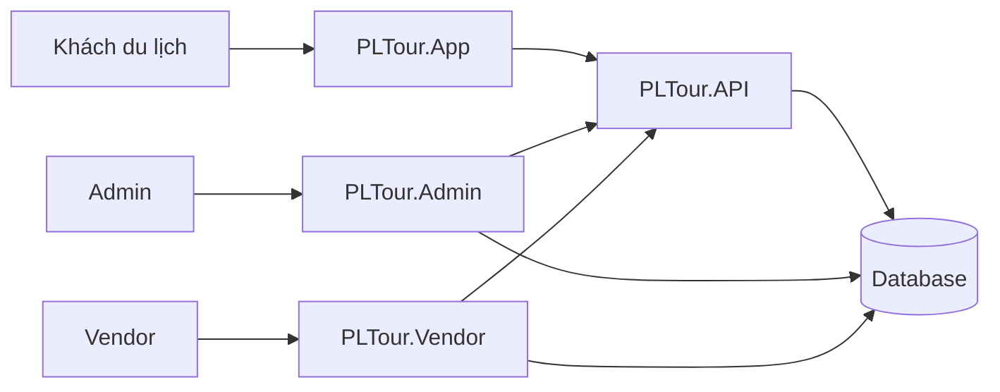
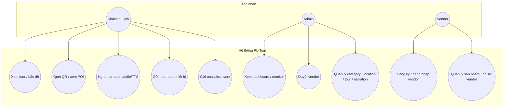
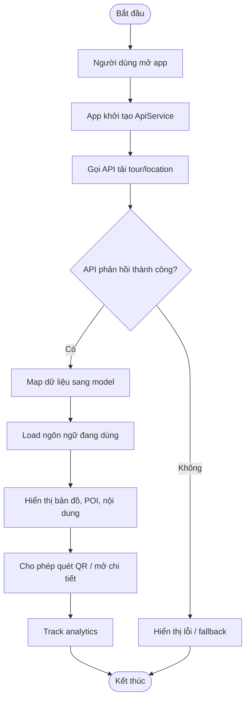
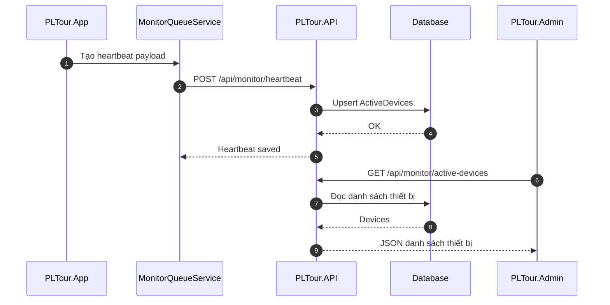
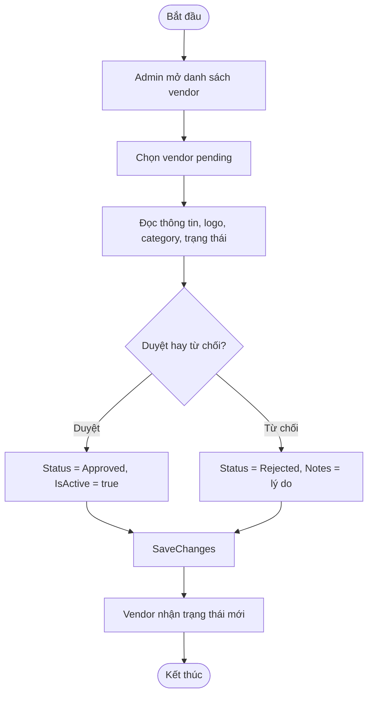
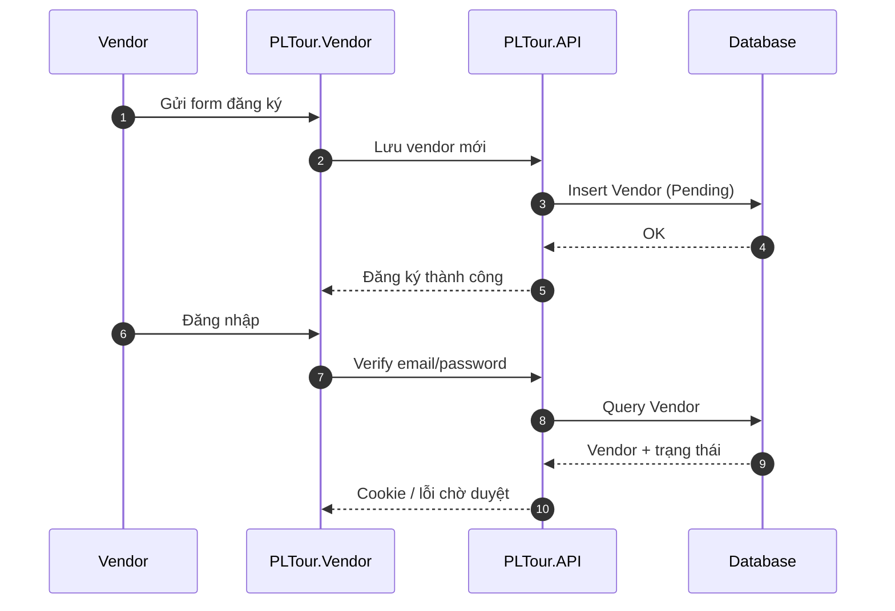
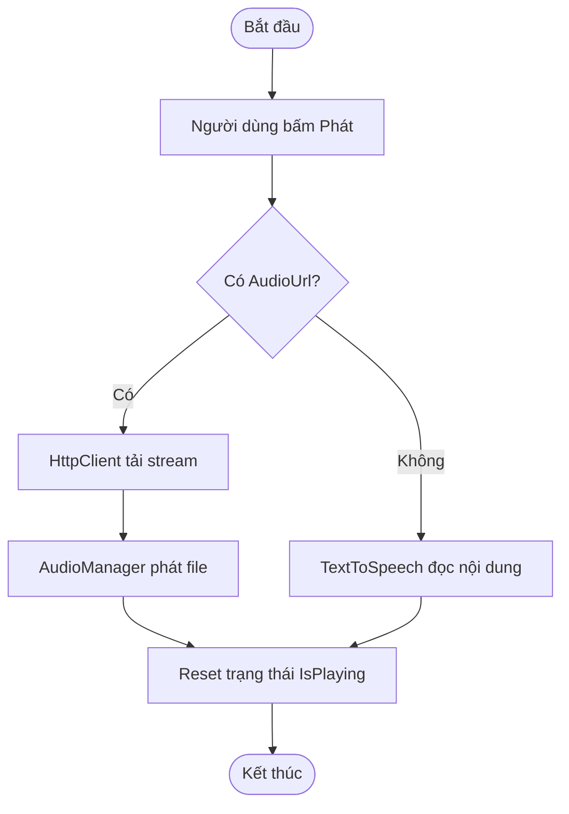
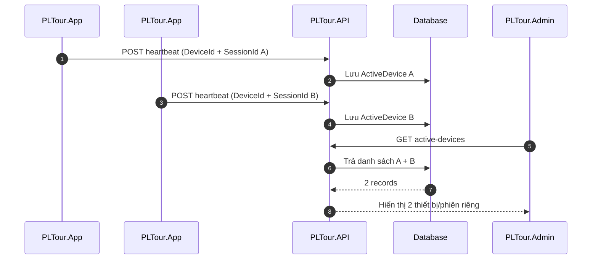

# PRD — PL-Tour

**Phiên bản:** 1.4  
**Ngày cập nhật:** 08/05/2026  
**Phạm vi:** Hệ thống PL-Tour gồm API, Admin, Vendor, và Mobile App

---

## Mục lục

1. [Tổng quan sản phẩm](#1-tổng-quan-sản-phẩm)
2. [Mục tiêu và phạm vi](#2-mục-tiêu-và-phạm-vi)
3. [Đối tượng sử dụng](#3-đối-tượng-sử-dụng)
4. [Danh mục chức năng](#4-danh-mục-chức-năng)
5. [Trạng thái hoàn thiện chức năng](#5-trạng-thái-hoàn-thiện-chức-năng)
6. [Sơ đồ nghiệp vụ đầy đủ](#6-sơ-đồ-nghiệp-vụ-đầy-đủ)
7. [Luồng nghiệp vụ chính](#7-luồng-nghiệp-vụ-chính)
8. [Dữ liệu chính](#8-dữ-liệu-chính)
9. [Rủi ro, giả định và điểm còn thiếu](#9-rủi-ro-giả-định-và-điểm-còn-thiếu)
10. [Tiêu chí hoàn thành](#10-tiêu-chí-hoàn-thành)
11. [Ghi chú triển khai](#11-ghi-chú-triển-khai)

---

## 1. Tổng quan sản phẩm

PL-Tour là nền tảng du lịch thông minh giúp người dùng khám phá địa điểm, xem tour trên bản đồ, quét QR, nghe thuyết minh đa ngôn ngữ, và theo dõi thông tin dịch vụ từ vendor. Hệ thống gồm:

- `PLTour.API` — backend REST API
- `PLTour.Admin` — cổng quản trị
- `PLTour.Vendor` — cổng vendor
- `PLTour.App` — ứng dụng MAUI cho khách du lịch
- `PLTour.Shared` — entity/DTO dùng chung

---

## 2. Mục tiêu và phạm vi

### 2.1 Mục tiêu

1. Hỗ trợ khách du lịch tra cứu điểm đến nhanh và trực quan.
2. Cung cấp trải nghiệm thuyết minh theo ngôn ngữ và audio.
3. Cho phép admin quản lý nội dung, vendor, và thiết bị monitor.
4. Cho phép vendor đăng ký, được duyệt, rồi quản lý cửa hàng/sản phẩm.
5. Đảm bảo app mobile có thể gửi heartbeat và analytics để admin giám sát.

### 2.2 Phạm vi

#### Trong phạm vi
- API đọc/ghi dữ liệu tour, location, narration, vendor, monitor.
- Admin dashboard, analytics, và monitor thiết bị.
- Vendor đăng ký, đăng nhập, cập nhật profile, quản lý cửa hàng/sản phẩm/ảnh.
- Mobile app xem bản đồ, quét QR, nghe narration, gửi heartbeat và analytics.

#### Ngoài phạm vi
- Thanh toán online phức tạp end-to-end.
- Booking engine riêng.
- Offline sync đầy đủ hai chiều.
- Push notification realtime.

---

## 3. Đối tượng sử dụng

### 3.1 Khách du lịch
- Dùng app mobile để xem tour, bản đồ, POI, nghe audio/TTS.
- Quét QR để mở nhanh nội dung liên quan.
- Theo dõi lịch sử phát âm thanh và thao tác gần nhất.

### 3.2 Admin
- Quản lý category, location, tour, narration, vendor.
- Xem dashboard, analytics, monitor thiết bị.
- Theo dõi tình trạng heartbeat, online/stale/offline.

### 3.3 Vendor
- Đăng ký gian hàng.
- Đăng nhập sau khi được duyệt.
- Cập nhật hồ sơ, logo, ảnh, cửa hàng, sản phẩm.

---

## 4. Danh mục chức năng

### 4.1 API

#### Đã có / đang vận hành
- Đăng nhập và cấp JWT cho các luồng cần auth.
- Trả danh sách tour và location.
- Trả narration theo ngôn ngữ.
- Ghi nhận heartbeat thiết bị.
- Ghi nhận analytics event.
- Trả danh sách thiết bị đang hoạt động.
- Trả chi tiết thiết bị theo `DeviceId`.
- Ghi nhận dữ liệu QR / audio / tour theo controller hiện có.

#### Chưa hoàn chỉnh / cần kiểm tra thêm
- Chuẩn hóa phân trang và lọc cho các endpoint danh sách.
- Thống nhất chuẩn trả lỗi API.
- Bổ sung validation chặt hơn cho payload heartbeat/event.
- Tối ưu đồng bộ dữ liệu monitor giữa nhiều session của cùng thiết bị.

### 4.2 Admin

#### Đã có / đang vận hành
- Dashboard thống kê.
- CRUD category, location, tour, narration.
- Duyệt vendor.
- Monitor thiết bị và trạng thái online/stale/offline.
- Xem chi tiết thiết bị.
- Xem analytics dashboard.

#### Chưa hoàn chỉnh / cần kiểm tra thêm
- Chuẩn hóa hiển thị trạng thái thiết bị theo session.
- Bổ sung tìm kiếm/lọc nâng cao cho monitor.
- Làm rõ dashboard thống kê theo khoảng thời gian và theo loại sự kiện.
- Đồng bộ giữa màn hình danh sách và màn hình chi tiết monitor.

### 4.3 Vendor

#### Đã có / đang vận hành
- Đăng ký tài khoản.
- Đăng nhập.
- Cập nhật profile cửa hàng.
- Quản lý sản phẩm.
- Quản lý ảnh/logo.
- Quản lý store/vendor data.

#### Chưa hoàn chỉnh / cần kiểm tra thêm
- Flow duyệt vendor/reject vendor cần chuẩn hóa thông báo.
- Validation form đăng ký/chỉnh sửa chưa đồng nhất toàn bộ.
- Một số màn hình cần kiểm tra lại UX khi dữ liệu rỗng.

### 4.4 Mobile App

#### Đã có / đang vận hành
- Tải tour/location từ API.
- Hiển thị bản đồ và POI.
- Phát audio hoặc TTS.
- Chọn ngôn ngữ hiển thị/narration.
- Gửi heartbeat và analytics.
- Lưu trạng thái lịch sử phát và cấu hình tự động phát.

#### Chưa hoàn chỉnh / cần kiểm tra thêm
- Cần chuẩn hóa base URL giữa môi trường debug/prod.
- Cần xác nhận heartbeat chạy đúng trên nhiều thiết bị.
- Cần kiểm tra lại việc giữ session monitor khi app restart.
- Cần bổ sung quy tắc retry/backoff cho queue khi mạng yếu.

---

## 5. Trạng thái hoàn thiện chức năng

### 5.1 Bảng trạng thái tổng hợp

| Nhóm chức năng | Trạng thái | Ghi chú |
|---|---|---|
| API tour/location/narration | Hoàn chỉnh cơ bản | Có thể dùng cho luồng chính |
| API monitor/heartbeat | Hoàn chỉnh cơ bản | Cần kiểm tra đồng bộ nhiều device/session |
| API analytics event | Hoàn chỉnh cơ bản | Cần chuẩn hóa báo cáo theo thời gian |
| Admin dashboard | Hoàn chỉnh cơ bản | Có thể cần mở rộng filter |
| Admin monitor thiết bị | Chưa hoàn chỉnh hoàn toàn | Cần làm rõ hiển thị multi-session |
| Admin vendor approval | Hoàn chỉnh cơ bản | Cần chuẩn hóa UX và feedback |
| Vendor register/login | Hoàn chỉnh cơ bản | Cần kiểm tra validate/edge case |
| Vendor quản lý sản phẩm | Hoàn chỉnh cơ bản | Cần kiểm tra màn hình trống |
| Mobile map/POI/narration | Hoàn chỉnh cơ bản | Luồng chính đã có |
| Mobile heartbeat queue | Chưa hoàn chỉnh hoàn toàn | Cần xác nhận retry hoạt động ổn |
| Báo cáo analytics nâng cao | Chưa hoàn chỉnh | Cần thêm dashboard theo KPI |

### 5.2 Danh sách chức năng đã hoàn thành

- Load tour/location trên app.
- Hiển thị POI trên bản đồ.
- Phát narration audio/TTS.
- Quét QR để mở nội dung.
- Vendor đăng ký, đăng nhập, quản lý dữ liệu.
- Admin duyệt vendor và quản lý nội dung.
- Ghi nhận heartbeat và analytics.
- Monitor thiết bị online/stale/offline.

### 5.3 Danh sách chức năng chưa hoàn chỉnh

- Phân biệt đầy đủ nhiều session của cùng thiết bị ở monitor.
- Thống kê monitor và analytics nâng cao theo thời gian thực hơn.
- Chuẩn hóa nhiều màn hình admin/vendor về UX và empty state.
- Đồng bộ cấu hình base URL / môi trường triển khai.
- Bổ sung kiểm thử tích hợp cho luồng heartbeat/analytics.

---

## 6. Sơ đồ nghiệp vụ đầy đủ

### 6.1 Sơ đồ ngữ cảnh hệ thống

```mermaid
flowchart LR
  K[Khách du lịch]
  AD[Admin]
  VE[Vendor]
  APP[PLTour.App]
  ADM[PLTour.Admin]
  VEN[PLTour.Vendor]
  API[PLTour.API]
  DB[(Database)]

  K --> APP
  AD --> ADM
  VE --> VEN

  APP --> API
  ADM --> API
  VEN --> API
  API --> DB
  ADM --> DB
  VEN --> DB
```

### 6.2 Sơ đồ use case tổng hợp

```mermaid
flowchart TB
  subgraph Actors["Tác nhân"]
    U1((Khách du lịch))
    U2((Admin))
    U3((Vendor))
  end

  subgraph System["Hệ thống PL-Tour"]
    UC1((Xem tour / bản đồ))
    UC2((Quét QR / xem POI))
    UC3((Nghe narration audio/TTS))
    UC4((Gửi heartbeat thiết bị))
    UC5((Gửi analytics event))
    UC6((Xem dashboard / monitor))
    UC7((Duyệt vendor))
    UC8((Đăng ký / đăng nhập vendor))
    UC9((Quản lý sản phẩm / hồ sơ vendor))
    UC10((Quản lý category / location / tour / narration))
  end

  U1 --> UC1
  U1 --> UC2
  U1 --> UC3
  U1 --> UC4
  U1 --> UC5
  U2 --> UC6
  U2 --> UC7
  U2 --> UC10
  U3 --> UC8
  U3 --> UC9
```

### 6.3 Activity — khách mở app và tải dữ liệu

```mermaid
flowchart TD
  Start([Bắt đầu]) --> A[Người dùng mở app]
  A --> B[App khởi tạo ApiService]
  B --> C[Gọi API tải tour/location]
  C --> D{API phản hồi thành công?}
  D -->|Không| E[Hiển thị lỗi / fallback]
  D -->|Có| F[Map dữ liệu sang model]
  F --> G[Load ngôn ngữ đang dùng]
  G --> H[Hiển thị bản đồ, POI, nội dung]
  H --> I[Cho phép quét QR / mở chi tiết]
  I --> J[Track analytics]
  J --> End([Kết thúc])
  E --> End
```

### 6.4 Sequence — app gửi heartbeat cho admin

```mermaid
sequenceDiagram
  autonumber
  participant App as PLTour.App
  participant MQ as MonitorQueueService
  participant API as PLTour.API
  participant DB as Database
  participant ADM as PLTour.Admin

  App->>MQ: Tạo heartbeat payload
  MQ->>API: POST /api/monitor/heartbeat
  API->>DB: Upsert ActiveDevices
  DB-->>API: OK
  API-->>MQ: Heartbeat saved
  ADM->>API: GET /api/monitor/active-devices
  API->>DB: Đọc danh sách thiết bị
  DB-->>API: Devices
  API-->>ADM: JSON danh sách thiết bị
```

### 6.5 Activity — admin duyệt vendor

```mermaid
flowchart TD
  Start([Bắt đầu]) --> A[Admin mở danh sách vendor]
  A --> B[Chọn vendor pending]
  B --> C[Đọc thông tin, logo, category, trạng thái]
  C --> D{Duyệt hay từ chối?}
  D -->|Duyệt| E[Status = Approved, IsActive = true]
  D -->|Từ chối| F[Status = Rejected, Notes = lý do]
  E --> G[SaveChanges]
  F --> G
  G --> H[Vendor nhận trạng thái mới]
  H --> End([Kết thúc])
```

### 6.6 Sequence — vendor đăng ký và login

```mermaid
sequenceDiagram
  autonumber
  participant V as Vendor
  participant WEB as PLTour.Vendor
  participant API as PLTour.API
  participant DB as Database

  V->>WEB: Gửi form đăng ký
  WEB->>API: Lưu vendor mới
  API->>DB: Insert Vendor (Pending)
  DB-->>API: OK
  API-->>WEB: Đăng ký thành công
  V->>WEB: Đăng nhập
  WEB->>API: Verify email/password
  API->>DB: Query Vendor
  DB-->>API: Vendor + trạng thái
  API-->>WEB: Cookie / lỗi chờ duyệt
```

### 6.7 Activity — phát narration trong app

```mermaid
flowchart TD
  Start([Bắt đầu]) --> A[Người dùng bấm Phát]
  A --> B{Có AudioUrl?}
  B -->|Có| C[HttpClient tải stream]
  C --> D[AudioManager phát file]
  B -->|Không| E[TextToSpeech đọc nội dung]
  D --> F[Reset trạng thái IsPlaying]
  E --> F
  F --> End([Kết thúc])
```

### 6.8 Sequence — monitor thiết bị nhiều phiên

```mermaid
sequenceDiagram
  autonumber
  participant App1 as PLTour.App #1
  participant App2 as PLTour.App #2
  participant API as PLTour.API
  participant DB as Database
  participant ADM as PLTour.Admin

  App1->>API: POST heartbeat (DeviceId + SessionId A)
  API->>DB: Lưu ActiveDevice A
  App2->>API: POST heartbeat (DeviceId + SessionId B)
  API->>DB: Lưu ActiveDevice B
  ADM->>API: GET active-devices
  API->>DB: Trả danh sách A + B
  DB-->>API: 2 records
  API-->>ADM: Hiển thị 2 thiết bị/phiên riêng
```

---

## 7. Luồng nghiệp vụ chính

### 7.1 Khách mở app
1. App tải tour/location từ API.
2. Map render POI.
3. App chọn narration theo ngôn ngữ hiện tại.
4. Nếu có `AudioUrl` thì phát audio, nếu không thì dùng TTS.
5. App gửi heartbeat và analytics về API.

### 7.2 Admin theo dõi thiết bị
1. App gửi heartbeat về `POST /api/monitor/heartbeat`.
2. API cập nhật hoặc tạo record trong bảng `ActiveDevices`.
3. Admin mở trang Monitor để xem danh sách thiết bị.
4. Trang Monitor đọc dữ liệu từ `GET /api/monitor/active-devices`.
5. Monitor cần phân biệt rõ `DeviceId` và `SessionId` khi nhiều phiên cùng thiết bị.

### 7.3 Vendor đăng ký và được duyệt
1. Vendor đăng ký gian hàng.
2. Tài khoản ở trạng thái pending.
3. Admin duyệt vendor.
4. Vendor login và quản lý cửa hàng/sản phẩm.

### 7.4 Analytics và monitor
1. App gửi event theo thao tác người dùng.
2. API lưu `AnalyticsEvent`.
3. Admin xem dashboard để theo dõi xu hướng.
4. Dữ liệu heartbeat giúp admin biết thiết bị đang online/stale/offline.

---

## 8. Dữ liệu chính

### 8.1 Shared entities
- `Vendor`
- `VendorStore`
- `VendorImage`
- `Product`
- `Tour`
- `TourLocation`
- `TourNarration`
- `TourAudio`
- `Location`
- `Narration`
- `Language`
- `Category`
- `ActiveDevice`
- `AnalyticsEvent`
- `User`

### 8.2 Các điểm cần lưu ý
- Một số cột trong DB có thể là null.
- Model cần khớp schema hiện tại để tránh lỗi cast.
- Base URL API của app và heartbeat phải đồng nhất hoặc được cấu hình rõ ràng.
- Dữ liệu monitor cần tránh ghi đè khi nhiều session cùng `DeviceId`.

### 8.3 Quan hệ dữ liệu quan trọng
- `Location` thuộc `Category`.
- `Narration` thuộc `Location` và `Language`.
- `Tour` liên kết nhiều `Location` thông qua `TourLocation`.
- `Vendor` có thể có nhiều `Store`, `Product`, `VendorImage`.
- `ActiveDevice` lưu heartbeat từng thiết bị/phiên.
- `AnalyticsEvent` gắn với session/device và có thể gắn location/tour.

---

## 9. Rủi ro, giả định và điểm còn thiếu

### 9.1 Rủi ro
1. Sai base URL giữa app data và heartbeat.
2. Schema DB và entity dễ bị lệch khi merge nhiều nhánh.
3. Một số cột nullable trong DB có thể gây runtime exception nếu model không cho phép null.
4. Vendor/Admin/App dùng chung entity nên cần đồng bộ rất cẩn thận.
5. Nếu monitor không phân biệt session, dữ liệu thiết bị có thể bị gộp sai.

### 9.2 Giả định
- Hệ thống chạy với mạng đủ ổn định để gửi heartbeat định kỳ.
- Admin và vendor chỉ dùng các luồng đã được phân quyền.
- Dữ liệu tour/location/narration đã được seed hoặc nhập đầy đủ.

### 9.3 Điểm còn thiếu hoặc cần hoàn thiện
- Chuẩn hóa hoàn toàn monitor multi-session/multi-device.
- Tăng độ chi tiết của dashboard analytics.
- Bổ sung test tự động cho heartbeat/monitor/analytics.
- Hoàn thiện UX cho các màn hình rỗng, lỗi, chờ duyệt.
- Chuẩn hóa logging, retry, và error handling trên toàn hệ thống.

---

## 10. Tiêu chí hoàn thành

- App tải dữ liệu tour/location thành công.
- Admin Monitor nhận heartbeat và hiển thị thiết bị.
- Vendor đăng ký/login/approve chạy ổn.
- Không còn lỗi schema null/cột không tồn tại ở flow chính.
- Heartbeat, analytics, và monitor hoạt động được trên nhiều thiết bị.
- Các chức năng đã và chưa hoàn chỉnh được liệt kê rõ ràng trong PRD.
- Sơ đồ nghiệp vụ thể hiện đủ luồng chính của app, admin, vendor, monitor.

---

## 11. Ghi chú triển khai

- Nên dùng một cấu hình base URL tập trung cho app.
- Nên có migration/backfill nếu DB có dữ liệu cũ thiếu cột mới.
- Khi cập nhật entity `Vendor`, phải kiểm tra toàn bộ Admin + Vendor + API.
- PRD này nên được cập nhật theo mỗi lần thay đổi schema hoặc luồng nghiệp vụ.
- Nếu có thay đổi monitor, cần cập nhật cả API, Admin UI, và Mobile heartbeat flow.
