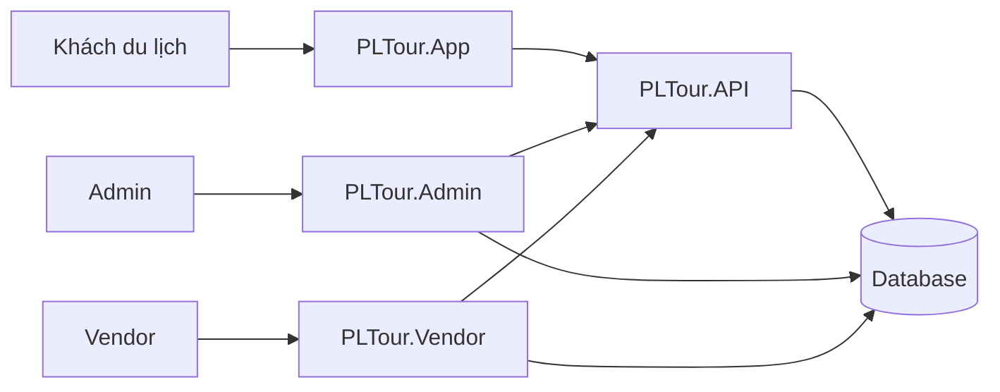
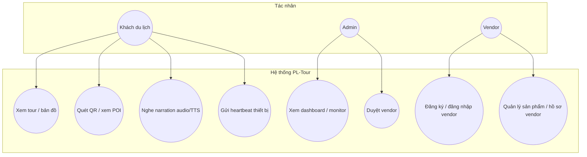
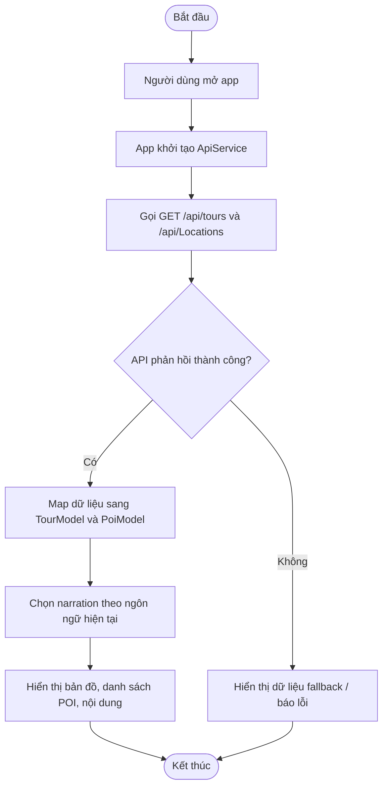
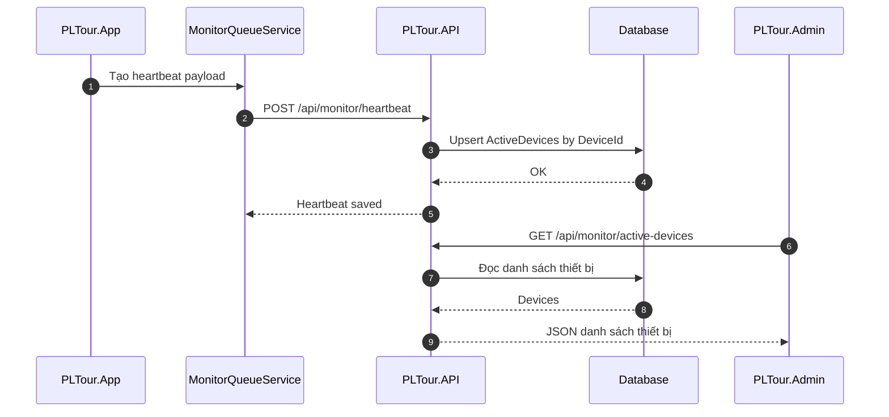
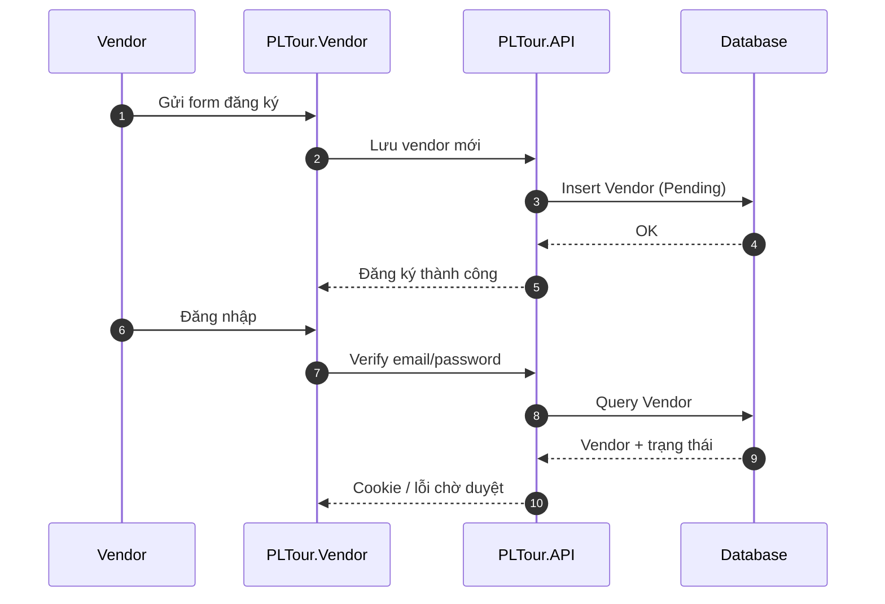

# PRD — PL-Tour

**Phiên bản:** 1.2  
**Ngày cập nhật:** 08/05/2026  
**Phạm vi:** Hệ thống PL-Tour gồm API, Admin, Vendor, và Mobile App

---

## 1. Tóm tắt sản phẩm

PL-Tour là nền tảng du lịch thông minh giúp người dùng khám phá địa điểm, xem tour trên bản đồ, quét QR, nghe thuyết minh đa ngôn ngữ, và theo dõi thông tin dịch vụ từ các vendor. Hệ thống gồm:

- `PLTour.API` — backend REST API
- `PLTour.Admin` — cổng quản trị
- `PLTour.Vendor` — cổng vendor
- `PLTour.App` — ứng dụng MAUI cho khách du lịch
- `PLTour.Shared` — entity/DTO dùng chung

---

## 2. Mục tiêu

1. Hỗ trợ khách du lịch tra cứu điểm đến nhanh và trực quan.
2. Cung cấp trải nghiệm thuyết minh theo ngôn ngữ và audio.
3. Cho phép admin quản lý nội dung, vendor, và thiết bị monitor.
4. Cho phép vendor đăng ký, được duyệt, rồi quản lý cửa hàng/sản phẩm.
5. Đảm bảo app mobile có thể gửi heartbeat và analytics để admin giám sát.

---

## 3. Người dùng mục tiêu

### 3.1 Khách du lịch
- Dùng app mobile để xem tour, bản đồ, POI, nghe audio/TTS.
- Quét QR để mở nhanh nội dung liên quan.

### 3.2 Admin
- Quản lý location, tour, narration, vendor.
- Xem dashboard và monitor thiết bị.
- Theo dõi analytics và trạng thái heartbeat.

### 3.3 Vendor
- Đăng ký gian hàng.
- Đăng nhập sau khi được duyệt.
- Cập nhật hồ sơ, logo, sản phẩm.

---

## 4. Phạm vi chức năng

### 4.1 API
- Đăng nhập và cấp JWT.
- Trả danh sách tour và location.
- Trả narration theo ngôn ngữ.
- Ghi nhận heartbeat thiết bị.
- Ghi nhận analytics event.
- Trả danh sách thiết bị đang hoạt động.

### 4.2 Admin
- Dashboard thống kê.
- CRUD category, location, tour, narration.
- Duyệt vendor.
- Monitor thiết bị và trạng thái online/stale/offline.

### 4.3 Vendor
- Đăng ký tài khoản.
- Đăng nhập.
- Cập nhật profile cửa hàng.
- Quản lý sản phẩm.
- Quản lý ảnh/logo.

### 4.4 Mobile App
- Tải tour/location từ API.
- Hiển thị bản đồ và POI.
- Phát audio hoặc TTS.
- Chọn ngôn ngữ hiển thị/narration.
- Gửi heartbeat và analytics.

---

## 5. Yêu cầu chi tiết

### 5.1 Mobile App
- Tải dữ liệu từ API thành công khi app khởi động hoặc `OnAppearing`.
- Hiển thị POI trên bản đồ.
- Hỗ trợ auto-play thuyết minh khi vào vùng POI nếu được bật.
- Chặn phát lặp khi người dùng vẫn còn ở trong vùng.
- Gửi heartbeat theo chu kỳ để admin monitor nhận biết thiết bị.
- Gửi analytics event khi mở app, mở màn hình, chọn ngôn ngữ, phát audio, quét QR.

### 5.2 Admin Monitor
- Hiển thị danh sách device và trạng thái theo heartbeat gần nhất.
- Hiển thị thông tin thiết bị: tên máy, model, OS, app version, pin, vị trí, thời gian heartbeat.
- Tự động phân loại `online`, `stale`, `offline` theo thời gian.

### 5.3 Vendor
- Đăng ký vendor với thông tin cửa hàng và liên hệ.
- Chờ admin duyệt trước khi login được.
- Cho phép sửa profile, upload logo, cập nhật địa chỉ và mô tả.

---

## 6. Yêu cầu phi chức năng

- **Tính ổn định:** retry queue cho heartbeat/analytics khi mạng yếu.
- **Tính nhất quán:** entity shared giữa các project phải đồng bộ với schema DB.
- **Bảo mật:** mật khẩu hash; admin/vendor auth riêng; không lưu secret trong source code.
- **Khả năng mở rộng:** nhiều thiết bị có thể cùng gửi heartbeat về hệ thống.
- **Hiệu năng:** phản hồi API đủ nhanh cho app mobile.

---

## 7. Sơ đồ nghiệp vụ chính

### 7.1 Sơ đồ ngữ cảnh hệ thống

```mermaid
flowchart LR
  K[Khách du lịch]
  AD[Admin]
  VE[Vendor]
  APP[PLTour.App]
  ADM[PLTour.Admin]
  VEN[PLTour.Vendor]
  API[PLTour.API]
  DB[(Database)]

  K --> APP
  AD --> ADM
  VE --> VEN

  APP --> API
  ADM --> API
  VEN --> API
  API --> DB
  ADM --> DB
  VEN --> DB
```

### 7.2 Sơ đồ use case tổng hợp

```mermaid
flowchart TB
  subgraph Actors["Tác nhân"]
    U1((Khách du lịch))
    U2((Admin))
    U3((Vendor))
  end

  subgraph System["Hệ thống PL-Tour"]
    UC1((Xem tour / bản đồ))
    UC2((Quét QR / xem POI))
    UC3((Nghe narration audio/TTS))
    UC4((Gửi heartbeat thiết bị))
    UC5((Xem dashboard / monitor))
    UC6((Duyệt vendor))
    UC7((Đăng ký / đăng nhập vendor))
    UC8((Quản lý sản phẩm / hồ sơ vendor))
  end

  U1 --> UC1
  U1 --> UC2
  U1 --> UC3
  U1 --> UC4
  U2 --> UC5
  U2 --> UC6
  U3 --> UC7
  U3 --> UC8
```

### 7.3 Activity — khách mở app và tải dữ liệu

```mermaid
flowchart TD
  Start([Bắt đầu]) --> A[Người dùng mở app]
  A --> B[App khởi tạo ApiService]
  B --> C[Gọi GET /api/tours và /api/Locations]
  C --> D{API phản hồi thành công?}
  D -->|Không| E[Hiển thị dữ liệu fallback / báo lỗi]
  D -->|Có| F[Map dữ liệu sang TourModel và PoiModel]
  F --> G[Chọn narration theo ngôn ngữ hiện tại]
  G --> H[Hiển thị bản đồ, danh sách POI, nội dung]
  H --> End([Kết thúc])
  E --> End
```

### 7.4 Sequence — app gửi heartbeat cho admin

```mermaid
sequenceDiagram
  autonumber
  participant App as PLTour.App
  participant MQ as MonitorQueueService
  participant API as PLTour.API
  participant DB as Database
  participant ADM as PLTour.Admin

  App->>MQ: Tạo heartbeat payload
  MQ->>API: POST /api/monitor/heartbeat
  API->>DB: Upsert ActiveDevices by DeviceId
  DB-->>API: OK
  API-->>MQ: Heartbeat saved
  ADM->>API: GET /api/monitor/active-devices
  API->>DB: Đọc danh sách thiết bị
  DB-->>API: Devices
  API-->>ADM: JSON danh sách thiết bị
```

### 7.5 Activity — admin duyệt vendor

```mermaid
flowchart TD
  Start([Bắt đầu]) --> A[Admin mở danh sách vendor]
  A --> B[Chọn vendor pending]
  B --> C[Đọc thông tin, logo, category, trạng thái]
  C --> D{Duyệt hay từ chối?}
  D -->|Duyệt| E[Status = Approved, IsActive = true]
  D -->|Từ chối| F[Status = Rejected, Notes = lý do]
  E --> G[SaveChanges]
  F --> G
  G --> H[Vendor nhận trạng thái mới]
  H --> End([Kết thúc])
```

### 7.6 Sequence — vendor đăng ký và login

```mermaid
sequenceDiagram
  autonumber
  participant V as Vendor
  participant WEB as PLTour.Vendor
  participant API as PLTour.API
  participant DB as Database

  V->>WEB: Gửi form đăng ký
  WEB->>API: Lưu vendor mới
  API->>DB: Insert Vendor (Pending)
  DB-->>API: OK
  API-->>WEB: Đăng ký thành công
  V->>WEB: Đăng nhập
  WEB->>API: Verify email/password
  API->>DB: Query Vendor
  DB-->>API: Vendor + trạng thái
  API-->>WEB: Cookie / lỗi chờ duyệt
```

### 7.7 Activity — phát narration trong app

```mermaid
flowchart TD
  Start([Bắt đầu]) --> A[Người dùng bấm Phát]
  A --> B{Có AudioUrl?}
  B -->|Có| C[HttpClient tải stream]
  C --> D[AudioManager phát file]
  B -->|Không| E[TextToSpeech đọc nội dung]
  D --> F[Reset trạng thái IsPlaying]
  E --> F
  F --> End([Kết thúc])
```

---

## 8. Luồng nghiệp vụ chính

### 8.1 Khách mở app
1. App tải tour/location từ API.
2. Map render POI.
3. App chọn narration theo ngôn ngữ hiện tại.
4. Nếu có `AudioUrl` thì phát audio, nếu không thì dùng TTS.
5. App gửi heartbeat và analytics về API.

### 8.2 Admin theo dõi thiết bị
1. App gửi heartbeat về `POST /api/monitor/heartbeat`.
2. API cập nhật hoặc tạo record thiết bị trong bảng `ActiveDevices`.
3. Admin mở trang Monitor để xem danh sách thiết bị.
4. Trang Monitor đọc dữ liệu từ `GET /api/monitor/active-devices`.

### 8.3 Vendor đăng ký và được duyệt
1. Vendor đăng ký gian hàng.
2. Tài khoản ở trạng thái pending.
3. Admin duyệt vendor.
4. Vendor login và quản lý cửa hàng/sản phẩm.

---

## 9. Dữ liệu chính

### 9.1 Shared entities
- `Vendor`
- `Product`
- `Tour`
- `TourLocation`
- `Location`
- `Narration`
- `Language`
- `Category`
- `ActiveDevice`
- `AnalyticsEvent`

### 9.2 Các điểm cần lưu ý
- Một số cột trong DB có thể là null.
- Model cần khớp schema hiện tại để tránh lỗi cast.
- Base URL API của app và heartbeat phải đồng nhất hoặc được cấu hình rõ ràng.

---

## 10. Rủi ro hiện tại

1. Sai base URL giữa app data và heartbeat.
2. Schema DB và entity dễ bị lệch khi merge nhiều nhánh.
3. Một số cột nullable trong DB có thể gây runtime exception nếu model không cho phép null.
4. Vendor/Admin/App dùng chung entity nên cần đồng bộ rất cẩn thận.

---

## 11. Tiêu chí hoàn thành

- App tải dữ liệu tour/location thành công.
- Admin Monitor nhận heartbeat và hiển thị thiết bị.
- Vendor đăng ký/login/approve chạy ổn.
- Không còn lỗi schema null/cột không tồn tại ở flow chính.
- Heartbeat, analytics, và monitor hoạt động được trên nhiều thiết bị.

---

## 12. Ghi chú triển khai

- Nên dùng một cấu hình base URL tập trung cho app.
- Nên có migration/backfill nếu DB có dữ liệu cũ thiếu cột mới.
- Khi cập nhật entity `Vendor`, phải kiểm tra toàn bộ Admin + Vendor + API.

---

## 13. Kết luận

PL-Tour tập trung vào trải nghiệm du lịch theo bản đồ, QR, audio đa ngôn ngữ, đồng thời cung cấp bộ công cụ quản trị và vendor để vận hành hệ thống. PRD này nên được cập nhật khi schema hoặc luồng nghiệp vụ thay đổi.
