# PRD — PL-Tour

**Phiên bản:** 1.5  
**Ngày cập nhật:** 08/05/2026  
**Phạm vi:** Hệ thống PL-Tour gồm API, Admin, Vendor, và Mobile App

---

## Mục lục

1. [Tổng quan sản phẩm](#1-tổng-quan-sản-phẩm)
2. [Kiến trúc hệ thống](#2-kiến-trúc-hệ-thống)
3. [Phân rã chức năng](#3-phân-rã-chức-năng)
4. [Chương chức năng Mobile App](#4-chương-chức-năng-mobile-app)
5. [Chương chức năng Admin](#5-chương-chức-năng-admin)
6. [Chương chức năng Vendor](#6-chương-chức-năng-vendor)
7. [Chương chức năng API](#7-chương-chức-năng-api)
8. [Sơ đồ nghiệp vụ chi tiết theo chức năng](#8-sơ-đồ-nghiệp-vụ-chi-tiết-theo-chức-năng)
9. [Trạng thái hoàn thiện](#9-trạng-thái-hoàn-thiện)
10. [Dữ liệu chính](#10-dữ-liệu-chính)
11. [Rủi ro, giả định và điểm còn thiếu](#11-rủi-ro-giả-định-và-điểm-còn-thiếu)
12. [Tiêu chí hoàn thành](#12-tiêu-chí-hoàn-thành)
13. [Ghi chú triển khai](#13-ghi-chú-triển-khai)

---

## 1. Tổng quan sản phẩm

PL-Tour là nền tảng du lịch thông minh giúp người dùng khám phá địa điểm, xem tour trên bản đồ, quét QR, nghe thuyết minh đa ngôn ngữ, và theo dõi thông tin dịch vụ từ vendor. Hệ thống gồm:

- `PLTour.API` — backend REST API
- `PLTour.Admin` — cổng quản trị
- `PLTour.Vendor` — cổng vendor
- `PLTour.App` — ứng dụng MAUI cho khách du lịch
- `PLTour.Shared` — entity/DTO dùng chung

---

## 2. Kiến trúc hệ thống

### 2.1 Thành phần

- **Mobile App (`PLTour.App`)**: hiển thị tour, map, POI, QR, narration, heartbeat.
- **Admin (`PLTour.Admin`)**: quản trị nội dung, vendor, analytics, monitor.
- **Vendor (`PLTour.Vendor`)**: đăng ký, đăng nhập, quản lý cửa hàng/sản phẩm.
- **API (`PLTour.API`)**: xử lý nghiệp vụ, lưu DB, trả dữ liệu cho các client.
- **Shared (`PLTour.Shared`)**: entity/DTO dùng chung.

### 2.2 Nguyên tắc phân rã

Mỗi chức năng nên được mô tả riêng để:

- Đếm được có bao nhiêu chức năng.
- Biết chức năng nào đã xong, chức năng nào còn thiếu.
- Mỗi chức năng có 1 sequence riêng.
- Sequence phải chỉ rõ service / controller / method nào gọi method nào.

---

## 3. Phân rã chức năng

### 3.1 Chức năng của Mobile App

1. Khởi tạo ứng dụng.
2. Chọn ngôn ngữ.
3. Tải tour và location.
4. Hiển thị bản đồ và POI.
5. Xem chi tiết địa điểm.
6. Quét QR.
7. Phát narration audio.
8. Đọc narration bằng TTS.
9. Ghi lịch sử phát.
10. Gửi heartbeat thiết bị.
11. Gửi analytics event.
12. Quản lý queue khi mạng yếu.
13. Tự động phát theo lịch sử / preference.

### 3.2 Chức năng của Admin

1. Đăng nhập admin.
2. Xem dashboard tổng quan.
3. Quản lý category.
4. Quản lý location.
5. Quản lý tour.
6. Quản lý narration.
7. Duyệt vendor.
8. Quản lý vendor.
9. Xem monitor thiết bị.
10. Xem chi tiết thiết bị.
11. Xem analytics dashboard.
12. Lọc / thống kê dữ liệu monitor.

### 3.3 Chức năng của Vendor

1. Đăng ký vendor.
2. Đăng nhập vendor.
3. Cập nhật profile.
4. Quản lý store.
5. Quản lý sản phẩm.
6. Quản lý ảnh vendor.
7. Quản lý subscription.

### 3.4 Chức năng của API

1. Xác thực và phân quyền.
2. Trả tour/location/narration.
3. Lưu heartbeat.
4. Lưu analytics event.
5. Trả active devices.
6. Quản lý vendor và store.
7. Quản lý tour/location/narration/category.
8. Quản lý upload / audio / QR.
9. Cung cấp dữ liệu thống kê.

---

## 4. Chương chức năng Mobile App

### 4.1 Chương 1 — Khởi tạo ứng dụng

**Mục tiêu:** Khởi tạo app, load ngôn ngữ, khởi chạy dịch vụ monitor.

**Thành phần liên quan:** `App.xaml.cs`, `MauiProgram.cs`, `LocalizationService`, `DeviceMonitorService`, `LocationService`.

**Luồng chính:**

1. `App.CreateWindow()` được gọi.
2. `App` gọi `DeviceMonitorService.Start()`.
3. `LocalizationService.ApplyLanguage()` áp dụng ngôn ngữ đã lưu.

**Sequence:**

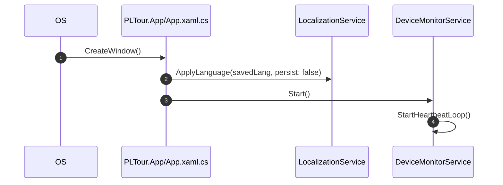
```mermaid
sequenceDiagram
  autonumber
  participant OS as OS
  participant App as PLTour.App/App.xaml.cs
  participant Loc as LocalizationService
  participant DMS as DeviceMonitorService

  OS->>App: CreateWindow()
  App->>Loc: ApplyLanguage(savedLang, persist: false)
  App->>DMS: Start()
  DMS->>DMS: StartHeartbeatLoop()
```

---

### 4.2 Chương 2 — Tải tour và location

**Mục tiêu:** Lấy dữ liệu tour/location từ API.

**Thành phần liên quan:** `ApiService`, `HomePage`, `MapPage`, `TourDetailPage`.

**Sequence:**

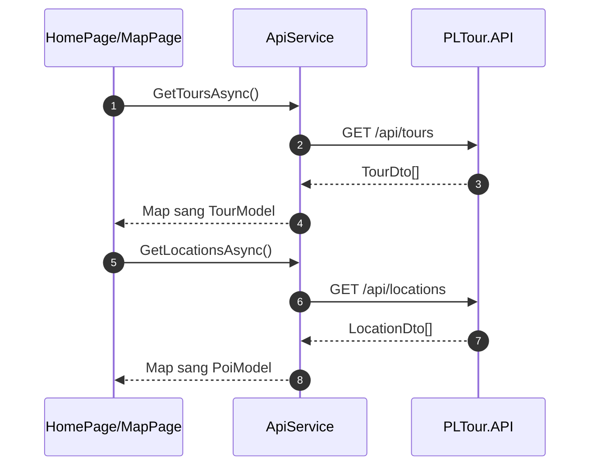
```mermaid
sequenceDiagram
  autonumber
  participant UI as HomePage/MapPage
  participant Api as ApiService
  participant API as PLTour.API

  UI->>Api: GetToursAsync()
  Api->>API: GET /api/tours
  API-->>Api: TourDto[]
  Api-->>UI: Map sang TourModel

  UI->>Api: GetLocationsAsync()
  Api->>API: GET /api/locations
  API-->>Api: LocationDto[]
  Api-->>UI: Map sang PoiModel
```

---

### 4.3 Chương 3 — Xem bản đồ và POI

**Mục tiêu:** Hiển thị bản đồ, marker, và POI.

**Thành phần liên quan:** `MapPage.xaml.cs`, `LocationService`, `PoiModel`, `TourModel`.

**Sequence:**

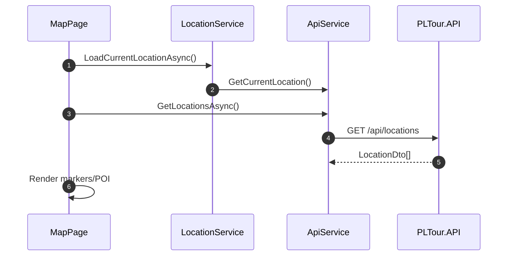
```mermaid
sequenceDiagram
  autonumber
  participant UI as MapPage
  participant LS as LocationService
  participant Api as ApiService
  participant API as PLTour.API

  UI->>LS: LoadCurrentLocationAsync()
  LS->>Api: GetCurrentLocation()
  UI->>Api: GetLocationsAsync()
  Api->>API: GET /api/locations
  API-->>Api: LocationDto[]
  UI->>UI: Render markers/POI
```

---

### 4.4 Chương 4 — Quét QR và mở chi tiết

**Mục tiêu:** Người dùng quét QR để mở chi tiết location/tour.

**Thành phần liên quan:** `QrScannerPage`, `ApiService`, `LocationService`, `TourDetailPage`.

**Sequence:**

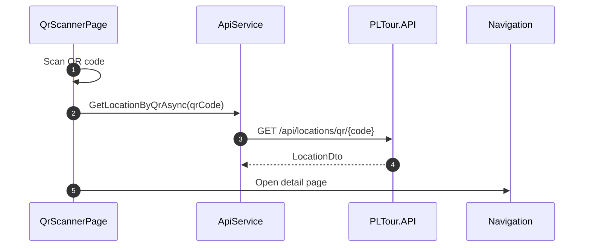
```mermaid
sequenceDiagram
  autonumber
  participant UI as QrScannerPage
  participant Api as ApiService
  participant API as PLTour.API
  participant Nav as Navigation

  UI->>UI: Scan QR code
  UI->>Api: GetLocationByQrAsync(qrCode)
  Api->>API: GET /api/locations/qr/{code}
  API-->>Api: LocationDto
  UI->>Nav: Open detail page
```

---

### 4.5 Chương 5 — Phát narration audio

**Mục tiêu:** Nếu có audio thì phát file audio.

**Thành phần liên quan:** `AudioService`, `ApiService`, `TourDetailPage`, `IAudioService`.

**Sequence:**

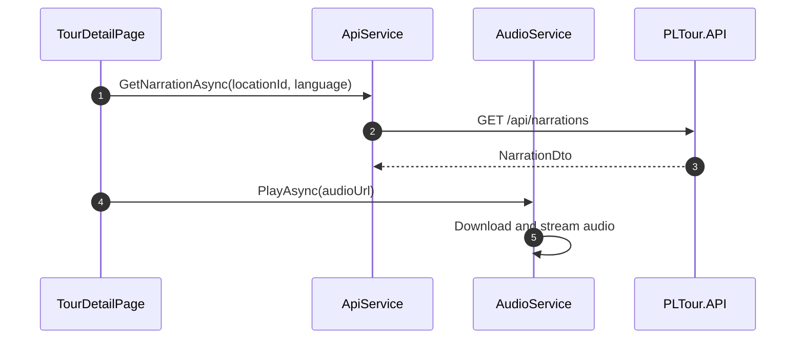
```mermaid
sequenceDiagram
  autonumber
  participant UI as TourDetailPage
  participant Api as ApiService
  participant AS as AudioService
  participant API as PLTour.API

  UI->>Api: GetNarrationAsync(locationId, language)
  Api->>API: GET /api/narrations
  API-->>Api: NarrationDto
  UI->>AS: PlayAsync(audioUrl)
  AS->>AS: Download and stream audio
```

---

### 4.6 Chương 6 — Đọc narration bằng TTS

**Mục tiêu:** Khi không có `AudioUrl`, app dùng TTS.

**Thành phần liên quan:** `AudioService`, `TourDetailPage`, `EdgeTtsService` phía API nếu có luồng tạo audio.

**Sequence:**

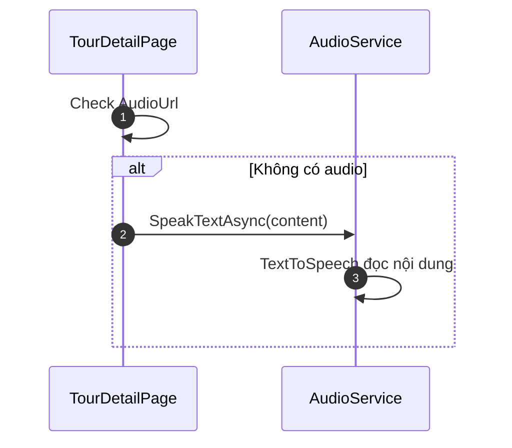
```mermaid
sequenceDiagram
  autonumber
  participant UI as TourDetailPage
  participant AS as AudioService

  UI->>UI: Check AudioUrl
  alt Không có audio
    UI->>AS: SpeakTextAsync(content)
    AS->>AS: TextToSpeech đọc nội dung
  end
```

---

### 4.7 Chương 7 — Gửi heartbeat thiết bị

**Mục tiêu:** Ghi nhận trạng thái thiết bị định kỳ.

**Thành phần liên quan:** `DeviceMonitorService`, `MonitorQueueService`, `MonitorQueueStore`, `PLTour.API.Controllers.MonitorController`.

**Sequence:**

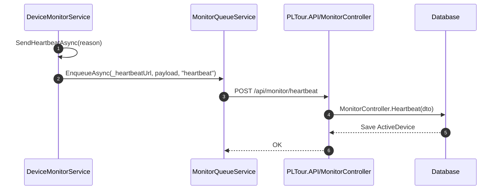
```mermaid
sequenceDiagram
  autonumber
  participant DMS as DeviceMonitorService
  participant MQ as MonitorQueueService
  participant API as PLTour.API/MonitorController
  participant DB as Database

  DMS->>DMS: SendHeartbeatAsync(reason)
  DMS->>MQ: EnqueueAsync(_heartbeatUrl, payload, "heartbeat")
  MQ->>API: POST /api/monitor/heartbeat
  API->>DB: MonitorController.Heartbeat(dto)
  DB-->>API: Save ActiveDevice
  API-->>MQ: OK
```

---

### 4.8 Chương 8 — Gửi analytics event

**Mục tiêu:** Ghi nhận hành vi người dùng.

**Thành phần liên quan:** `DeviceMonitorService`, `MonitorQueueService`, `AnalyticsService`, `MonitorController`.

**Sequence:**

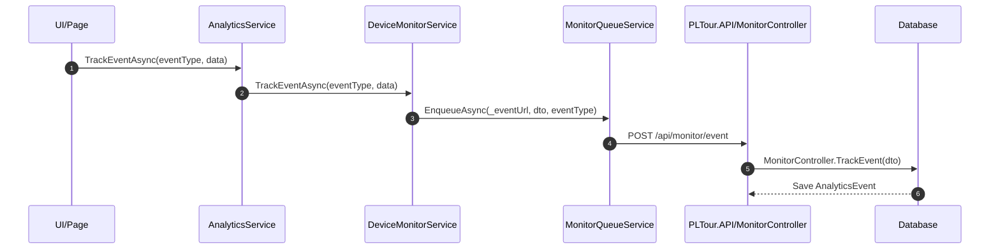
```mermaid
sequenceDiagram
  autonumber
  participant UI as UI/Page
  participant Ana as AnalyticsService
  participant DMS as DeviceMonitorService
  participant MQ as MonitorQueueService
  participant API as PLTour.API/MonitorController
  participant DB as Database

  UI->>Ana: TrackEventAsync(eventType, data)
  Ana->>DMS: TrackEventAsync(eventType, data)
  DMS->>MQ: EnqueueAsync(_eventUrl, dto, eventType)
  MQ->>API: POST /api/monitor/event
  API->>DB: MonitorController.TrackEvent(dto)
  DB-->>API: Save AnalyticsEvent
```

---

### 4.9 Chương 9 — Xử lý queue khi mạng yếu

**Mục tiêu:** Không mất heartbeat/event khi offline.

**Thành phần liên quan:** `MonitorQueueService`, `MonitorQueueStore`, `QueuedActionService`.

**Sequence:**

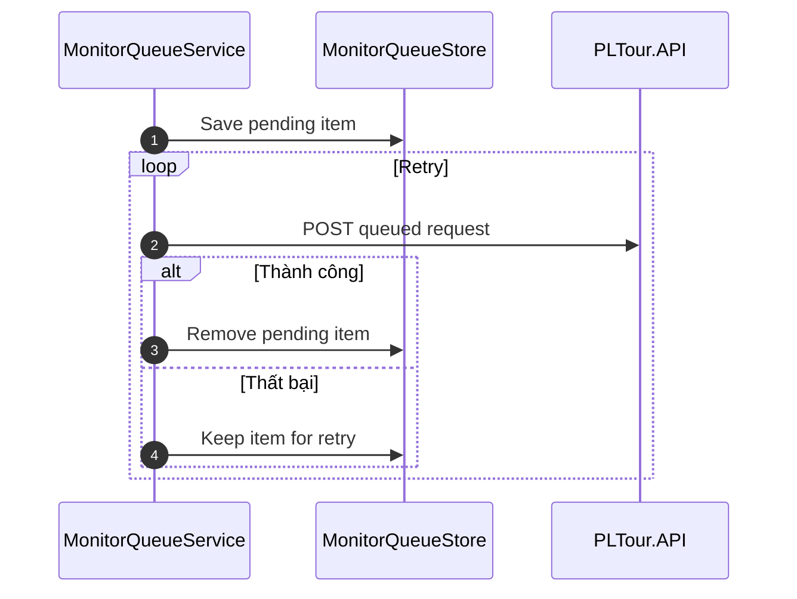
```mermaid
sequenceDiagram
  autonumber
  participant MQ as MonitorQueueService
  participant Store as MonitorQueueStore
  participant API as PLTour.API

  MQ->>Store: Save pending item
  loop Retry
    MQ->>API: POST queued request
    alt Thành công
      MQ->>Store: Remove pending item
    else Thất bại
      MQ->>Store: Keep item for retry
    end
  end
```

---

## 5. Chương chức năng Admin

### 5.1 Chương 1 — Đăng nhập admin

**Mục tiêu:** Admin xác thực trước khi truy cập dashboard.

**Thành phần liên quan:** `AccountController`, `LoginViewModel`, cookie auth.

**Sequence:**

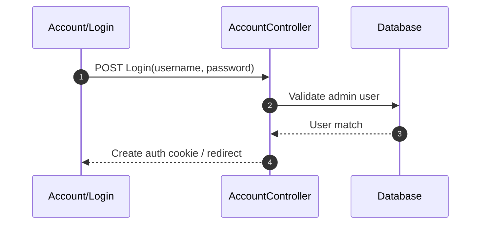
```mermaid
sequenceDiagram
  autonumber
  participant UI as Account/Login
  participant C as AccountController
  participant DB as Database

  UI->>C: POST Login(username, password)
  C->>DB: Validate admin user
  DB-->>C: User match
  C-->>UI: Create auth cookie / redirect
```

---

### 5.2 Chương 2 — Xem dashboard tổng quan

**Mục tiêu:** Xem số liệu tổng hợp.

**Thành phần liên quan:** `DashboardController`, `HomeController`.

**Sequence:**

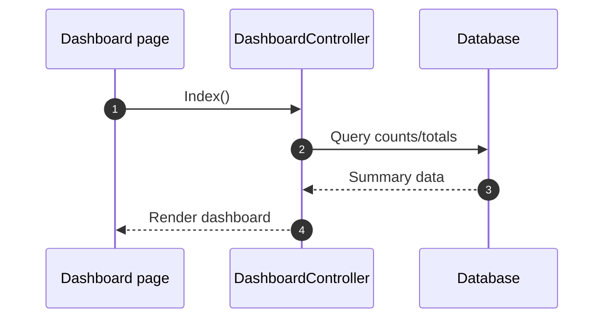
```mermaid
sequenceDiagram
  autonumber
  participant UI as Dashboard page
  participant C as DashboardController
  participant DB as Database

  UI->>C: Index()
  C->>DB: Query counts/totals
  DB-->>C: Summary data
  C-->>UI: Render dashboard
```

---

### 5.3 Chương 3 — Quản lý category

**Mục tiêu:** CRUD category.

**Thành phần liên quan:** `CategoryController`.

**Sequence:**

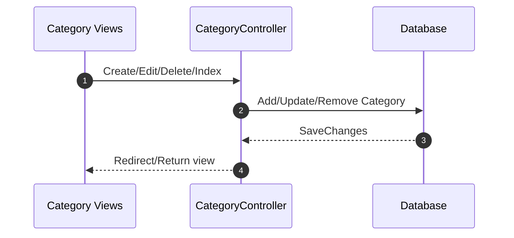
```mermaid
sequenceDiagram
  autonumber
  participant UI as Category Views
  participant C as CategoryController
  participant DB as Database

  UI->>C: Create/Edit/Delete/Index
  C->>DB: Add/Update/Remove Category
  DB-->>C: SaveChanges
  C-->>UI: Redirect/Return view
```

---

### 5.4 Chương 4 — Quản lý location

**Mục tiêu:** CRUD location.

**Thành phần liên quan:** `LocationController`.

**Sequence:**

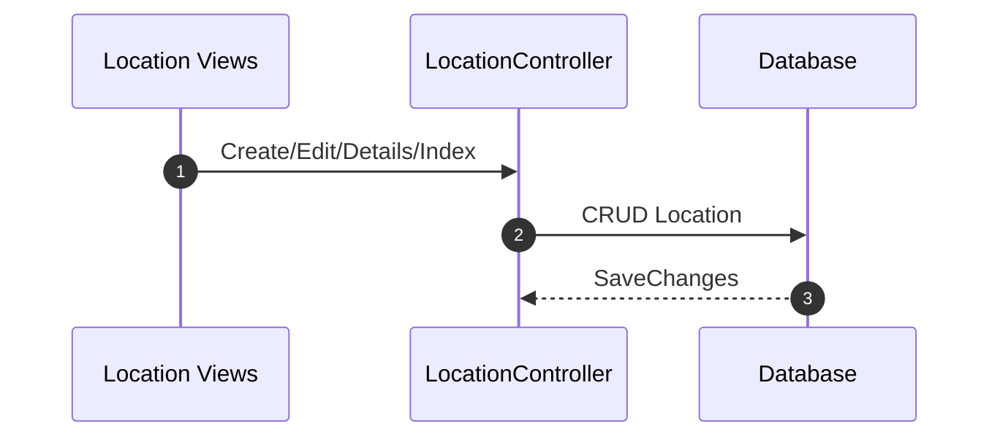
```mermaid
sequenceDiagram
  autonumber
  participant UI as Location Views
  participant C as LocationController
  participant DB as Database

  UI->>C: Create/Edit/Details/Index
  C->>DB: CRUD Location
  DB-->>C: SaveChanges
```

---

### 5.5 Chương 5 — Quản lý tour

**Mục tiêu:** CRUD tour và quan hệ tour-location.

**Thành phần liên quan:** `TourController`.

**Sequence:**

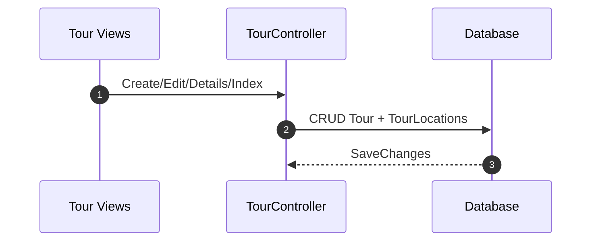
```mermaid
sequenceDiagram
  autonumber
  participant UI as Tour Views
  participant C as TourController
  participant DB as Database

  UI->>C: Create/Edit/Details/Index
  C->>DB: CRUD Tour + TourLocations
  DB-->>C: SaveChanges
```

---

### 5.6 Chương 6 — Quản lý narration

**Mục tiêu:** CRUD narration theo location/language.

**Thành phần liên quan:** `NarrationController`.

**Sequence:**

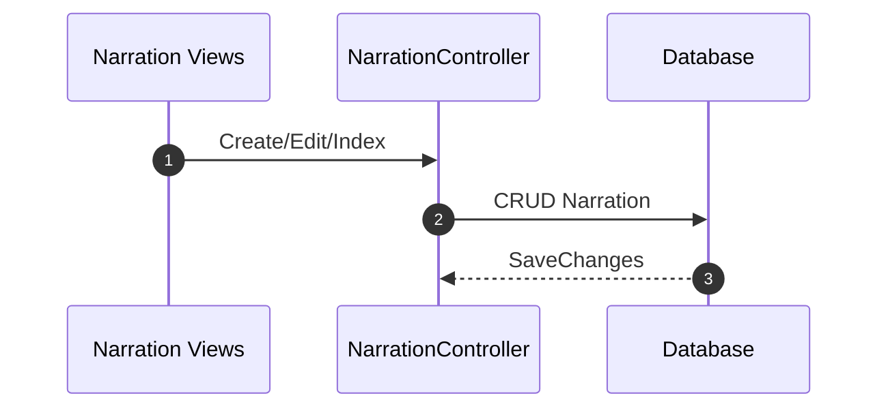
```mermaid
sequenceDiagram
  autonumber
  participant UI as Narration Views
  participant C as NarrationController
  participant DB as Database

  UI->>C: Create/Edit/Index
  C->>DB: CRUD Narration
  DB-->>C: SaveChanges
```

---

### 5.7 Chương 7 — Duyệt vendor

**Mục tiêu:** Approve / reject vendor.

**Thành phần liên quan:** `VendorController`, `HomeController`, `Details.cshtml`.

**Sequence:**

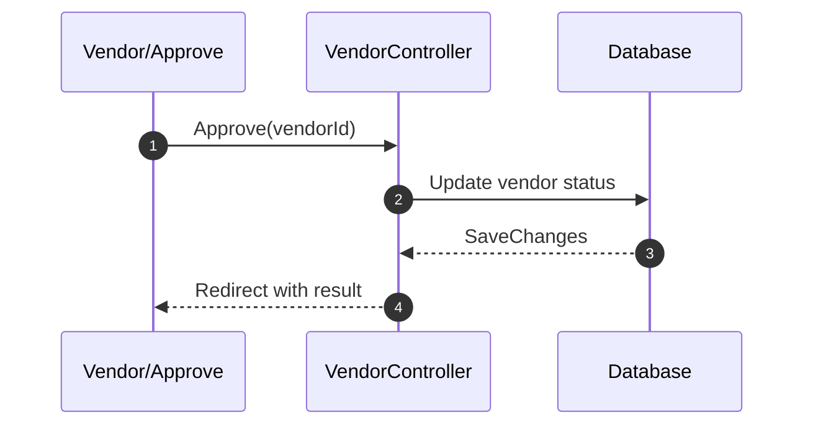
```mermaid
sequenceDiagram
  autonumber
  participant UI as Vendor/Approve
  participant C as VendorController
  participant DB as Database

  UI->>C: Approve(vendorId)
  C->>DB: Update vendor status
  DB-->>C: SaveChanges
  C-->>UI: Redirect with result
```

---

### 5.8 Chương 8 — Monitor thiết bị

**Mục tiêu:** Xem danh sách thiết bị online/stale/offline.

**Thành phần liên quan:** `MonitorController`, `ActiveDeviceDto`, `_MonitorRow.cshtml`.

**Sequence:**

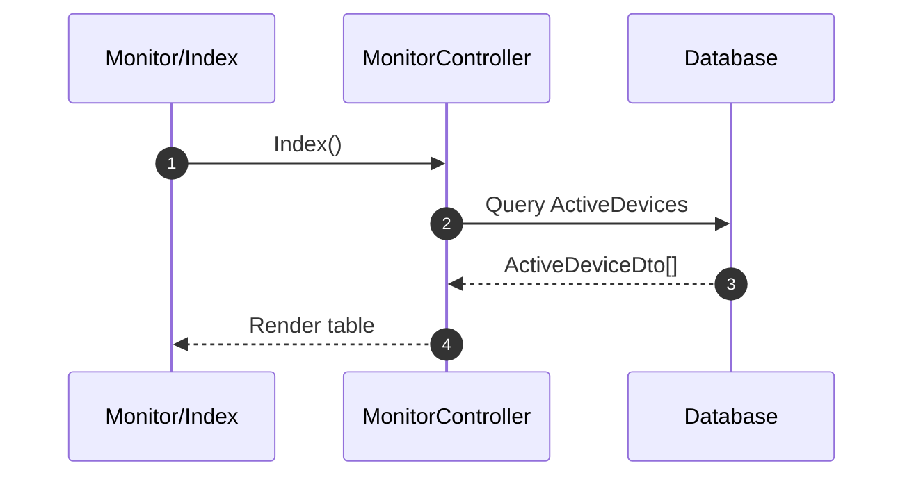
```mermaid
sequenceDiagram
  autonumber
  participant UI as Monitor/Index
  participant C as MonitorController
  participant DB as Database

  UI->>C: Index()
  C->>DB: Query ActiveDevices
  DB-->>C: ActiveDeviceDto[]
  C-->>UI: Render table
```

---

### 5.9 Chương 9 — Xem chi tiết thiết bị

**Mục tiêu:** Xem chi tiết một thiết bị cụ thể.

**Thành phần liên quan:** `MonitorController.DeviceDetails()`.

**Sequence:**

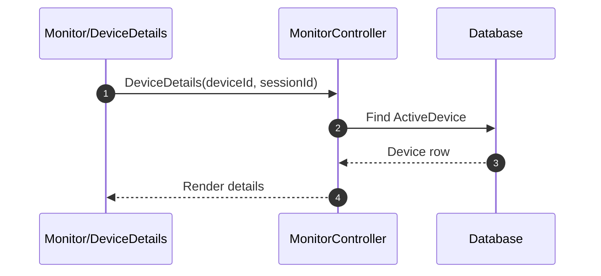
```mermaid
sequenceDiagram
  autonumber
  participant UI as Monitor/DeviceDetails
  participant C as MonitorController
  participant DB as Database

  UI->>C: DeviceDetails(deviceId, sessionId)
  C->>DB: Find ActiveDevice
  DB-->>C: Device row
  C-->>UI: Render details
```

---

### 5.10 Chương 10 — Xem analytics dashboard

**Mục tiêu:** Xem dữ liệu thống kê.

**Thành phần liên quan:** `AnalyticsController`, `Dashboard.cshtml`.

**Sequence:**

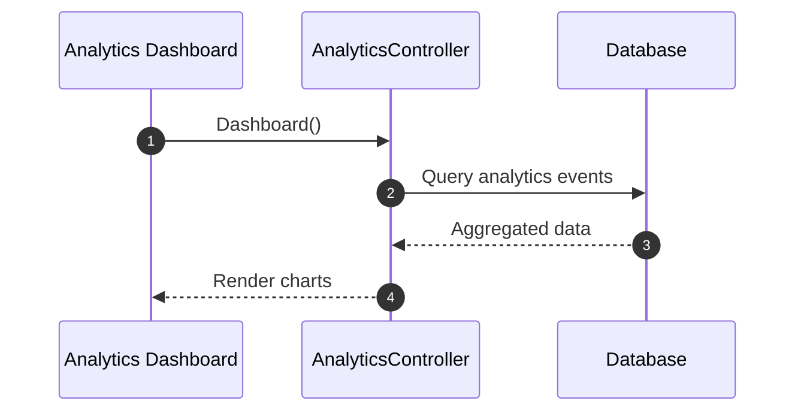
```mermaid
sequenceDiagram
  autonumber
  participant UI as Analytics Dashboard
  participant C as AnalyticsController
  participant DB as Database

  UI->>C: Dashboard()
  C->>DB: Query analytics events
  DB-->>C: Aggregated data
  C-->>UI: Render charts
```

---

## 6. Chương chức năng Vendor

### 6.1 Chương 1 — Đăng ký vendor

**Mục tiêu:** Tạo tài khoản vendor mới.

**Thành phần liên quan:** `VendorRegistrationController`, `VendorRegistrationViewModel`.

**Sequence:**

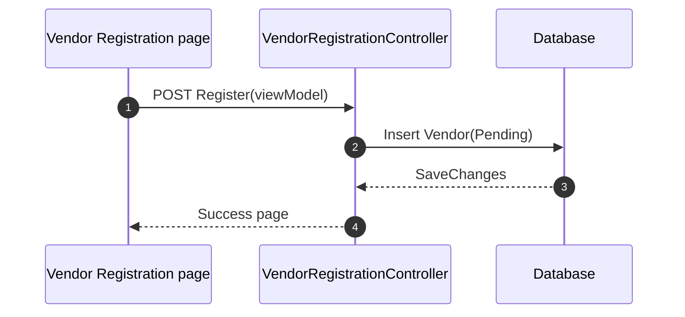
```mermaid
sequenceDiagram
  autonumber
  participant UI as Vendor Registration page
  participant C as VendorRegistrationController
  participant DB as Database

  UI->>C: POST Register(viewModel)
  C->>DB: Insert Vendor(Pending)
  DB-->>C: SaveChanges
  C-->>UI: Success page
```

---

### 6.2 Chương 2 — Đăng nhập vendor

**Mục tiêu:** Vendor đăng nhập để vào dashboard.

**Thành phần liên quan:** `VendorLoginController`, `VendorLoginViewModel`.

**Sequence:**

```mermaid
sequenceDiagram
  autonumber
  participant UI as Vendor Login page
  participant C as VendorLoginController
  participant DB as Database

  UI->>C: POST Login(email, password)
  C->>DB: Query vendor by email
  DB-->>C: Vendor row
  C-->>UI: Cookie / lỗi chờ duyệt
```

---

### 6.3 Chương 3 — Cập nhật profile vendor

**Mục tiêu:** Vendor chỉnh sửa hồ sơ.

**Thành phần liên quan:** `VendorDashboardController`, `EditProfile.cshtml`.

**Sequence:**

```mermaid
sequenceDiagram
  autonumber
  participant UI as EditProfile
  participant C as VendorDashboardController
  participant DB as Database

  UI->>C: GET/POST EditProfile
  C->>DB: Update Vendor
  DB-->>C: SaveChanges
  C-->>UI: Render result
```

---

### 6.4 Chương 4 — Quản lý store

**Mục tiêu:** Tạo, sửa, xem store.

**Thành phần liên quan:** `VendorStoreController`.

**Sequence:**

```mermaid
sequenceDiagram
  autonumber
  participant UI as VendorStore Views
  participant C as VendorStoreController
  participant DB as Database

  UI->>C: Create/Edit/Details/Index
  C->>DB: CRUD VendorStore
  DB-->>C: SaveChanges
```

---

### 6.5 Chương 5 — Quản lý sản phẩm

**Mục tiêu:** CRUD product.

**Thành phần liên quan:** `VendorProductController`.

**Sequence:**

```mermaid
sequenceDiagram
  autonumber
  participant UI as VendorProduct Views
  participant C as VendorProductController
  participant DB as Database

  UI->>C: Create/Edit/Index
  C->>DB: CRUD Product
  DB-->>C: SaveChanges
```

---

### 6.6 Chương 6 — Quản lý ảnh vendor

**Mục tiêu:** Upload và quản lý ảnh.

**Thành phần liên quan:** `VendorImageController`, `CloudinaryService`.

**Sequence:**

```mermaid
sequenceDiagram
  autonumber
  participant UI as VendorImage Views
  participant C as VendorImageController
  participant CS as CloudinaryService
  participant DB as Database

  UI->>C: Upload image
  C->>CS: UploadAsync(file)
  CS-->>C: ImageUrl
  C->>DB: Save VendorImage
  DB-->>C: SaveChanges
```

---

## 7. Chương chức năng API

### 7.1 Chương 1 — Auth

**Mục tiêu:** Đăng nhập và cấp token.

**Thành phần liên quan:** `AuthController`.

**Sequence:**

```mermaid
sequenceDiagram
  autonumber
  participant UI as Client
  participant C as AuthController
  participant DB as Database

  UI->>C: POST login
  C->>DB: Validate user/vendor/admin
  DB-->>C: Match result
  C-->>UI: JWT / error
```

---

### 7.2 Chương 2 — Trả tour/location/narration

**Mục tiêu:** Cung cấp dữ liệu cho app.

**Thành phần liên quan:** `ToursController`, `LocationsController`, `NarrationsController`, `TourNarrationController`.

**Sequence:**

```mermaid
sequenceDiagram
  autonumber
  participant App as PLTour.App
  participant C1 as ToursController
  participant C2 as LocationsController
  participant C3 as NarrationsController
  participant DB as Database

  App->>C1: GET /api/tours
  C1->>DB: Query Tours
  DB-->>C1: TourDto[]

  App->>C2: GET /api/locations
  C2->>DB: Query Locations
  DB-->>C2: LocationDto[]

  App->>C3: GET /api/narrations
  C3->>DB: Query Narrations
  DB-->>C3: NarrationDto[]
```

---

### 7.3 Chương 3 — Lưu heartbeat

**Mục tiêu:** Nhận dữ liệu thiết bị từ app.

**Thành phần liên quan:** `MonitorController.Heartbeat()`, `ActiveDevice`.

**Sequence:**

```mermaid
sequenceDiagram
  autonumber
  participant App as DeviceMonitorService
  participant C as MonitorController
  participant DB as Database

  App->>C: POST /api/monitor/heartbeat
  C->>DB: Find or add ActiveDevice
  DB-->>C: SaveChanges
  C-->>App: Heartbeat saved
```

---

### 7.4 Chương 4 — Lưu analytics event

**Mục tiêu:** Ghi nhận hành vi người dùng.

**Thành phần liên quan:** `MonitorController.TrackEvent()`, `AnalyticsEvent`.

**Sequence:**

```mermaid
sequenceDiagram
  autonumber
  participant App as DeviceMonitorService
  participant C as MonitorController
  participant DB as Database

  App->>C: POST /api/monitor/event
  C->>DB: Insert AnalyticsEvent
  DB-->>C: SaveChanges
  C-->>App: Event saved
```

---

### 7.5 Chương 5 — Trả active devices

**Mục tiêu:** Cung cấp danh sách thiết bị đang hoạt động cho admin.

**Thành phần liên quan:** `MonitorController.GetActiveDevices()`.

**Sequence:**

```mermaid
sequenceDiagram
  autonumber
  participant Admin as PLTour.Admin
  participant C as MonitorController
  participant DB as Database

  Admin->>C: GET /api/monitor/active-devices
  C->>DB: Query ActiveDevices
  DB-->>C: ActiveDeviceDto[]
  C-->>Admin: JSON list
```

---

### 7.6 Chương 6 — Trả chi tiết device

**Mục tiêu:** Xem chi tiết 1 device theo `DeviceId` và `SessionId`.

**Thành phần liên quan:** `MonitorController.GetDeviceById()`.

**Sequence:**

```mermaid
sequenceDiagram
  autonumber
  participant Admin as PLTour.Admin
  participant C as MonitorController
  participant DB as Database

  Admin->>C: GET /api/monitor/active-devices/{deviceId}?sessionId=...
  C->>DB: Query device
  DB-->>C: Device row
  C-->>Admin: ActiveDeviceDto
```

---

### 7.7 Chương 7 — Báo cáo analytics

**Mục tiêu:** Trả dữ liệu tổng hợp cho dashboard.

**Thành phần liên quan:** `AnalyticsController`.

**Sequence:**

```mermaid
sequenceDiagram
  autonumber
  participant Admin as PLTour.Admin
  participant C as AnalyticsController
  participant DB as Database

  Admin->>C: GET dashboard stats
  C->>DB: Aggregate AnalyticsEvents
  DB-->>C: Summary data
  C-->>Admin: Chart payload
```

---

## 8. Sơ đồ nghiệp vụ chi tiết theo chức năng

### 8.1 Sơ đồ tổng thể các chương

```mermaid
flowchart TB
  A[Mobile App]
  B[Admin]
  C[Vendor]
  D[API]

  A --> D
  B --> D
  C --> D

  subgraph Mobile[Mobile App]
    A1[Khởi tạo]
    A2[Tải tour/location]
    A3[Xem map/POI]
    A4[QR]
    A5[Narration]
    A6[Heartbeat]
    A7[Analytics]
  end

  subgraph AdminMod[Admin]
    B1[Dashboard]
    B2[Category]
    B3[Location]
    B4[Tour]
    B5[Narration]
    B6[Vendor Approval]
    B7[Monitor]
    B8[Analytics]
  end

  subgraph VendorMod[Vendor]
    C1[Register]
    C2[Login]
    C3[Profile]
    C4[Store]
    C5[Product]
    C6[Images]
  end
```

### 8.2 Sơ đồ monitor thiết bị

```mermaid
flowchart TD
  App[PLTour.App] --> MQ[MonitorQueueService]
  MQ --> API[MonitorController]
  API --> DB[(ActiveDevices)]
  DB --> Admin[Monitor Page]
```

### 8.3 Sơ đồ analytics

```mermaid
flowchart TD
  App[PLTour.App] --> MQ[MonitorQueueService]
  MQ --> API[MonitorController.TrackEvent]
  API --> DB[(AnalyticsEvents)]
  DB --> Admin[Analytics Dashboard]
```

---

## 9. Trạng thái hoàn thiện

### 9.1 Đã hoàn chỉnh cơ bản

- Khởi tạo app.
- Load tour/location.
- Xem map/POI.
- Quét QR.
- Phát narration audio/TTS.
- Gửi heartbeat.
- Gửi analytics event.
- Đăng ký / đăng nhập vendor.
- CRUD nội dung admin cơ bản.
- Monitor thiết bị cơ bản.

### 9.2 Chưa hoàn chỉnh hoàn toàn

- Monitor multi-session/multi-device cần chuẩn hóa rõ hơn.
- Dashboard analytics nâng cao.
- UX cho các màn hình trống/lỗi.
- Test tự động cho heartbeat/queue/analytics.
- Chuẩn hóa retry/backoff cho queue khi mạng yếu.

---

## 10. Dữ liệu chính

### 10.1 Shared entities

- `Vendor`
- `VendorStore`
- `VendorImage`
- `Product`
- `Tour`
- `TourLocation`
- `TourNarration`
- `TourAudio`
- `Location`
- `Narration`
- `Language`
- `Category`
- `ActiveDevice`
- `AnalyticsEvent`
- `User`

### 10.2 Quan hệ dữ liệu quan trọng

- `Location` thuộc `Category`.
- `Narration` thuộc `Location` và `Language`.
- `Tour` liên kết nhiều `Location` thông qua `TourLocation`.
- `Vendor` có thể có nhiều `Store`, `Product`, `VendorImage`.
- `ActiveDevice` lưu heartbeat từng thiết bị/phiên.
- `AnalyticsEvent` gắn với session/device và có thể gắn location/tour.

---

## 11. Rủi ro, giả định và điểm còn thiếu

### 11.1 Rủi ro

1. Sai base URL giữa app data và heartbeat.
2. Schema DB và entity dễ bị lệch khi merge nhiều nhánh.
3. Một số cột nullable trong DB có thể gây runtime exception nếu model không cho phép null.
4. Vendor/Admin/App dùng chung entity nên cần đồng bộ rất cẩn thận.
5. Nếu monitor không phân biệt session, dữ liệu thiết bị có thể bị gộp sai.

### 11.2 Giả định

- Hệ thống chạy với mạng đủ ổn định để gửi heartbeat định kỳ.
- Admin và vendor chỉ dùng các luồng đã được phân quyền.
- Dữ liệu tour/location/narration đã được seed hoặc nhập đầy đủ.

### 11.3 Điểm còn thiếu hoặc cần hoàn thiện

- Chuẩn hóa hoàn toàn monitor multi-session/multi-device.
- Tăng độ chi tiết của dashboard analytics.
- Bổ sung test tự động cho heartbeat/monitor/analytics.
- Hoàn thiện UX cho các màn hình rỗng, lỗi, chờ duyệt.
- Chuẩn hóa logging, retry, và error handling trên toàn hệ thống.

---

## 12. Tiêu chí hoàn thành

- App tải dữ liệu tour/location thành công.
- Admin Monitor nhận heartbeat và hiển thị thiết bị.
- Vendor đăng ký/login/approve chạy ổn.
- Không còn lỗi schema null/cột không tồn tại ở flow chính.
- Heartbeat, analytics, và monitor hoạt động được trên nhiều thiết bị.
- Mỗi chức năng có sequence riêng, rõ service nào gọi method nào.
- PRD được chia chapter rõ ràng để dễ đọc và đếm chức năng.

---

## 13. Ghi chú triển khai

- Nên dùng một cấu hình base URL tập trung cho app.
- Nên có migration/backfill nếu DB có dữ liệu cũ thiếu cột mới.
- Khi cập nhật entity `Vendor`, phải kiểm tra toàn bộ Admin + Vendor + API.
- PRD này nên được cập nhật theo mỗi lần thay đổi schema hoặc luồng nghiệp vụ.
- Nếu có thay đổi monitor, cần cập nhật cả API, Admin UI, và Mobile heartbeat flow.

---

## 14. Bổ sung kiến trúc Offline-First cho Mobile App

### 14.1 Mục tiêu

Mobile App của PL-Tour được mở rộng theo hướng **offline-first** để người dùng vẫn có thể:

- Xem danh sách tour đã tải trước đó.
- Mở chi tiết tour/địa điểm khi không có mạng.
- Xem bản đồ và danh sách POI từ cache cục bộ.
- Ghi nhận analytics/event khi offline và đồng bộ lại khi có mạng.
- Nhận thông báo rõ ràng về trạng thái mạng và trạng thái đồng bộ.

### 14.2 Thành phần bổ sung

- `OfflineCacheService` — lưu cache tour, location, POI theo JSON cục bộ.
- `MonitorQueueService` — hàng đợi lưu heartbeat/event chưa gửi được.
- `MonitorQueueStore` — lưu persistent queue vào file trong `AppDataDirectory`.
- `Connectivity` — kiểm tra trạng thái mạng realtime.
- `HomePage` / `TourDetailPage` / `MapPage` — hiển thị banner/badge offline.

### 14.3 Luồng offline của Mobile App

1. App mở lên và kiểm tra kết nối mạng.
2. Nếu có mạng, `ApiService` tải dữ liệu từ API và đồng thời lưu vào cache.
3. Nếu mất mạng, app đọc dữ liệu đã cache trong `OfflineCacheService`.
4. Khi người dùng thao tác, analytics event được đẩy vào `MonitorQueueService`.
5. Nếu không có mạng, queue vẫn giữ event trong file local.
6. Khi có mạng lại, queue tự gửi lần lượt các event còn tồn đọng lên API.
7. UI hiển thị banner offline và trạng thái sync để người dùng biết dữ liệu nào đang là cache.

### 14.4 Sequence — tải dữ liệu tour khi online/offline

```mermaid
sequenceDiagram
  autonumber
  participant UI as HomePage / TourDetailPage / MapPage
  participant Api as ApiService
  participant Cache as OfflineCacheService
  participant API as PLTour.API

  UI->>Api: GetToursAsync() / GetLocationsAsync()
  alt Có mạng
    Api->>API: GET /api/tours or /api/locations
    API-->>Api: DTOs
    Api->>Cache: SaveToursAsync() / SaveLocationsAsync()
    Api-->>UI: Trả dữ liệu mới
  else Không có mạng
    Api->>Cache: LoadToursAsync() / LoadLocationsAsync()
    Cache-->>Api: Dữ liệu cục bộ
    Api-->>UI: Trả cache offline
  end
```

### 14.5 Sequence — queue analytics offline

```mermaid
sequenceDiagram
  autonumber
  participant UI as App UI
  participant Ana as AnalyticsService
  participant DMS as DeviceMonitorService
  participant MQ as MonitorQueueService
  participant Store as MonitorQueueStore
  participant API as PLTour.API

  UI->>Ana: TrackPoiViewAsync() / TrackAudioStartAsync() / TrackAudioStopAsync()
  Ana->>DMS: TrackEventAsync(eventType, dto)
  DMS->>MQ: EnqueueAsync(url, payload, label)
  MQ->>Store: Persist queue to local file
  alt Có mạng
    MQ->>API: POST event / heartbeat
    API-->>MQ: OK
    MQ->>Store: Update persisted queue
  else Không có mạng
    MQ->>Store: Giữ event để gửi sau
  end
```

### 14.6 Cách cache dữ liệu

#### Cache danh sách

- Khi `ApiService.GetToursAsync()` hoặc `GetAllLocationsAsync()` trả dữ liệu hợp lệ, app lưu vào cache.
- Khi API lỗi, app đọc cache thay thế.

#### Cache chi tiết tour

- Khi mở `TourDetailPage`, nếu tour không có đầy đủ `Pois`, app tìm cache theo `TourId`.
- `OfflineCacheService` lưu riêng:
  - `tour-{id}.json`
  - `tour-pois-{id}.json`

#### Cache bản đồ

- `MapPage` ưu tiên đọc dữ liệu đã cache.
- Nếu mất mạng, người dùng vẫn xem được POI và điều hướng cơ bản theo dữ liệu cũ.

### 14.7 UI phản hồi trạng thái offline

- `HomePage` có banner thông báo app đang dùng dữ liệu lưu tạm.
- `HomePage` hiển thị `SyncStatusText` để báo số event đang chờ gửi.
- `TourDetailPage` hiển thị offline badge khi xem dữ liệu cache.
- `MapPage` log và xử lý nhánh offline khi không có kết nối.

### 14.8 Ưu điểm của thiết kế offline-first

- Tăng khả năng sử dụng khi mạng yếu hoặc mất mạng.
- Không làm mất dữ liệu hành vi người dùng.
- Trải nghiệm mở app nhanh hơn nhờ cache cục bộ.
- Dễ mở rộng thêm cache ảnh, cache audio, hoặc cache route sau này.

### 14.9 Hạn chế hiện tại

- Cache đang ưu tiên JSON cục bộ, chưa tối ưu cho dung lượng lớn.
- Đồng bộ conflict giữa local và server chưa có cơ chế xử lý phức tạp.
- Ảnh và audio mới chỉ phụ thuộc vào URL/hệ thống cache của app, chưa có cơ chế tải trước toàn bộ.
- Queue retry đã có nhưng vẫn cần tinh chỉnh backoff / giám sát số lượng hàng đợi.

### 14.10 Hướng phát triển tiếp theo

- Cache ảnh tour/POI theo file local.
- Cache audio narration để nghe hoàn toàn offline.
- Đồng bộ 2 chiều cho đánh giá, check-in và phản hồi người dùng.
- Hiển thị màn hình “đang đồng bộ” rõ hơn.
- Bổ sung test tự động cho offline cache và retry queue.
