# PRD (Product Requirements Document) - PL-Tour

| Thuộc tính | Giá trị |
| --- | --- |
| **Phiên bản tài liệu** | **1.7** |
| **Ngày cập nhật** | **2026-05-14** |
| **Trạng thái** | Đã viết lại theo bố cục rõ ràng hơn, ít gộp hơn, và bổ sung/chuẩn hóa các sơ đồ sequence cho những logic chính còn thiếu hoặc chưa đủ rõ. |
| **Mục đích** | Mô tả yêu cầu sản phẩm PL-Tour theo cấu trúc chuyên nghiệp, dễ đọc, dễ nghiệm thu và dễ cập nhật theo thay đổi mã nguồn. |

### Mục lục nhanh
1. [Giới thiệu](#1-giới-thiệu)
2. [Mục tiêu sản phẩm](#2-mục-tiêu-sản-phẩm)
3. [Vai trò người dùng](#3-vai-trò-người-dùng)
4. [Phạm vi chức năng](#4-phạm-vi-chức-năng)
5. [Kiến trúc hệ thống](#5-kiến-trúc-hệ-thống)
6. [Phân rã chức năng](#6-phân-rã-chức-năng)
7. [Chương chức năng Mobile App](#7-chương-chức-năng-mobile-app)
8. [Chương chức năng Admin](#8-chương-chức-năng-admin)
9. [Chương chức năng Vendor](#9-chương-chức-năng-vendor)
10. [Chương chức năng API](#10-chương-chức-năng-api)
11. [Sơ đồ nghiệp vụ tổng quan](#11-sơ-đồ-nghiệp-vụ-tổng-quan)
12. [Trạng thái hoàn thiện](#12-trạng-thái-hoàn-thiện)
13. [Dữ liệu chính](#13-dữ-liệu-chính)
14. [Rủi ro, giả định và điểm còn thiếu](#14-rủi-ro-giả-định-và-điểm-còn-thiếu)
15. [Tiêu chí hoàn thành](#15-tiêu-chí-hoàn-thành)
16. [Ghi chú triển khai](#16-ghi-chú-triển-khai)

---

## 1. Giới thiệu

### 1.1 Mục tiêu tài liệu

Tài liệu này mô tả yêu cầu sản phẩm cho hệ thống **PL-Tour** theo hướng rõ ràng, có thể dùng cho báo cáo đồ án, trao đổi nghiệp vụ và đối chiếu với mã nguồn.

### 1.2 Tổng quan dự án

PL-Tour là hệ thống du lịch thông minh gồm 4 thành phần chính:

- **PLTour.App** — ứng dụng MAUI cho khách du lịch.
- **PLTour.API** — backend REST API.
- **PLTour.Admin** — cổng quản trị.
- **PLTour.Vendor** — cổng vendor.

Mục tiêu cốt lõi của hệ thống là hỗ trợ người dùng khám phá địa điểm, xem POI trên bản đồ, quét QR, nghe thuyết minh đa ngôn ngữ, đồng thời giúp admin/vendor quản trị nội dung và theo dõi vận hành.

### 1.3 Phạm vi phiên bản

- Mobile App: khởi tạo, tải dữ liệu, map, POI, QR, narration, heartbeat, analytics, queue khi mạng yếu.
- Admin: dashboard, quản lý category/location/tour/narration/vendor, monitor thiết bị, analytics.
- Vendor: đăng ký, đăng nhập, profile, store, product, ảnh, subscription.
- API: auth, dữ liệu tour/location/narration, heartbeat, analytics, vendor/store, upload và thống kê.

---

## 2. Mục tiêu sản phẩm

### 2.1 Mục tiêu nghiệp vụ

- Hỗ trợ khách du lịch khám phá địa điểm theo ngữ cảnh, bản đồ và QR.
- Cung cấp thuyết minh đa ngôn ngữ theo từng địa điểm.
- Cho phép admin quản trị nội dung, vendor và dữ liệu vận hành tập trung.
- Ghi nhận heartbeat, analytics và trạng thái thiết bị để theo dõi hoạt động thực tế.

### 2.2 Mục tiêu kỹ thuật

- Tách biệt rõ vai trò Mobile App, Admin, Vendor và API.
- Dễ mở rộng thêm ngôn ngữ, địa điểm, narration và dữ liệu thống kê.
- Hỗ trợ khi mạng yếu nhờ queue và retry.
- Chuẩn hóa cách mô tả sequence để chỉ rõ service/controller/method được gọi.

---

## 3. Vai trò người dùng

### 3.1 Traveler / Khách du lịch
- Muốn mở app nhanh, xem bản đồ, chọn POI và nghe thuyết minh.
- Muốn quét QR để vào đúng nội dung cần xem.
- Muốn app hoạt động ổn định trong điều kiện mạng không tốt.

### 3.2 Admin / Quản trị viên
- Muốn quản lý category, location, tour, narration và vendor.
- Muốn xem dashboard monitor thiết bị và analytics.
- Muốn theo dõi trạng thái dữ liệu và vận hành hệ thống.

### 3.3 Vendor / Đối tác nội dung
- Muốn quản lý store, sản phẩm và ảnh.
- Muốn cập nhật nội dung thuộc phạm vi của mình.
- Muốn quy trình duyệt rõ ràng và dễ kiểm soát.

---

## 4. Phạm vi chức năng

### 4.1 In scope
- Mobile App: khởi tạo, chọn ngôn ngữ, tải dữ liệu, map, POI, QR, narration, heartbeat, analytics, queue offline.
- Admin: login, dashboard, quản lý category/location/tour/narration/vendor, monitor thiết bị, analytics.
- Vendor: đăng ký, đăng nhập, profile, store, product, image, subscription.
- API: auth, dữ liệu tour/location/narration, heartbeat, analytics, vendor/store, upload và thống kê.

### 4.2 Out of scope
- AI recommendation realtime.
- Thanh toán đa cổng phức tạp.
- Các module chưa được triển khai trong repo hiện tại.

---

## 5. Kiến trúc hệ thống

### 5.1 Thành phần

- **Mobile App (`PLTour.App`)**: hiển thị tour, map, POI, QR, narration, heartbeat.
- **Admin (`PLTour.Admin`)**: quản trị nội dung, vendor, analytics, monitor.
- **Vendor (`PLTour.Vendor`)**: đăng ký, đăng nhập, quản lý cửa hàng/sản phẩm.
- **API (`PLTour.API`)**: xử lý nghiệp vụ, lưu DB, trả dữ liệu cho các client.
- **Shared (`PLTour.Shared`)**: entity/DTO dùng chung.

### 5.2 Nguyên tắc phân rã

Mỗi chức năng nên được mô tả riêng để:

- Đếm được có bao nhiêu chức năng.
- Biết chức năng nào đã xong, chức năng nào còn thiếu.
- Mỗi chức năng có 1 sequence riêng.
- Sequence phải chỉ rõ service / controller / method nào gọi method nào.

---

## 6. Phân rã chức năng

### 6.1 Chức năng của Mobile App

1. Khởi tạo ứng dụng.
2. Chọn ngôn ngữ.
3. Tải tour và location.
4. Hiển thị bản đồ và POI.
5. Xem chi tiết địa điểm.
6. Quét QR.
7. Phát narration audio.
8. Đọc narration bằng TTS.
9. Ghi lịch sử phát.
10. Gửi heartbeat thiết bị.
11. Gửi analytics event.
12. Quản lý queue khi mạng yếu.
13. Tự động phát theo lịch sử / preference.

### 6.2 Chức năng của Admin

1. Đăng nhập admin.
2. Xem dashboard tổng quan.
3. Quản lý category.
4. Quản lý location.
5. Quản lý tour.
6. Quản lý narration.
7. Duyệt vendor.
8. Quản lý vendor.
9. Xem monitor thiết bị.
10. Xem chi tiết thiết bị.
11. Xem analytics dashboard.
12. Lọc / thống kê dữ liệu monitor.

### 6.3 Chức năng của Vendor

1. Đăng ký vendor.
2. Đăng nhập vendor.
3. Cập nhật profile.
4. Quản lý store.
5. Quản lý sản phẩm.
6. Quản lý ảnh vendor.
7. Quản lý subscription.

### 6.4 Chức năng của API

1. Xác thực và phân quyền.
2. Trả tour/location/narration.
3. Lưu heartbeat.
4. Lưu analytics event.
5. Trả active devices.
6. Quản lý vendor và store.
7. Quản lý tour/location/narration/category.
8. Quản lý upload / audio / QR.
9. Cung cấp dữ liệu thống kê.

---

## 7. Chương chức năng Mobile App

### 7.1 Chương 1 — Khởi tạo ứng dụng

**Mục tiêu:** Khởi tạo ứng dụng, áp dụng ngôn ngữ đã lưu và khởi chạy các dịch vụ nền cần thiết.

**Thành phần liên quan:** `App.xaml.cs`, `MauiProgram.cs`, `LocalizationService`, `DeviceMonitorService`, `LocationService`.

**Luồng chính:**

1. Hệ điều hành khởi tạo cửa sổ ứng dụng.
2. `App` đọc cấu hình đã lưu, bao gồm ngôn ngữ và trạng thái thiết bị.
3. `LocalizationService.ApplyLanguage()` áp dụng culture hiện tại.
4. `DeviceMonitorService.Start()` bật heartbeat loop.
5. App chuyển sang màn hình đầu tiên.

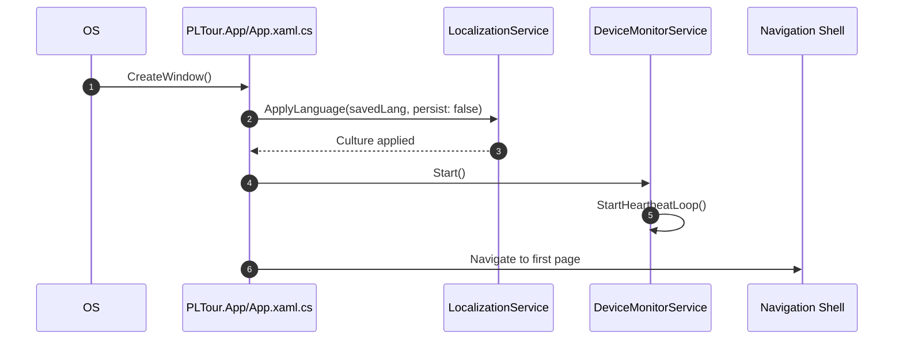
```mermaid
sequenceDiagram
  autonumber
  participant OS as OS
  participant App as PLTour.App/App.xaml.cs
  participant Loc as LocalizationService
  participant DMS as DeviceMonitorService
  participant Nav as Navigation Shell

  OS->>App: CreateWindow()
  App->>Loc: ApplyLanguage(savedLang, persist: false)
  Loc-->>App: Culture applied
  App->>DMS: Start()
  DMS->>DMS: StartHeartbeatLoop()
  App->>Nav: Navigate to first page
```

### 7.2 Chương 2 — Chọn ngôn ngữ

**Mục tiêu:** Người dùng chọn ngôn ngữ và hệ thống lưu lại để dùng cho các lần mở app sau.

**Thành phần liên quan:** `SettingsPage`, `LocalizationService`, `Preferences`.

**Luồng chính:**

1. Người dùng mở trang cài đặt.
2. Chọn ngôn ngữ mong muốn.
3. Ứng dụng lưu ngôn ngữ vào `Preferences`.
4. `LocalizationService.ApplyLanguage(selectedLang, persist: true)` cập nhật culture.
5. UI được làm mới ngay.

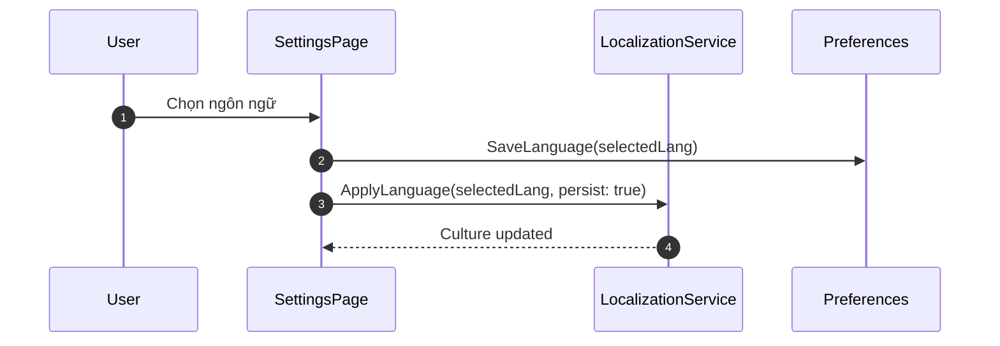
```mermaid
sequenceDiagram
  autonumber
  participant User as User
  participant UI as SettingsPage
  participant Loc as LocalizationService
  participant P as Preferences

  User->>UI: Chọn ngôn ngữ
  UI->>P: SaveLanguage(selectedLang)
  UI->>Loc: ApplyLanguage(selectedLang, persist: true)
  Loc-->>UI: Culture updated
```

### 7.3 Chương 3 — Tải tour và location

**Mục tiêu:** Lấy dữ liệu tour/location từ API.

**Thành phần liên quan:** `ApiService`, `HomePage`, `MapPage`, `TourDetailPage`.

**Luồng chính:**

1. Màn hình chính yêu cầu danh sách tour.
2. App gọi API lấy tour và location.
3. API trả dữ liệu DTO.
4. App map DTO sang model hiển thị.

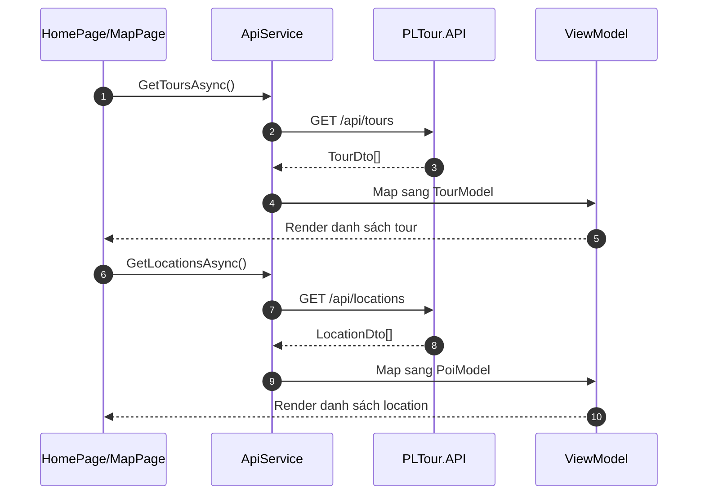
```mermaid
sequenceDiagram
  autonumber
  participant UI as HomePage/MapPage
  participant Api as ApiService
  participant API as PLTour.API
  participant VM as ViewModel

  UI->>Api: GetToursAsync()
  Api->>API: GET /api/tours
  API-->>Api: TourDto[]
  Api->>VM: Map sang TourModel
  VM-->>UI: Render danh sách tour

  UI->>Api: GetLocationsAsync()
  Api->>API: GET /api/locations
  API-->>Api: LocationDto[]
  Api->>VM: Map sang PoiModel
  VM-->>UI: Render danh sách location
```

### 7.4 Chương 4 — Hiển thị bản đồ và POI

**Mục tiêu:** Hiển thị bản đồ, marker và POI.

**Thành phần liên quan:** `MapPage.xaml.cs`, `LocationService`, `PoiModel`, `TourModel`.

**Luồng chính:**

1. `MapPage` lấy vị trí hiện tại của người dùng.
2. App yêu cầu danh sách location từ API.
3. Dữ liệu được hiển thị lên bản đồ dưới dạng marker.
4. Người dùng có thể chọn marker để mở chi tiết.

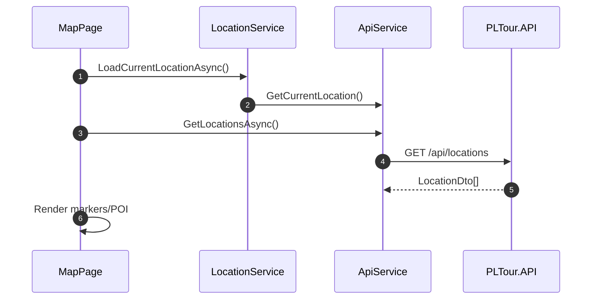
```mermaid
sequenceDiagram
  autonumber
  participant UI as MapPage
  participant LS as LocationService
  participant Api as ApiService
  participant API as PLTour.API

  UI->>LS: LoadCurrentLocationAsync()
  LS->>Api: GetCurrentLocation()
  UI->>Api: GetLocationsAsync()
  Api->>API: GET /api/locations
  API-->>Api: LocationDto[]
  UI->>UI: Render markers/POI
```

### 7.5 Chương 5 — Xem chi tiết địa điểm

**Mục tiêu:** Mở trang chi tiết một POI từ bản đồ, danh sách hoặc popup.

**Thành phần liên quan:** `MapPage.xaml.cs`, `PoiDetailPopupView.xaml`, `TourDetailPage.xaml.cs`, `ApiService`.

**Luồng chính:**

1. Người dùng chọn một POI từ bản đồ hoặc danh sách.
2. Màn hình gọi `ApiService.GetLocationByIdAsync(id)`.
3. API trả dữ liệu chi tiết địa điểm.
4. UI map dữ liệu vào `PoiDetailViewModel` và hiển thị nội dung.

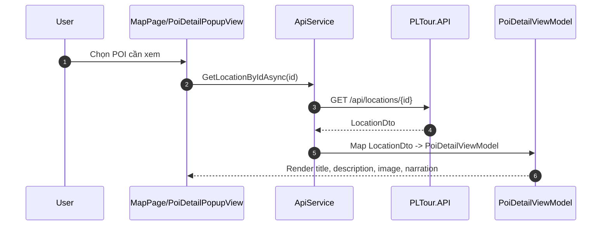
```mermaid
sequenceDiagram
  autonumber
  participant User as User
  participant UI as MapPage/PoiDetailPopupView
  participant Api as ApiService
  participant API as PLTour.API
  participant VM as PoiDetailViewModel

  User->>UI: Chọn POI cần xem
  UI->>Api: GetLocationByIdAsync(id)
  Api->>API: GET /api/locations/{id}
  API-->>Api: LocationDto
  Api->>VM: Map LocationDto -> PoiDetailViewModel
  VM-->>UI: Render title, description, image, narration
```

### 7.6 Chương 6 — Quét QR

**Mục tiêu:** Người dùng quét QR để mở đúng location/tour tương ứng.

**Thành phần liên quan:** `QrScannerPage.xaml.cs`, `ApiService`, `Navigation`.

**Luồng chính:**

1. Người dùng mở màn hình quét QR.
2. Ứng dụng đọc mã QR và gửi lên API.
3. API giải mã mã QR và trả về `LocationDto` hoặc dữ liệu điều hướng.
4. Ứng dụng điều hướng tới màn hình chi tiết.

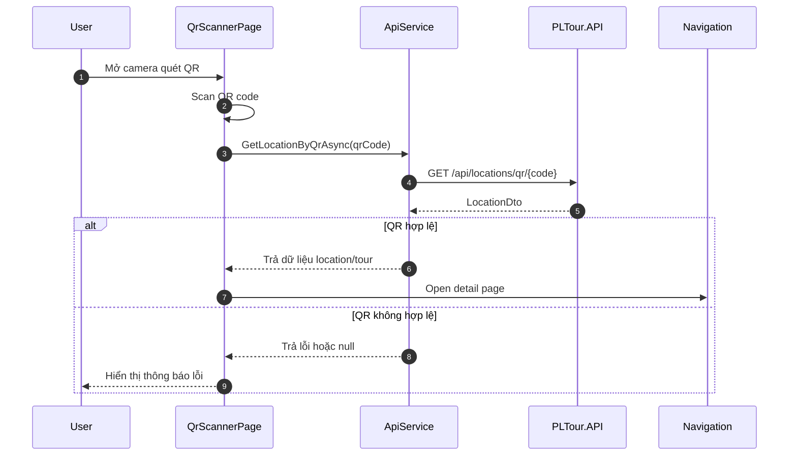
```mermaid
sequenceDiagram
  autonumber
  participant User as User
  participant UI as QrScannerPage
  participant Api as ApiService
  participant API as PLTour.API
  participant Nav as Navigation

  User->>UI: Mở camera quét QR
  UI->>UI: Scan QR code
  UI->>Api: GetLocationByQrAsync(qrCode)
  Api->>API: GET /api/locations/qr/{code}
  API-->>Api: LocationDto
  alt QR hợp lệ
    Api-->>UI: Trả dữ liệu location/tour
    UI->>Nav: Open detail page
  else QR không hợp lệ
    Api-->>UI: Trả lỗi hoặc null
    UI-->>User: Hiển thị thông báo lỗi
  end
```

### 7.7 Chương 7 — Phát narration audio

**Mục tiêu:** Nếu địa điểm có audio thì phát đúng file audio theo ngôn ngữ người dùng.

**Thành phần liên quan:** `TourDetailPage.xaml.cs`, `ApiService`, `AudioService`, `IAudioService`.

**Luồng chính:**

1. UI lấy narration theo `locationId` và `language`.
2. API trả `NarrationDto`.
3. Nếu có `AudioUrl`, app phát file audio từ storage.
4. Nếu chưa có file, app chuyển sang TTS hoặc fallback nội dung.

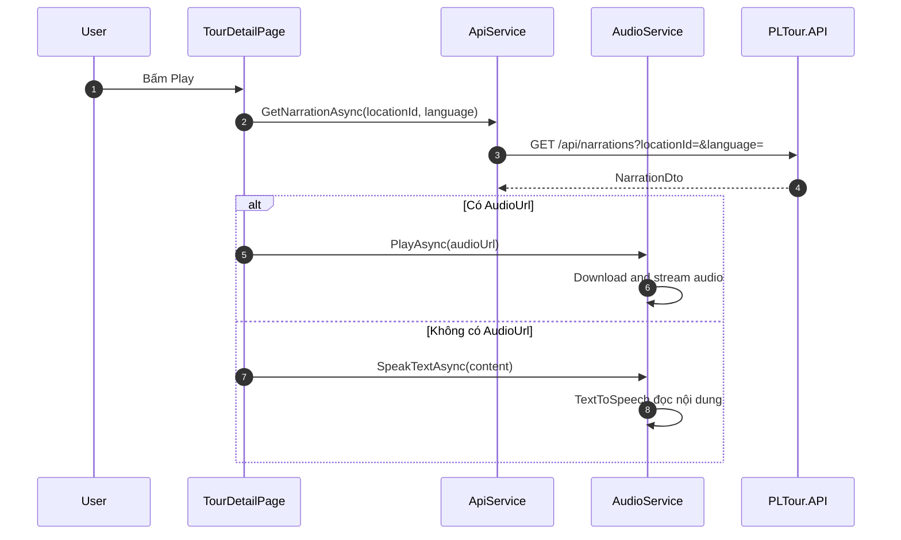
```mermaid
sequenceDiagram
  autonumber
  participant User as User
  participant UI as TourDetailPage
  participant Api as ApiService
  participant AS as AudioService
  participant API as PLTour.API

  User->>UI: Bấm Play
  UI->>Api: GetNarrationAsync(locationId, language)
  Api->>API: GET /api/narrations?locationId=&language=
  API-->>Api: NarrationDto
  alt Có AudioUrl
    UI->>AS: PlayAsync(audioUrl)
    AS->>AS: Download and stream audio
  else Không có AudioUrl
    UI->>AS: SpeakTextAsync(content)
    AS->>AS: TextToSpeech đọc nội dung
  end
```

### 7.8 Chương 8 — Đọc narration bằng TTS

**Mục tiêu:** Khi không có audio được tạo sẵn, ứng dụng đọc nội dung bằng TTS.

**Thành phần liên quan:** `AudioService`, `TourDetailPage`.

**Luồng chính:**

1. UI kiểm tra `AudioUrl` của nội dung.
2. Nếu không có audio, app gọi TTS.
3. Nếu có audio, app phát audio bình thường.

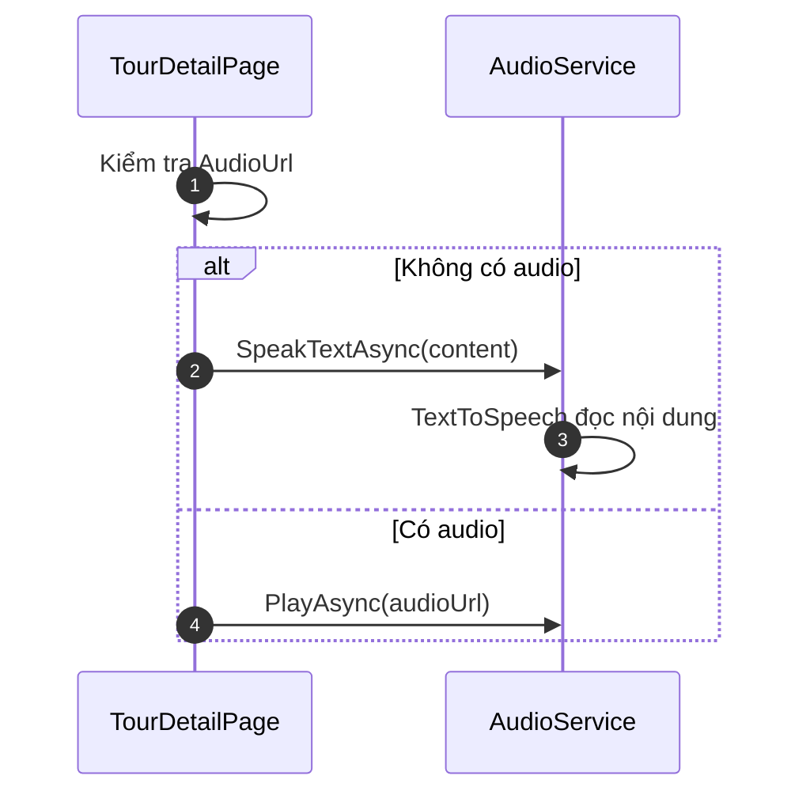
```mermaid
sequenceDiagram
  autonumber
  participant UI as TourDetailPage
  participant AS as AudioService

  UI->>UI: Kiểm tra AudioUrl
  alt Không có audio
    UI->>AS: SpeakTextAsync(content)
    AS->>AS: TextToSpeech đọc nội dung
  else Có audio
    UI->>AS: PlayAsync(audioUrl)
  end
```

### 7.9 Chương 9 — Ghi lịch sử phát

**Mục tiêu:** Ghi lại thời lượng phát và nội dung đã nghe để phục vụ analytics.

**Thành phần liên quan:** `AnalyticsService`, `ApiService`, `ListenAnalyticsController`.

**Luồng chính:**

1. Người dùng kết thúc phiên nghe.
2. UI gọi `OnPlaybackEnded(duration)`.
3. `AnalyticsService` tạo payload listen.
4. `ApiService` đẩy dữ liệu lên backend.
5. API trả trạng thái accepted hoặc duplicate.

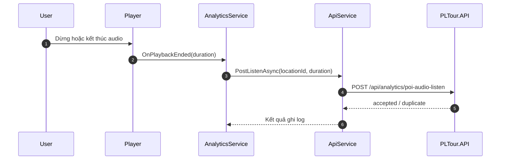
```mermaid
sequenceDiagram
  autonumber
  participant User as User
  participant UI as Player
  participant Ana as AnalyticsService
  participant Api as ApiService
  participant API as PLTour.API

  User->>UI: Dừng hoặc kết thúc audio
  UI->>Ana: OnPlaybackEnded(duration)
  Ana->>Api: PostListenAsync(locationId, duration)
  Api->>API: POST /api/analytics/poi-audio-listen
  API-->>Api: accepted / duplicate
  Api-->>Ana: Kết quả ghi log
```

### 7.10 Chương 10 — Gửi heartbeat thiết bị

**Mục tiêu:** Ghi nhận trạng thái thiết bị định kỳ để admin theo dõi online/offline.

**Thành phần liên quan:** `DeviceMonitorService`, `MonitorQueueService`, `MonitorController`.

**Luồng chính:**

1. `DeviceMonitorService` chạy heartbeat theo chu kỳ.
2. Payload heartbeat được đưa vào queue để tránh mất dữ liệu.
3. `MonitorQueueService` gửi request lên API.
4. API lưu hoặc cập nhật `ActiveDevice` trong database.

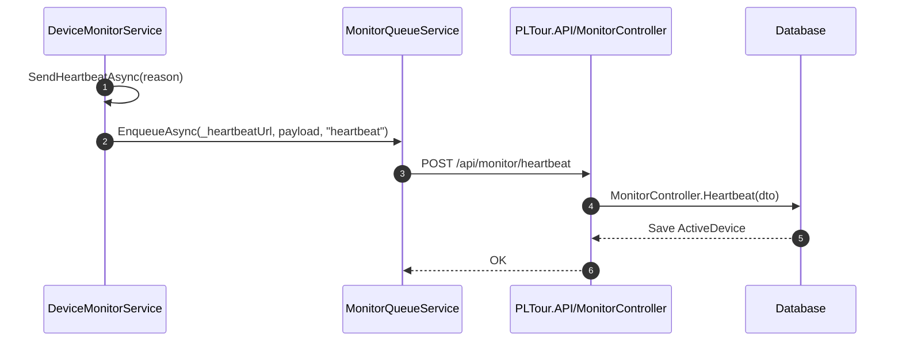
```mermaid
sequenceDiagram
  autonumber
  participant DMS as DeviceMonitorService
  participant MQ as MonitorQueueService
  participant API as PLTour.API/MonitorController
  participant DB as Database

  DMS->>DMS: SendHeartbeatAsync(reason)
  DMS->>MQ: EnqueueAsync(_heartbeatUrl, payload, "heartbeat")
  MQ->>API: POST /api/monitor/heartbeat
  API->>DB: MonitorController.Heartbeat(dto)
  DB-->>API: Save ActiveDevice
  API-->>MQ: OK
```

### 7.11 Chương 11 — Gửi analytics event

**Mục tiêu:** Ghi nhận hành vi người dùng trong app.

**Thành phần liên quan:** `DeviceMonitorService`, `MonitorQueueService`, `AnalyticsService`.

**Luồng chính:**

1. UI phát sinh sự kiện cần theo dõi.
2. `AnalyticsService` chuẩn hóa payload.
3. `DeviceMonitorService` đẩy payload vào queue.
4. API lưu `AnalyticsEvent` vào database.

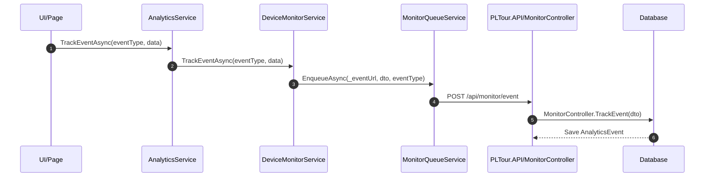
```mermaid
sequenceDiagram
  autonumber
  participant UI as UI/Page
  participant Ana as AnalyticsService
  participant DMS as DeviceMonitorService
  participant MQ as MonitorQueueService
  participant API as PLTour.API/MonitorController
  participant DB as Database

  UI->>Ana: TrackEventAsync(eventType, data)
  Ana->>DMS: TrackEventAsync(eventType, data)
  DMS->>MQ: EnqueueAsync(_eventUrl, dto, eventType)
  MQ->>API: POST /api/monitor/event
  API->>DB: MonitorController.TrackEvent(dto)
  DB-->>API: Save AnalyticsEvent
```

### 7.12 Chương 12 — Quản lý queue khi mạng yếu

**Mục tiêu:** Không mất heartbeat hoặc analytics event khi thiết bị offline.

**Thành phần liên quan:** `MonitorQueueService`, `MonitorQueueStore`, `QueuedActionService`.

**Luồng chính:**

1. Nếu API không phản hồi, item được lưu vào local queue.
2. Queue giữ lại các item chưa gửi thành công.
3. Hệ thống retry theo chu kỳ.
4. Khi gửi thành công, item bị xóa khỏi queue.

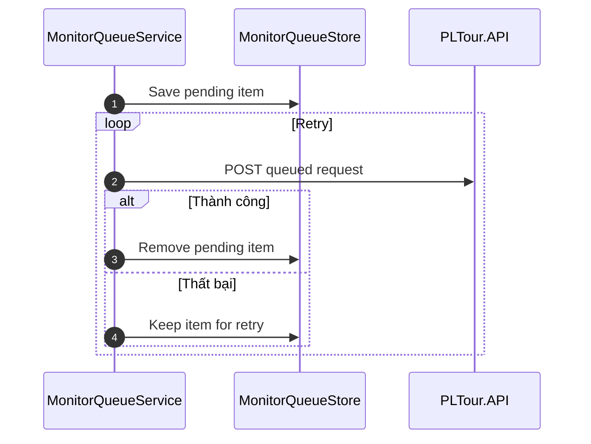
```mermaid
sequenceDiagram
  autonumber
  participant MQ as MonitorQueueService
  participant Store as MonitorQueueStore
  participant API as PLTour.API

  MQ->>Store: Save pending item
  loop Retry
    MQ->>API: POST queued request
    alt Thành công
      MQ->>Store: Remove pending item
    else Thất bại
      MQ->>Store: Keep item for retry
    end
  end
```

### 7.13 Chương 13 — Tự động phát theo lịch sử / preference

**Mục tiêu:** Ứng dụng ưu tiên tự phát theo lịch sử nghe hoặc cấu hình người dùng.

**Thành phần liên quan:** `AudioService`, `Preferences`, `TourDetailPage`.

**Luồng chính:**

1. UI đọc cờ autoplay từ `Preferences`.
2. Nếu bật, app chọn nội dung gợi ý tiếp theo.
3. Nếu tắt, app chỉ chờ người dùng bấm phát.
4. Logic này được dùng lại khi mở trang chi tiết POI.

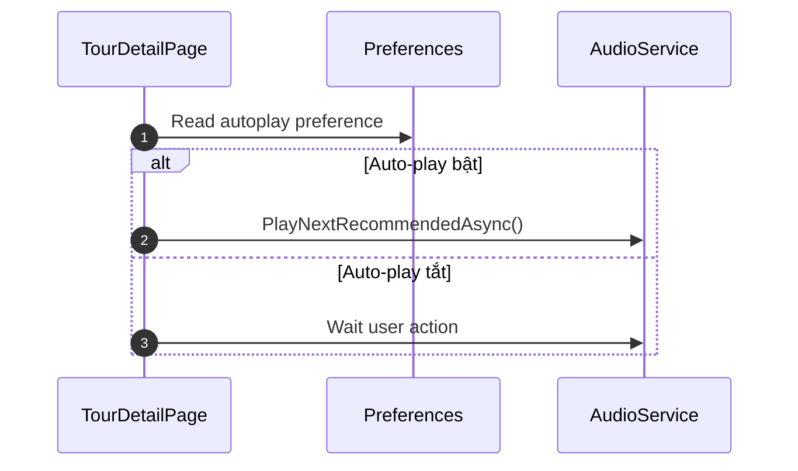
```mermaid
sequenceDiagram
  autonumber
  participant UI as TourDetailPage
  participant P as Preferences
  participant AS as AudioService

  UI->>P: Read autoplay preference
  alt Auto-play bật
    UI->>AS: PlayNextRecommendedAsync()
  else Auto-play tắt
    UI->>AS: Wait user action
  end
```

---

## 8. Chương chức năng Admin

### 8.1 Chương 1 — Đăng nhập admin

**Mục tiêu:** Admin xác thực trước khi truy cập dashboard.

**Thành phần liên quan:** `AccountController`, `LoginViewModel`, cookie auth.

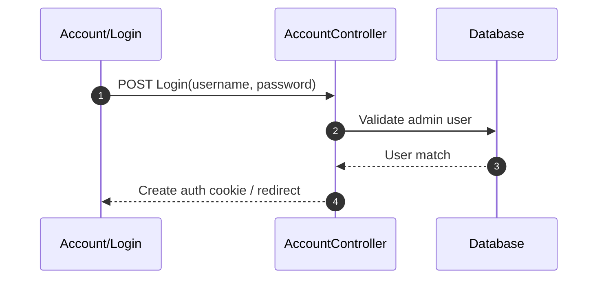
```mermaid
sequenceDiagram
  autonumber
  participant UI as Account/Login
  participant C as AccountController
  participant DB as Database

  UI->>C: POST Login(username, password)
  C->>DB: Validate admin user
  DB-->>C: User match
  C-->>UI: Create auth cookie / redirect
```

### 8.2 Chương 2 — Xem dashboard tổng quan

**Mục tiêu:** Xem số liệu tổng hợp.

**Thành phần liên quan:** `DashboardController`, `HomeController`.

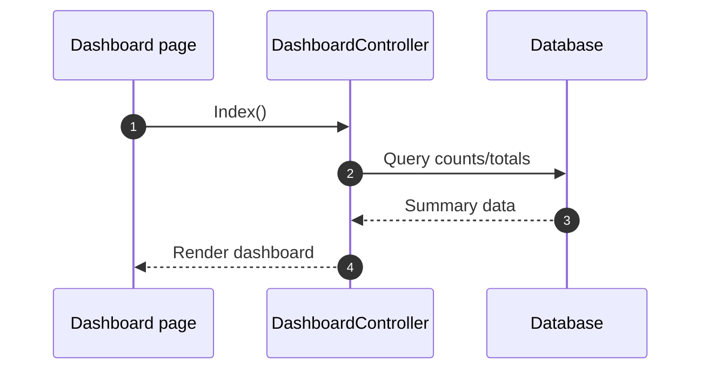
```mermaid
sequenceDiagram
  autonumber
  participant UI as Dashboard page
  participant C as DashboardController
  participant DB as Database

  UI->>C: Index()
  C->>DB: Query counts/totals
  DB-->>C: Summary data
  C-->>UI: Render dashboard
```

### 8.3 Chương 3 — Quản lý category

**Mục tiêu:** CRUD category.

**Thành phần liên quan:** `CategoryController`.

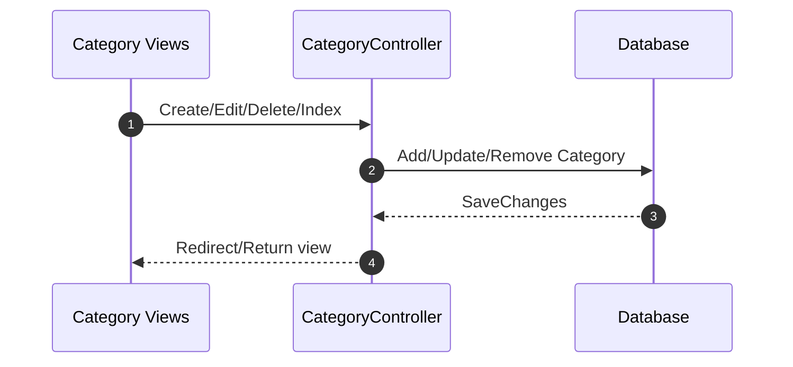
```mermaid
sequenceDiagram
  autonumber
  participant UI as Category Views
  participant C as CategoryController
  participant DB as Database

  UI->>C: Create/Edit/Delete/Index
  C->>DB: Add/Update/Remove Category
  DB-->>C: SaveChanges
  C-->>UI: Redirect/Return view
```

### 8.4 Chương 4 — Quản lý location

**Mục tiêu:** CRUD location.

**Thành phần liên quan:** `LocationController`.

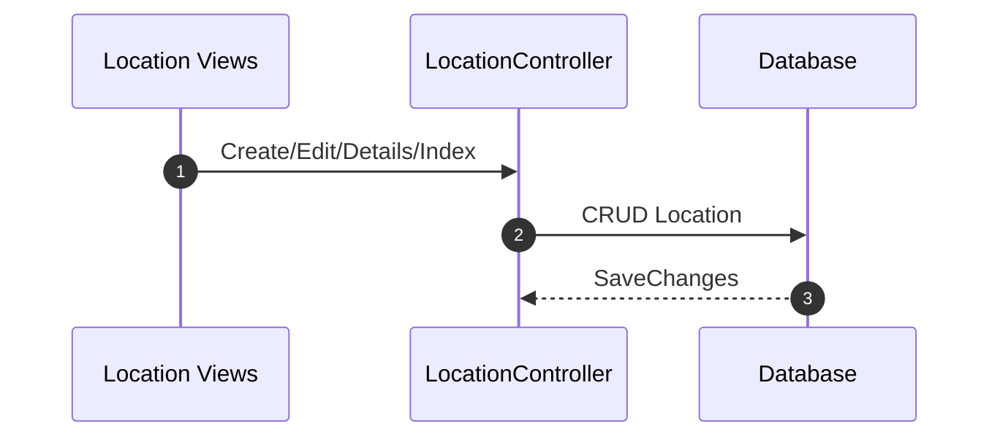
```mermaid
sequenceDiagram
  autonumber
  participant UI as Location Views
  participant C as LocationController
  participant DB as Database

  UI->>C: Create/Edit/Details/Index
  C->>DB: CRUD Location
  DB-->>C: SaveChanges
```

### 8.5 Chương 5 — Quản lý tour

**Mục tiêu:** CRUD tour và quan hệ tour-location.

**Thành phần liên quan:** `TourController`.

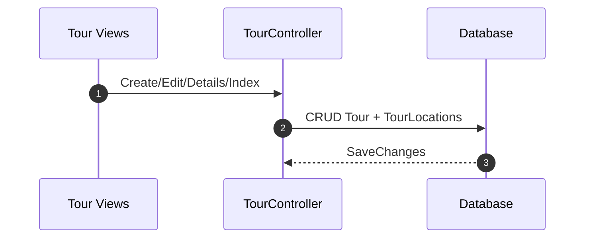
```mermaid
sequenceDiagram
  autonumber
  participant UI as Tour Views
  participant C as TourController
  participant DB as Database

  UI->>C: Create/Edit/Details/Index
  C->>DB: CRUD Tour + TourLocations
  DB-->>C: SaveChanges
```

### 8.6 Chương 6 — Quản lý narration

**Mục tiêu:** CRUD narration theo location/language.

**Thành phần liên quan:** `NarrationController`.

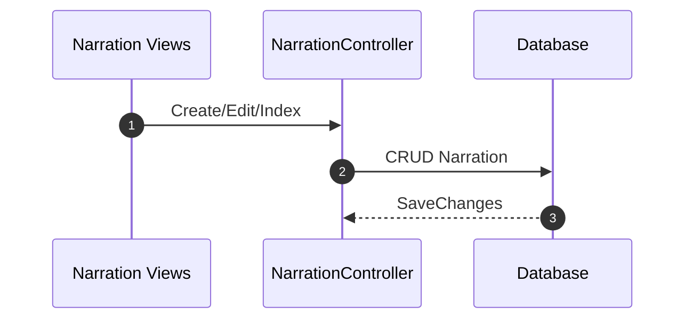
```mermaid
sequenceDiagram
  autonumber
  participant UI as Narration Views
  participant C as NarrationController
  participant DB as Database

  UI->>C: Create/Edit/Index
  C->>DB: CRUD Narration
  DB-->>C: SaveChanges
```

### 8.7 Chương 7 — Duyệt vendor

**Mục tiêu:** Approve / reject vendor.

**Thành phần liên quan:** `VendorController`, `HomeController`, `Details.cshtml`.

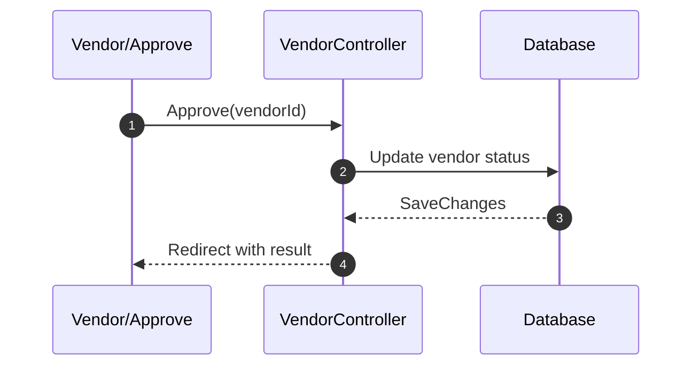
```mermaid
sequenceDiagram
  autonumber
  participant UI as Vendor/Approve
  participant C as VendorController
  participant DB as Database

  UI->>C: Approve(vendorId)
  C->>DB: Update vendor status
  DB-->>C: SaveChanges
  C-->>UI: Redirect with result
```

### 8.8 Chương 8 — Monitor thiết bị

**Mục tiêu:** Xem danh sách thiết bị online/stale/offline.

**Thành phần liên quan:** `MonitorController`, `ActiveDeviceDto`, `_MonitorRow.cshtml`.

```mermaid
sequenceDiagram
  autonumber
  participant UI as Monitor/Index
  participant C as MonitorController
  participant DB as Database

  UI->>C: Index()
  C->>DB: Query ActiveDevices
  DB-->>C: ActiveDeviceDto[]
  C-->>UI: Render table
```

### 8.9 Chương 9 — Xem chi tiết thiết bị

**Mục tiêu:** Xem chi tiết một thiết bị cụ thể.

**Thành phần liên quan:** `MonitorController.DeviceDetails()`.

```mermaid
sequenceDiagram
  autonumber
  participant UI as Monitor/DeviceDetails
  participant C as MonitorController
  participant DB as Database

  UI->>C: DeviceDetails(deviceId, sessionId)
  C->>DB: Find ActiveDevice
  DB-->>C: Device row
  C-->>UI: Render details
```

### 8.10 Chương 10 — Xem analytics dashboard

**Mục tiêu:** Xem dữ liệu thống kê.

**Thành phần liên quan:** `AnalyticsController`, `Dashboard.cshtml`.

```mermaid
sequenceDiagram
  autonumber
  participant UI as Analytics Dashboard
  participant C as AnalyticsController
  participant DB as Database

  UI->>C: Dashboard()
  C->>DB: Query analytics events
  DB-->>C: Aggregated data
  C-->>UI: Render charts
```

---

## 9. Chương chức năng Vendor

### 9.1 Chương 1 — Đăng ký vendor

**Mục tiêu:** Tạo tài khoản vendor mới.

**Thành phần liên quan:** `VendorRegistrationController`, `VendorRegistrationViewModel`.

```mermaid
sequenceDiagram
  autonumber
  participant UI as Vendor Registration page
  participant C as VendorRegistrationController
  participant DB as Database

  UI->>C: POST Register(viewModel)
  C->>DB: Insert Vendor(Pending)
  DB-->>C: SaveChanges
  C-->>UI: Success page
```

### 9.2 Chương 2 — Đăng nhập vendor

**Mục tiêu:** Vendor đăng nhập để vào dashboard.

**Thành phần liên quan:** `VendorLoginController`, `VendorLoginViewModel`.

```mermaid
sequenceDiagram
  autonumber
  participant UI as Vendor Login page
  participant C as VendorLoginController
  participant DB as Database

  UI->>C: POST Login(email, password)
  C->>DB: Query vendor by email
  DB-->>C: Vendor row
  C-->>UI: Cookie / lỗi chờ duyệt
```

### 9.3 Chương 3 — Cập nhật profile vendor

**Mục tiêu:** Vendor chỉnh sửa hồ sơ.

**Thành phần liên quan:** `VendorDashboardController`, `EditProfile.cshtml`.

```mermaid
sequenceDiagram
  autonumber
  participant UI as EditProfile
  participant C as VendorDashboardController
  participant DB as Database

  UI->>C: GET/POST EditProfile
  C->>DB: Update Vendor
  DB-->>C: SaveChanges
  C-->>UI: Render result
```

### 9.4 Chương 4 — Quản lý store

**Mục tiêu:** Tạo, sửa, xem store.

**Thành phần liên quan:** `VendorStoreController`.

```mermaid
sequenceDiagram
  autonumber
  participant UI as VendorStore Views
  participant C as VendorStoreController
  participant DB as Database

  UI->>C: Create/Edit/Details/Index
  C->>DB: CRUD VendorStore
  DB-->>C: SaveChanges
```

### 9.5 Chương 5 — Quản lý sản phẩm

**Mục tiêu:** CRUD product.

**Thành phần liên quan:** `VendorProductController`.

```mermaid
sequenceDiagram
  autonumber
  participant UI as VendorProduct Views
  participant C as VendorProductController
  participant DB as Database

  UI->>C: Create/Edit/Index
  C->>DB: CRUD Product
  DB-->>C: SaveChanges
```

### 9.6 Chương 6 — Quản lý ảnh vendor

**Mục tiêu:** Upload và quản lý ảnh.

**Thành phần liên quan:** `VendorImageController`, `CloudinaryService`.

```mermaid
sequenceDiagram
  autonumber
  participant UI as VendorImage Views
  participant C as VendorImageController
  participant CS as CloudinaryService
  participant DB as Database

  UI->>C: Upload image
  C->>CS: UploadAsync(file)
  CS-->>C: ImageUrl
  C->>DB: Save VendorImage
  DB-->>C: SaveChanges
```

### 9.7 Chương 7 — Quản lý subscription

**Mục tiêu:** Vendor quản lý gói sử dụng hoặc nâng cấp.

**Thành phần liên quan:** `VendorSubscriptionController`.

```mermaid
sequenceDiagram
  autonumber
  participant UI as Subscription page
  participant C as VendorSubscriptionController
  participant DB as Database

  UI->>C: Open subscription page
  C->>DB: Query current plan
  DB-->>C: Subscription info
  C-->>UI: Render status
```

---

## 10. Chương chức năng API

### 10.1 Chương 1 — Auth

**Mục tiêu:** Đăng nhập và cấp token.

**Thành phần liên quan:** `AuthController`.

```mermaid
sequenceDiagram
  autonumber
  participant UI as Client
  participant C as AuthController
  participant DB as Database

  UI->>C: POST login
  C->>DB: Validate user/vendor/admin
  DB-->>C: Match result
  C-->>UI: JWT / error
```

### 10.2 Chương 2 — Trả tour/location/narration

**Mục tiêu:** Cung cấp dữ liệu cho app.

**Thành phần liên quan:** `ToursController`, `LocationsController`, `NarrationsController`, `TourNarrationController`.

```mermaid
sequenceDiagram
  autonumber
  participant App as PLTour.App
  participant C1 as ToursController
  participant C2 as LocationsController
  participant C3 as NarrationsController
  participant DB as Database

  App->>C1: GET /api/tours
  C1->>DB: Query Tours
  DB-->>C1: TourDto[]

  App->>C2: GET /api/locations
  C2->>DB: Query Locations
  DB-->>C2: LocationDto[]

  App->>C3: GET /api/narrations
  C3->>DB: Query Narrations
  DB-->>C3: NarrationDto[]
```

### 10.3 Chương 3 — Lưu heartbeat

**Mục tiêu:** Nhận dữ liệu thiết bị từ app.

**Thành phần liên quan:** `MonitorController.Heartbeat()`, `ActiveDevice`.

```mermaid
sequenceDiagram
  autonumber
  participant App as DeviceMonitorService
  participant C as MonitorController
  participant DB as Database

  App->>C: POST /api/monitor/heartbeat
  C->>DB: Find or add ActiveDevice
  DB-->>C: SaveChanges
  C-->>App: Heartbeat saved
```

### 10.4 Chương 4 — Lưu analytics event

**Mục tiêu:** Ghi nhận hành vi người dùng.

**Thành phần liên quan:** `MonitorController.TrackEvent()`, `AnalyticsEvent`.

```mermaid
sequenceDiagram
  autonumber
  participant App as DeviceMonitorService
  participant C as MonitorController
  participant DB as Database

  App->>C: POST /api/monitor/event
  C->>DB: Insert AnalyticsEvent
  DB-->>C: SaveChanges
  C-->>App: Event saved
```

### 10.5 Chương 5 — Trả active devices

**Mục tiêu:** Cung cấp danh sách thiết bị đang hoạt động cho admin.

**Thành phần liên quan:** `MonitorController.GetActiveDevices()`.

```mermaid
sequenceDiagram
  autonumber
  participant Admin as PLTour.Admin
  participant C as MonitorController
  participant DB as Database

  Admin->>C: GET /api/monitor/active-devices
  C->>DB: Query ActiveDevices
  DB-->>C: ActiveDeviceDto[]
  C-->>Admin: JSON list
```

### 10.6 Chương 6 — Trả chi tiết device

**Mục tiêu:** Xem chi tiết 1 device theo `DeviceId` và `SessionId`.

**Thành phần liên quan:** `MonitorController.GetDeviceById()`.

```mermaid
sequenceDiagram
  autonumber
  participant Admin as PLTour.Admin
  participant C as MonitorController
  participant DB as Database

  Admin->>C: GET /api/monitor/active-devices/{deviceId}?sessionId=...
  C->>DB: Query device
  DB-->>C: Device row
  C-->>Admin: ActiveDeviceDto
```

### 10.7 Chương 7 — Báo cáo analytics

**Mục tiêu:** Trả dữ liệu tổng hợp cho dashboard.

**Thành phần liên quan:** `AnalyticsController`.

```mermaid
sequenceDiagram
  autonumber
  participant Admin as PLTour.Admin
  participant C as AnalyticsController
  participant DB as Database

  Admin->>C: GET dashboard stats
  C->>DB: Aggregate AnalyticsEvents
  DB-->>C: Summary data
  C-->>Admin: Chart payload
```

---

## 11. Sơ đồ Use Case, Mapping và Activity

### 11.1 Bảng mapping chức năng → Use Case → Sequence → Activity

| Nhóm | ID | Use case | Sequence | Activity |
| --- | --- | --- | --- | --- |
| Mobile | UC-M01 | Khởi tạo app | 12.1 | 13.1 |
| Mobile | UC-M02 | Chọn ngôn ngữ | 12.2 | 13.2 |
| Mobile | UC-M03 | Tải tour và location | 12.3 | 13.3 |
| Mobile | UC-M04 | Hiển thị bản đồ và POI | 12.4 | 13.4 |
| Mobile | UC-M05 | Xem chi tiết địa điểm | 12.5 | 13.5 |
| Mobile | UC-M06 | Quét QR | 12.6 | 13.6 |
| Mobile | UC-M07 | Phát narration audio | 12.7 | 13.7 |
| Mobile | UC-M08 | Đọc narration bằng TTS | 12.8 | 13.8 |
| Mobile | UC-M09 | Ghi lịch sử phát | 12.9 | 13.9 |
| Mobile | UC-M10 | Gửi heartbeat thiết bị | 12.10 | 13.10 |
| Mobile | UC-M11 | Gửi analytics event | 12.11 | 13.11 |
| Mobile | UC-M12 | Quản lý queue khi mạng yếu | 12.12 | 13.12 |
| Mobile | UC-M13 | Tự động phát theo preference | 12.13 | 13.13 |
| Admin | UC-A01 | Đăng nhập admin | 12.14 | 13.14 |
| Admin | UC-A02 | Dashboard tổng quan | 12.15 | 13.15 |
| Admin | UC-A03 | Quản lý category | 12.16 | 13.16 |
| Admin | UC-A04 | Quản lý location | 12.17 | 13.17 |
| Admin | UC-A05 | Quản lý tour | 12.18 | 13.18 |
| Admin | UC-A06 | Quản lý narration | 12.19 | 13.19 |
| Admin | UC-A07 | Duyệt vendor | 12.20 | 13.20 |
| Admin | UC-A08 | Monitor thiết bị | 12.21 | 13.21 |
| Admin | UC-A09 | Xem chi tiết thiết bị | 12.22 | 13.22 |
| Admin | UC-A10 | Xem analytics dashboard | 12.23 | 13.23 |
| Vendor | UC-V01 | Đăng ký vendor | 12.24 | 13.24 |
| Vendor | UC-V02 | Đăng nhập vendor | 12.25 | 13.25 |
| Vendor | UC-V03 | Cập nhật profile | 12.26 | 13.26 |
| Vendor | UC-V04 | Quản lý store | 12.27 | 13.27 |
| Vendor | UC-V05 | Quản lý sản phẩm | 12.28 | 13.28 |
| Vendor | UC-V06 | Quản lý ảnh vendor | 12.29 | 13.29 |
| Vendor | UC-V07 | Quản lý subscription | 12.30 | 13.30 |

### 11.2 Sơ đồ Use Case tổng quan

```mermaid
flowchart LR
  User[Traveler]
  Admin[Admin]
  Vendor[Vendor]

  subgraph Mobile[Mobile App]
    M1((UC-M01 Khởi tạo app))
    M2((UC-M02 Chọn ngôn ngữ))
    M3((UC-M03 Tải tour/location))
    M4((UC-M04 Bản đồ và POI))
    M5((UC-M05 Chi tiết địa điểm))
    M6((UC-M06 Quét QR))
    M7((UC-M07 Phát narration))
    M8((UC-M08 TTS fallback))
    M9((UC-M09 Ghi history nghe))
    M10((UC-M10 Heartbeat))
    M11((UC-M11 Analytics event))
    M12((UC-M12 Queue offline))
    M13((UC-M13 Auto-play preference))
  end

  subgraph AdminApp[Admin]
    A1((UC-A01 Login admin))
    A2((UC-A02 Dashboard))
    A3((UC-A03 Category))
    A4((UC-A04 Location))
    A5((UC-A05 Tour))
    A6((UC-A06 Narration))
    A7((UC-A07 Approve vendor))
    A8((UC-A08 Monitor devices))
    A9((UC-A09 Device details))
    A10((UC-A10 Analytics dashboard))
  end

  subgraph VendorApp[Vendor]
    V1((UC-V01 Register vendor))
    V2((UC-V02 Login vendor))
    V3((UC-V03 Update profile))
    V4((UC-V04 Manage store))
    V5((UC-V05 Manage product))
    V6((UC-V06 Manage images))
    V7((UC-V07 Manage subscription))
  end

  User --> M1
  User --> M2
  User --> M3
  User --> M4
  User --> M5
  User --> M6
  User --> M7
  User --> M8
  User --> M9
  User --> M10
  User --> M11
  User --> M12
  User --> M13

  Admin --> A1
  Admin --> A2
  Admin --> A3
  Admin --> A4
  Admin --> A5
  Admin --> A6
  Admin --> A7
  Admin --> A8
  Admin --> A9
  Admin --> A10

  Vendor --> V1
  Vendor --> V2
  Vendor --> V3
  Vendor --> V4
  Vendor --> V5
  Vendor --> V6
  Vendor --> V7

  M2 -. include .-> M1
  M3 -. include .-> M1
  M4 -. include .-> M1
  M5 -. include .-> M1
  M6 -. include .-> M1
  M7 -. include .-> M1
  M8 -. include .-> M1
  M9 -. include .-> M1
  M10 -. include .-> M1
  M11 -. include .-> M1
  M12 -. include .-> M1
  M13 -. include .-> M1

  A2 -. include .-> A1
  A3 -. include .-> A1
  A4 -. include .-> A1
  A5 -. include .-> A1
  A6 -. include .-> A1
  A7 -. include .-> A1
  A8 -. include .-> A1
  A9 -. include .-> A1
  A10 -. include .-> A1

  V2 -. include .-> V1
  V3 -. include .-> V1
  V4 -. include .-> V1
  V5 -. include .-> V1
  V6 -. include .-> V1
  V7 -. include .-> V1
```

### 11.3 Sơ đồ luồng tổng thể giữa vai trò và API

```mermaid
flowchart TB
  U[Traveler] --> A[PLTour.App]
  ADM[Admin] --> B[PLTour.Admin]
  V[Vender] --> C[PLTour.Vendor]

  A --> D[PLTour.API]
  B --> D
  C --> D

  D --> DB[(Database)]
  D --> AQ[Analytics Queue]
  D --> MQ[Monitor Queue]
  D --> AQ2[Offline Queue]
```

### 11.4 Sơ đồ monitor thiết bị

```mermaid
flowchart TD
  App[PLTour.App] --> MQ[MonitorQueueService]
  MQ --> API[MonitorController]
  API --> DB[(ActiveDevices)]
  DB --> Admin[Admin Dashboard]
```

### 11.5 Sơ đồ analytics

```mermaid
flowchart TD
  App[PLTour.App] --> MQ[MonitorQueueService]
  MQ --> API[MonitorController.TrackEvent]
  API --> DB[(AnalyticsEvents)]
  DB --> Admin[Analytics Dashboard]
```

### 11.6 Mối liên hệ Activity / Sequence

- `12.x` mô tả sequence diagram cho từng use case.
- `13.x` mô tả activity tương ứng cùng chỉ số.
- Mỗi use case trong bảng mapping phải có ít nhất một sequence và một activity.

---

## 12. Sequence diagram

## 12.1 Chương 1 — Khởi tạo ứng dụng

**Mục tiêu:** Khởi tạo ứng dụng, áp dụng ngôn ngữ đã lưu và bật monitor.

**Thành phần liên quan:** `App.xaml.cs`, `MauiProgram.cs`, `LocalizationService`, `DeviceMonitorService`.

```mermaid
sequenceDiagram
  autonumber
  participant OS as OS
  participant App as PLTour.App/App.xaml.cs
  participant Loc as LocalizationService
  participant DMS as DeviceMonitorService
  participant Nav as Navigation Shell

  OS->>App: CreateWindow()
  App->>Loc: ApplyLanguage(savedLang, persist: false)
  Loc-->>App: Culture applied
  App->>DMS: Start()
  DMS->>DMS: StartHeartbeatLoop()
  App->>Nav: Navigate to first page
```

## 12.2 Chương 2 — Chọn ngôn ngữ

**Mục tiêu:** Người dùng chọn ngôn ngữ và lưu cấu hình cho các lần mở app sau.

**Thành phần liên quan:** `SettingsPage`, `LocalizationService`, `Preferences`.

```mermaid
sequenceDiagram
  autonumber
  participant User as User
  participant UI as SettingsPage
  participant Loc as LocalizationService
  participant P as Preferences

  User->>UI: Chọn ngôn ngữ
  UI->>Loc: ApplyLanguage(selectedLang, persist: true)
  Loc->>P: Save language
  Loc-->>UI: Refresh UI text
```

## 12.3 Chương 3 — Tải tour và location

**Mục tiêu:** Lấy dữ liệu tour/location từ API.

**Thành phần liên quan:** `ApiService`, `HomePage`, `MapPage`, `TourDetailPage`.

```mermaid
sequenceDiagram
  autonumber
  participant UI as HomePage/MapPage
  participant Api as ApiService
  participant API as PLTour.API
  participant VM as ViewModel

  UI->>Api: GetToursAsync()
  Api->>API: GET /api/tours
  API-->>Api: TourDto[]
  Api->>VM: Map sang TourModel
  VM-->>UI: Render danh sách tour

  UI->>Api: GetLocationsAsync()
  Api->>API: GET /api/locations
  API-->>Api: LocationDto[]
  Api->>VM: Map sang PoiModel
  VM-->>UI: Render danh sách location
```

## 12.4 Chương 4 — Hiển thị bản đồ và POI

**Mục tiêu:** Hiển thị bản đồ, marker và POI.

**Thành phần liên quan:** `MapPage.xaml.cs`, `LocationService`, `PoiModel`, `TourModel`.

```mermaid
sequenceDiagram
  autonumber
  participant UI as MapPage
  participant LS as LocationService
  participant Api as ApiService
  participant API as PLTour.API

  UI->>LS: LoadCurrentLocationAsync()
  LS->>Api: GetCurrentLocation()
  UI->>Api: GetLocationsAsync()
  Api->>API: GET /api/locations
  API-->>Api: LocationDto[]
  UI->>UI: Render markers/POI
```

## 12.5 Chương 5 — Xem chi tiết địa điểm

**Mục tiêu:** Mở trang chi tiết một POI từ bản đồ, danh sách hoặc popup.

**Thành phần liên quan:** `MapPage.xaml.cs`, `PoiDetailPopupView.xaml`, `TourDetailPage.xaml.cs`, `ApiService`.

```mermaid
sequenceDiagram
  autonumber
  participant User as User
  participant UI as MapPage/PoiDetailPopupView
  participant Api as ApiService
  participant API as PLTour.API
  participant VM as PoiDetailViewModel

  User->>UI: Chọn POI cần xem
  UI->>Api: GetLocationByIdAsync(id)
  Api->>API: GET /api/locations/{id}
  API-->>Api: LocationDto
  Api->>VM: Map LocationDto -> PoiDetailViewModel
  VM-->>UI: Render title, description, image, narration
```

## 12.6 Chương 6 — Quét QR

**Mục tiêu:** Người dùng quét QR để mở đúng location/tour tương ứng.

**Thành phần liên quan:** `QrScannerPage.xaml.cs`, `ApiService`, `Navigation`.

```mermaid
sequenceDiagram
  autonumber
  participant User as User
  participant UI as QrScannerPage
  participant Api as ApiService
  participant API as PLTour.API
  participant Nav as Navigation

  User->>UI: Mở camera quét QR
  UI->>UI: Scan QR code
  UI->>Api: GetLocationByQrAsync(qrCode)
  Api->>API: GET /api/locations/qr/{code}
  API-->>Api: LocationDto
  alt QR hợp lệ
    Api-->>UI: Trả dữ liệu location/tour
    UI->>Nav: Open detail page
  else QR không hợp lệ
    Api-->>UI: Trả lỗi hoặc null
    UI-->>User: Hiển thị thông báo lỗi
  end
```

## 12.7 Chương 7 — Phát narration audio

**Mục tiêu:** Nếu địa điểm có audio thì phát đúng file audio theo ngôn ngữ người dùng.

**Thành phần liên quan:** `TourDetailPage.xaml.cs`, `ApiService`, `AudioService`, `IAudioService`.

```mermaid
sequenceDiagram
  autonumber
  participant User as User
  participant UI as TourDetailPage
  participant Api as ApiService
  participant AS as AudioService
  participant API as PLTour.API

  User->>UI: Bấm Play
  UI->>Api: GetNarrationAsync(locationId, language)
  Api->>API: GET /api/narrations?locationId=&language=
  API-->>Api: NarrationDto
  alt Có AudioUrl
    UI->>AS: PlayAsync(audioUrl)
    AS->>AS: Download and stream audio
  else Không có AudioUrl
    UI->>AS: SpeakTextAsync(content)
    AS->>AS: TextToSpeech đọc nội dung
  end
```

## 12.8 Chương 8 — Đọc narration bằng TTS

**Mục tiêu:** Khi không có audio được tạo sẵn, ứng dụng đọc nội dung bằng TTS.

**Thành phần liên quan:** `AudioService`, `TourDetailPage`.

```mermaid
sequenceDiagram
  autonumber
  participant UI as TourDetailPage
  participant AS as AudioService

  UI->>UI: Kiểm tra AudioUrl
  alt Không có audio
    UI->>AS: SpeakTextAsync(content)
    AS->>AS: TextToSpeech đọc nội dung
  else Có audio
    UI->>AS: PlayAsync(audioUrl)
  end
```

## 12.9 Chương 9 — Ghi lịch sử phát

**Mục tiêu:** Ghi lại thời lượng phát và nội dung đã nghe để phục vụ analytics.

**Thành phần liên quan:** `AnalyticsService`, `ApiService`, `ListenAnalyticsController`.

```mermaid
sequenceDiagram
  autonumber
  participant User as User
  participant UI as Player
  participant Ana as AnalyticsService
  participant Api as ApiService
  participant API as PLTour.API

  User->>UI: Dừng hoặc kết thúc audio
  UI->>Ana: OnPlaybackEnded(duration)
  Ana->>Api: PostListenAsync(locationId, duration)
  Api->>API: POST /api/analytics/poi-audio-listen
  API-->>Api: accepted / duplicate
  Api-->>Ana: Kết quả ghi log
```

## 12.10 Chương 10 — Gửi heartbeat thiết bị

**Mục tiêu:** Ghi nhận trạng thái thiết bị định kỳ để admin theo dõi online/offline.

**Thành phần liên quan:** `DeviceMonitorService`, `MonitorQueueService`, `MonitorController`.

```mermaid
sequenceDiagram
  autonumber
  participant DMS as DeviceMonitorService
  participant MQ as MonitorQueueService
  participant API as PLTour.API/MonitorController
  participant DB as Database

  DMS->>DMS: SendHeartbeatAsync(reason)
  DMS->>MQ: EnqueueAsync(_heartbeatUrl, payload, "heartbeat")
  MQ->>API: POST /api/monitor/heartbeat
  API->>DB: MonitorController.Heartbeat(dto)
  DB-->>API: Save ActiveDevice
  API-->>MQ: OK
```

## 12.11 Chương 11 — Gửi analytics event

**Mục tiêu:** Ghi nhận hành vi người dùng trong app.

**Thành phần liên quan:** `DeviceMonitorService`, `MonitorQueueService`, `AnalyticsService`.

```mermaid
sequenceDiagram
  autonumber
  participant UI as UI/Page
  participant Ana as AnalyticsService
  participant DMS as DeviceMonitorService
  participant MQ as MonitorQueueService
  participant API as PLTour.API/MonitorController
  participant DB as Database

  UI->>Ana: TrackEventAsync(eventType, data)
  Ana->>DMS: TrackEventAsync(eventType, data)
  DMS->>MQ: EnqueueAsync(_eventUrl, dto, eventType)
  MQ->>API: POST /api/monitor/event
  API->>DB: MonitorController.TrackEvent(dto)
  DB-->>API: Save AnalyticsEvent
```

## 12.12 Chương 12 — Quản lý queue khi mạng yếu

**Mục tiêu:** Không mất heartbeat hoặc analytics event khi thiết bị offline.

**Thành phần liên quan:** `MonitorQueueService`, `MonitorQueueStore`, `QueuedActionService`.

```mermaid
sequenceDiagram
  autonumber
  participant MQ as MonitorQueueService
  participant Store as MonitorQueueStore
  participant API as PLTour.API

  MQ->>Store: Save pending item
  loop Retry
    MQ->>API: POST queued request
    alt Thành công
      MQ->>Store: Remove pending item
    else Thất bại
      MQ->>Store: Keep item for retry
    end
  end
```

## 12.13 Chương 13 — Tự động phát theo lịch sử / preference

**Mục tiêu:** Ứng dụng ưu tiên tự phát theo lịch sử nghe hoặc cấu hình người dùng.

**Thành phần liên quan:** `AudioService`, `Preferences`, `TourDetailPage`.

```mermaid
sequenceDiagram
  autonumber
  participant UI as TourDetailPage
  participant P as Preferences
  participant AS as AudioService

  UI->>P: Read autoplay preference
  alt Auto-play bật
    UI->>AS: PlayNextRecommendedAsync()
  else Auto-play tắt
    UI->>AS: Wait user action
  end
```

## 12.14 Chương 14 — Đăng nhập admin

**Mục tiêu:** Admin xác thực trước khi truy cập dashboard.

**Thành phần liên quan:** `AccountController`, `LoginViewModel`, cookie auth.

```mermaid
sequenceDiagram
  autonumber
  participant UI as Account/Login
  participant C as AccountController
  participant DB as Database

  UI->>C: POST Login(username, password)
  C->>DB: Validate admin user
  DB-->>C: User match
  C-->>UI: Create auth cookie / redirect
```

## 12.15 Chương 15 — Xem dashboard tổng quan

**Mục tiêu:** Xem số liệu tổng hợp.

**Thành phần liên quan:** `DashboardController`, `HomeController`.

```mermaid
sequenceDiagram
  autonumber
  participant UI as Dashboard page
  participant C as DashboardController
  participant DB as Database

  UI->>C: Index()
  C->>DB: Query counts/totals
  DB-->>C: Summary data
  C-->>UI: Render dashboard
```

## 12.16 Chương 16 — Quản lý category

**Mục tiêu:** CRUD category.

**Thành phần liên quan:** `CategoryController`.

```mermaid
sequenceDiagram
  autonumber
  participant UI as Category Views
  participant C as CategoryController
  participant DB as Database

  UI->>C: Create/Edit/Delete/Index
  C->>DB: Add/Update/Remove Category
  DB-->>C: SaveChanges
  C-->>UI: Redirect/Return view
```

## 12.17 Chương 17 — Quản lý location

**Mục tiêu:** CRUD location.

**Thành phần liên quan:** `LocationController`.

```mermaid
sequenceDiagram
  autonumber
  participant UI as Location Views
  participant C as LocationController
  participant DB as Database

  UI->>C: Create/Edit/Details/Index
  C->>DB: CRUD Location
  DB-->>C: SaveChanges
```

## 12.18 Chương 18 — Quản lý tour

**Mục tiêu:** CRUD tour và quan hệ tour-location.

**Thành phần liên quan:** `TourController`.

```mermaid
sequenceDiagram
  autonumber
  participant UI as Tour Views
  participant C as TourController
  participant DB as Database

  UI->>C: Create/Edit/Details/Index
  C->>DB: CRUD Tour + TourLocations
  DB-->>C: SaveChanges
```

## 12.19 Chương 19 — Quản lý narration

**Mục tiêu:** CRUD narration theo location/language.

**Thành phần liên quan:** `NarrationController`.

```mermaid
sequenceDiagram
  autonumber
  participant UI as Narration Views
  participant C as NarrationController
  participant DB as Database

  UI->>C: Create/Edit/Index
  C->>DB: CRUD Narration
  DB-->>C: SaveChanges
```

## 12.20 Chương 20 — Duyệt vendor

**Mục tiêu:** Approve / reject vendor.

**Thành phần liên quan:** `VendorController`, `HomeController`, `Details.cshtml`.

```mermaid
sequenceDiagram
  autonumber
  participant UI as Vendor/Approve
  participant C as VendorController
  participant DB as Database

  UI->>C: Approve(vendorId)
  C->>DB: Update vendor status
  DB-->>C: SaveChanges
  C-->>UI: Redirect with result
```

## 12.21 Chương 21 — Monitor thiết bị

**Mục tiêu:** Xem danh sách thiết bị online/stale/offline.

**Thành phần liên quan:** `MonitorController`, `ActiveDeviceDto`, `_MonitorRow.cshtml`.

```mermaid
sequenceDiagram
  autonumber
  participant UI as Monitor/Index
  participant C as MonitorController
  participant DB as Database

  UI->>C: Index()
  C->>DB: Query ActiveDevices
  DB-->>C: ActiveDeviceDto[]
  C-->>UI: Render table
```

## 12.22 Chương 22 — Xem chi tiết thiết bị

**Mục tiêu:** Xem chi tiết một thiết bị cụ thể.

**Thành phần liên quan:** `MonitorController.DeviceDetails()`.

```mermaid
sequenceDiagram
  autonumber
  participant UI as Monitor/DeviceDetails
  participant C as MonitorController
  participant DB as Database

  UI->>C: DeviceDetails(deviceId, sessionId)
  C->>DB: Find ActiveDevice
  DB-->>C: Device row
  C-->>UI: Render details
```

## 12.23 Chương 23 — Xem analytics dashboard

**Mục tiêu:** Xem dữ liệu thống kê.

**Thành phần liên quan:** `AnalyticsController`.

```mermaid
sequenceDiagram
  autonumber
  participant UI as Analytics Dashboard
  participant C as AnalyticsController
  participant DB as Database

  UI->>C: Dashboard()
  C->>DB: Query analytics events
  DB-->>C: Aggregated data
  C-->>UI: Render charts
```

## 12.24 Chương 24 — Đăng ký vendor

**Mục tiêu:** Tạo tài khoản vendor mới.

**Thành phần liên quan:** `VendorRegistrationController`, `VendorRegistrationViewModel`.

```mermaid
sequenceDiagram
  autonumber
  participant UI as Vendor Registration page
  participant C as VendorRegistrationController
  participant DB as Database

  UI->>C: POST Register(viewModel)
  C->>DB: Insert Vendor(Pending)
  DB-->>C: SaveChanges
  C-->>UI: Success page
```

## 12.25 Chương 25 — Đăng nhập vendor

**Mục tiêu:** Vendor đăng nhập để vào dashboard.

**Thành phần liên quan:** `VendorLoginController`, `VendorLoginViewModel`.

```mermaid
sequenceDiagram
  autonumber
  participant UI as Vendor Login page
  participant C as VendorLoginController
  participant DB as Database

  UI->>C: POST Login(email, password)
  C->>DB: Query vendor by email
  DB-->>C: Vendor row
  C-->>UI: Cookie / lỗi chờ duyệt
```

## 12.26 Chương 26 — Cập nhật profile vendor

**Mục tiêu:** Vendor chỉnh sửa hồ sơ.

**Thành phần liên quan:** `VendorDashboardController`, `EditProfile.cshtml`.

```mermaid
sequenceDiagram
  autonumber
  participant UI as EditProfile
  participant C as VendorDashboardController
  participant DB as Database

  UI->>C: GET/POST EditProfile
  C->>DB: Update Vendor
  DB-->>C: SaveChanges
  C-->>UI: Render result
```

## 12.27 Chương 27 — Quản lý store

**Mục tiêu:** Tạo, sửa, xem store.

**Thành phần liên quan:** `VendorStoreController`.

```mermaid
sequenceDiagram
  autonumber
  participant UI as VendorStore Views
  participant C as VendorStoreController
  participant DB as Database

  UI->>C: Create/Edit/Details/Index
  C->>DB: CRUD VendorStore
  DB-->>C: SaveChanges
```

## 12.28 Chương 28 — Quản lý sản phẩm

**Mục tiêu:** CRUD product.

**Thành phần liên quan:** `VendorProductController`.

```mermaid
sequenceDiagram
  autonumber
  participant UI as VendorProduct Views
  participant C as VendorProductController
  participant DB as Database

  UI->>C: Create/Edit/Index
  C->>DB: CRUD Product
  DB-->>C: SaveChanges
```

## 12.29 Chương 29 — Quản lý ảnh vendor

**Mục tiêu:** Upload và quản lý ảnh.

**Thành phần liên quan:** `VendorImageController`, `CloudinaryService`.

```mermaid
sequenceDiagram
  autonumber
  participant UI as VendorImage Views
  participant C as VendorImageController
  participant CS as CloudinaryService
  participant DB as Database

  UI->>C: Upload image
  C->>CS: UploadAsync(file)
  CS-->>C: ImageUrl
  C->>DB: Save VendorImage
  DB-->>C: SaveChanges
```

## 12.30 Chương 30 — Quản lý subscription

**Mục tiêu:** Vendor quản lý gói sử dụng hoặc nâng cấp.

**Thành phần liên quan:** `VendorSubscriptionController`.

```mermaid
sequenceDiagram
  autonumber
  participant UI as Subscription page
  participant C as VendorSubscriptionController
  participant DB as Database

  UI->>C: Open subscription page
  C->>DB: Query current plan
  DB-->>C: Subscription info
  C-->>UI: Render status
```

---

## 13. Activity diagram

### 13.1 Activity - UC-M01 Khởi tạo ứng dụng

```mermaid
flowchart TD
    M0[Mở app] --> M1[Load saved language]
    M1 --> M2[Start DeviceMonitorService]
    M2 --> M3[Vào shell page đầu tiên]
```

### 13.2 Activity - UC-M02 Chọn ngôn ngữ

```mermaid
flowchart TD
    A0[Mở Settings] --> A1[Chọn ngôn ngữ]
    A1 --> A2[ApplyLanguage]
    A2 --> A3[Save Preferences]
    A3 --> A4[Refresh UI]
```

### 13.3 Activity - UC-M03 Tải tour và location

```mermaid
flowchart TD
    B0[HomePage mở] --> B1[Call API tours]
    B1 --> B2[Call API locations]
    B2 --> B3[Map dữ liệu vào UI]
```

### 13.4 Activity - UC-M04 Hiển thị bản đồ và POI

```mermaid
flowchart TD
    C0[Mở MapPage] --> C1[Get current location]
    C1 --> C2[Load POI list]
    C2 --> C3[Render markers]
```

### 13.5 Activity - UC-M05 Xem chi tiết địa điểm

```mermaid
flowchart TD
    D0[Chọn POI] --> D1[Load detail]
    D1 --> D2[Map sang ViewModel]
    D2 --> D3[Render detail screen]
```

### 13.6 Activity - UC-M06 Quét QR

```mermaid
flowchart TD
    E0[Open scanner] --> E1[Scan QR]
    E1 --> E2{QR hợp lệ?}
    E2 -- Không --> E3[Show error]
    E2 -- Có --> E4[Open detail page]
```

### 13.7 Activity - UC-M07 Phát narration

```mermaid
flowchart TD
    F0[Open detail] --> F1[Load narration]
    F1 --> F2{Có AudioUrl?}
    F2 -- Có --> F3[Play stream]
    F2 -- Không --> F4[Fallback TTS]
```

### 13.8 Activity - UC-M08 Đọc narration bằng TTS

```mermaid
flowchart TD
    G0[Không có audio] --> G1[SpeakTextAsync]
    G1 --> G2[TextToSpeech]
```

### 13.9 Activity - UC-M09 Ghi lịch sử phát

```mermaid
flowchart TD
    H0[Playback ended] --> H1[Create listen payload]
    H1 --> H2[Post analytics]
    H2 --> H3[Lưu kết quả]
```

### 13.10 Activity - UC-M10 Gửi heartbeat thiết bị

```mermaid
flowchart TD
    I0[Timer tick] --> I1[Enqueue heartbeat]
    I1 --> I2[Send to API]
    I2 --> I3[Update ActiveDevice]
```

### 13.11 Activity - UC-M11 Gửi analytics event

```mermaid
flowchart TD
    J0[UI event] --> J1[TrackEventAsync]
    J1 --> J2[Enqueue analytics]
    J2 --> J3[Lưu DB]
```

### 13.12 Activity - UC-M12 Quản lý queue khi mạng yếu

```mermaid
flowchart TD
    K0[Request fail] --> K1[Save to local queue]
    K1 --> K2[Retry loop]
    K2 --> K3{Success?}
    K3 -- Có --> K4[Remove item]
    K3 -- Không --> K1
```

### 13.13 Activity - UC-M13 Tự động phát theo preference

```mermaid
flowchart TD
    L0[Read autoplay] --> L1{Enabled?}
    L1 -- Có --> L2[Play next recommended]
    L1 -- Không --> L3[Wait user action]
```

### 13.14 Activity - UC-A01 Đăng nhập admin

```mermaid
flowchart TD
    M0[Open login] --> M1[Enter credentials]
    M1 --> M2[Validate admin]
    M2 --> M3[Go dashboard]
```

### 13.15 Activity - UC-A02 Xem dashboard tổng quan

```mermaid
flowchart TD
    N0[Open dashboard] --> N1[Query counts]
    N1 --> N2[Render summary cards]
```

### 13.16 Activity - UC-A03 Quản lý category

```mermaid
flowchart TD
    O0[Open category module] --> O1[Create/Edit/Delete]
    O1 --> O2[Save changes]
```

### 13.17 Activity - UC-A04 Quản lý location

```mermaid
flowchart TD
    P0[Open location module] --> P1[Create/Edit/Details]
    P1 --> P2[Save changes]
```

### 13.18 Activity - UC-A05 Quản lý tour

```mermaid
flowchart TD
    Q0[Open tour module] --> Q1[Create/Edit/Details]
    Q1 --> Q2[Save changes]
```

### 13.19 Activity - UC-A06 Quản lý narration

```mermaid
flowchart TD
    R0[Open narration module] --> R1[Create/Edit]
    R1 --> R2[Save changes]
```

### 13.20 Activity - UC-A07 Duyệt vendor

```mermaid
flowchart TD
    S0[Open pending vendors] --> S1[Approve/Reject]
    S1 --> S2[Update vendor status]
```

### 13.21 Activity - UC-A08 Monitor thiết bị

```mermaid
flowchart TD
    T0[Open monitor page] --> T1[Query active devices]
    T1 --> T2[Render table]
```

### 13.22 Activity - UC-A09 Xem chi tiết thiết bị

```mermaid
flowchart TD
    U0[Open detail] --> U1[Find device]
    U1 --> U2[Render device detail]
```

### 13.23 Activity - UC-A10 Xem analytics dashboard

```mermaid
flowchart TD
    V0[Open analytics] --> V1[Load analytics events]
    V1 --> V2[Render charts]
```

### 13.24 Activity - UC-V01 Đăng ký vendor

```mermaid
flowchart TD
    W0[Open register] --> W1[Enter vendor data]
    W1 --> W2[Create pending vendor]
```

### 13.25 Activity - UC-V02 Đăng nhập vendor

```mermaid
flowchart TD
    X0[Open vendor login] --> X1[Enter credentials]
    X1 --> X2[Validate vendor]
    X2 --> X3[Go vendor dashboard]
```

### 13.26 Activity - UC-V03 Cập nhật profile

```mermaid
flowchart TD
    Y0[Open profile] --> Y1[Edit data]
    Y1 --> Y2[Save profile]
```

### 13.27 Activity - UC-V04 Quản lý store

```mermaid
flowchart TD
    Z0[Open store module] --> Z1[Create/Edit/Details]
    Z1 --> Z2[Save store]
```

### 13.28 Activity - UC-V05 Quản lý sản phẩm

```mermaid
flowchart TD
    AA0[Open product module] --> AA1[Create/Edit]
    AA1 --> AA2[Save product]
```

### 13.29 Activity - UC-V06 Quản lý ảnh vendor

```mermaid
flowchart TD
    AB0[Open image module] --> AB1[Upload image]
    AB1 --> AB2[Save image URL]
```

### 13.30 Activity - UC-V07 Quản lý subscription

```mermaid
flowchart TD
    AC0[Open subscription page] --> AC1[View current plan]
    AC1 --> AC2[Upgrade or renew]
```

---

## 14. Dữ liệu chính

### 14.1 Shared entities

- `Vendor`
- `VendorStore`
- `VendorImage`
- `Product`
- `Tour`
- `TourLocation`
- `TourNarration`
- `TourAudio`
- `Location`
- `Narration`
- `Language`
- `Category`
- `ActiveDevice`
- `AnalyticsEvent`
- `User`

### 14.2 Quan hệ dữ liệu quan trọng

- `Location` thuộc `Category`.
- `Narration` thuộc `Location` và `Language`.
- `Tour` liên kết nhiều `Location` thông qua `TourLocation`.
- `Vendor` có thể có nhiều `Store`, `Product`, `VendorImage`.
- `ActiveDevice` lưu heartbeat từng thiết bị/phiên.
- `AnalyticsEvent` gắn với session/device và có thể gắn location/tour.

---

## 15. Rủi ro, giả định và điểm còn thiếu

### 15.1 Rủi ro

1. Sai base URL giữa app data và heartbeat.
2. Schema DB và entity dễ bị lệch khi merge nhiều nhánh.
3. Một số cột nullable trong DB có thể gây runtime exception nếu model không cho phép null.
4. Vendor/Admin/App dùng chung entity nên cần đồng bộ rất cẩn thận.
5. Nếu monitor không phân biệt session, dữ liệu thiết bị có thể bị gộp sai.

### 15.2 Giả định

- Hệ thống chạy với mạng đủ ổn định để gửi heartbeat định kỳ.
- Admin và vendor chỉ dùng các luồng đã được phân quyền.
- Dữ liệu tour/location/narration đã được seed hoặc nhập đầy đủ.

### 15.3 Điểm còn thiếu hoặc cần hoàn thiện

- Chuẩn hóa hoàn toàn monitor multi-session/multi-device.
- Tăng độ chi tiết của dashboard analytics.
- Bổ sung test tự động cho heartbeat/monitor/analytics.
- Hoàn thiện UX cho các màn hình rỗng, lỗi, chờ duyệt.
- Chuẩn hóa logging, retry và error handling trên toàn hệ thống.

---

## 16. Tiêu chí hoàn thành

- App tải dữ liệu tour/location thành công.
- Admin Monitor nhận heartbeat và hiển thị thiết bị.
- Vendor đăng ký/login/approve chạy ổn.
- Không còn lỗi schema null/cột không tồn tại ở flow chính.
- Heartbeat, analytics và monitor hoạt động được trên nhiều thiết bị.
- Mỗi chức năng có sequence riêng, rõ service nào gọi method nào.
- PRD được chia chapter rõ ràng để dễ đọc và đếm chức năng.

---

## 17. Ghi chú triển khai

- Nên dùng một cấu hình base URL tập trung cho app.
- Nên có migration/backfill nếu DB có dữ liệu cũ thiếu cột mới.
- Khi cập nhật entity `Vendor`, phải kiểm tra toàn bộ Admin + Vendor + API.
- PRD này nên được cập nhật theo mỗi lần thay đổi schema hoặc luồng nghiệp vụ.
- Nếu có thay đổi monitor, cần cập nhật cả API, Admin UI, và Mobile heartbeat flow.
